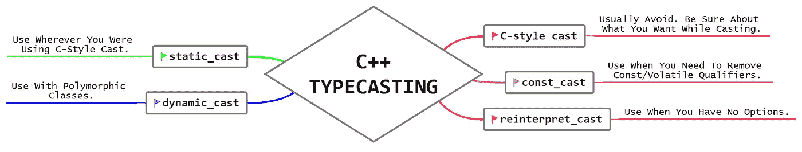

# 面向 C 开发人员的 C++类型转换及示例

> 原文：<https://blog.devgenius.io/c-type-casting-with-an-example-for-c-developers-9ff5769e26b8?source=collection_archive---------2----------------------->



在这里，我们不仅会看到 C++类型转换的例子，而且我还会介绍为什么我们需要它&欺骗代码，让 C 开发人员容易记住它。虽然我不是专家，但这是我从各种来源和行业经验中学到的。

在 C++中，有 5 种不同类型的类型转换:C 风格转换、`static_cast`、`const_cast`、`dynamic_cast`和`reinterpret_cast`。

这是我的博客的交叉帖子。

我通常以“我们为什么需要它”开始，但这次我们首先快速浏览一些术语。

# 你需要面对的术语

1.  **隐式转换:**编译器自动进行类型转换。和`float f = 3;`一样，这里编译器不会抱怨，而是直接把整型的`3`转换成`float` &赋值给`f`。
2.  **显式转换**:开发者使用一个造型操作符来指导转换。所有类型的手动强制转换都属于显式类型转换类别。和`int * p = (int*)malloc(10);`一样，这里我们显式地将`void*`造型为`int*`。
3.  `**l-value**`:代表存储位置的标识符。比如变量名，`*ptr`其中`ptr`指向一个内存位置等。
4.  `**r-value**`:赋值(`=`)运算符右侧出现非`l-value`、`r-value`的值。喜欢

```
int a = 5; // 5 = r-value, 
q = p + 5; // p + 5 is r-value
```

注意:虽然有一些例外&关于`l-value` & `r-value`还有更多要学的，我已经在这里讨论过[。](http://www.vishalchovatiya.com/lvalue-rvalue-and-their-references-with-example-in-cpp/)

# 为什么我们需要类型转换？

*   数据是内存中位(`0`s&s`1`s)的表示。
*   数据类型是编译器指令，它告诉编译器如何存储和处理特定的数据。
*   `unsigned int a = 5;`通过该语句，您可以假设 4 个字节将被保留在您的存储器&中。在执行时，它将在该存储器位置存储`0000 0000 0000 0000 0000 0000 0000 0101`个数据位。这很简单。
*   让我们再进一步，`float f = 3.0;`这条语句还会在内存中保留 4 个字节&以 1 的形式存储数据位)。符号位，2)。指数& 3)。尾数。回想一下[浮点数如何存储在内存中](http://www.vishalchovatiya.com/how-floating-point-no-is-stored-memory/)。
*   但是当你像`float f = 3;`那样写的时候，编译器会很困惑，如何在 float 类型的内存中存储一个整数值。
*   所以它会自动假定(这里是隐式转换)你想要存储`3.0`而不是`3`，从人类的角度来看这在技术上是相同的，但是从[计算机内存的角度来看](http://www.vishalchovatiya.com/memory-layout-of-cpp-object/)就不同了，因为它们存储的方式不同。
*   有很多这样的场景，你提供数据存储在内存中，用来表示不同的数据类型。
*   例如，在下面的例子中，您试图将类型为`B`的对象分配给类型为`A`的对象

```
class A{};
class B{};int main ()
{
  B b;
  A a = b; 
  return 0;
}
```

*   在这种情况下，编译器不能做出任何假设&只是抛出一个编译错误:

```
exit status 1
error: no viable conversion from 'B' to 'A'
  A a = b;
    ^   ~
note: candidate constructor (the implicit copy constructor) not viable: no known conversion from 'B' to 'const A &' for 1st argument
class A{};
      ^
note: candidate constructor (the implicit move constructor) not viable: no known conversion from 'B' to 'A &&' for 1st argument
class A{};
      ^
1 error generated.
```

*   但是当您按如下方式定义转换运算符时:

```
class B {
public:
  operator A(){
    cout<<"CONVERSION OPERATOR\n";
    return A();
  } 
};
```

*   编译器将简单地调用这个成员函数&不会抛出任何错误，因为程序员明确地提到这是他/她想要的转换方式。

# 为 c 开发人员提供了一个 5️⃣ C++类型转换的例子

# `C-style casts`

```
int main() { 
    float res = 10 / 4;
    cout<<res<<endl;
    return 0; 
}
```

*   当您试图运行上面的代码时，您将得到我们没有预料到的输出`2`。为了正确初始化`res`变量，我们需要使用 float 进行如下类型转换:

```
float res = (float)10 / 4;
```

*   现在你的答案会是`2.5`。这种类型的铸造是非常简单的&直截了当，因为它出现。
*   您也可以用 C++将上述转换写成:

```
float res = float(10) / 4;
```

*   c 风格的强制转换可以在不改变底层内存表示的情况下改变数据类型，这可能会导致垃圾结果。

# `static_cast`

*   如果你像我一样是 C 开发人员，那么这将是你最好的 goto C++ cast，它符合大多数例子，比如:

```
int * p = malloc(10);
```

*   当你试图用 C 编译器编译上述代码时，它工作得很好。但是 C++编译器不够善良。它将抛出如下错误:

```
exit status 1
error: cannot initialize a variable of type 'int *' with an rvalue of type 'void *'
  int * p = malloc(10);
        ^   ~~~~~~~~~~
1 error generated.
```

*   你首先想到的是 C 风格的演员阵容:

```
int * p = (int*)malloc(10);
```

*   这是可行的，但是在 C++中不推荐这种类型的造型。像这样处理隐式转换。我们将主要在隐式转换失败的地方使用它进行转换，比如 malloc。

```
int * p = static_cast<int*>(malloc(10));
```

*   `static_cast`的主要优点是它提供了编译时类型检查，使得无意中出错变得更加困难。让我们用 C++例子来理解这一点:

```
class B {};
class D : public B {};
class X {};int main()
{
  D* d = new D;
  B* b = static_cast<B*>(d); // this works
  X* x = static_cast<X*>(d); // ERROR - Won't compile
  return 0;
}
```

*   正如您所看到的，如果不了解所涉及的所有类，很难区分这两种情况。
*   C 风格造型的另一个问题是太难定位了。在复杂的表达式中，很难看到 C 风格的类型转换，例如`T(something)`语法等同于`(T)something`。

# `const_cast`

*   现在我们将直接跳到例子。没有任何理论能比实例更好地解释这一点。

**1。忽略常量**

```
int i = 0;
const int& ref = i;
const int* ptr = &i;*ptr = 3; // Not OK
const_cast<int&>(ref) = 3;  //OK
*const_cast<int*>(ptr) = 3; //OK
```

*   您可以修改`i`，因为被赋值的对象(此处为`i`)不是`const`。如果将 const 限定符添加到`i`，代码将会编译，但是它的行为将是未定义的(这可能意味着从“它工作得很好”到“程序将崩溃>”。)

**2。使用** `**const**` `**this**` **指针**修改数据成员

*   `const_cast`可用于通过一个方法改变非常数类成员，在该方法中该指针被声明为常量。-这在基于`const`重载成员函数时也很有用，例如:

```
class X
{
public:
    int var;
    void changeAndPrint(int temp) const
    {
        this->var = temp;                    // Throw compilation error
        (const_cast<X *>(this))->var = temp; // Works fine
    }
    void changeAndPrint(int *temp)
    {
        // Do some stuff
    }
};
int main()
{
    int a = 4;
    X x;
    x.changeAndPrint(&a);
    x.changeAndPrint(5);
    cout << x.var << endl;
    return 0;
}
```

**3。将** `**const**` **参数传递给只接受非常数参数**的函数

*   `const_cast`也可用于将常量数据传递给不接收常量参数的函数。请参见以下代码:

```
int fun(int* ptr) 
{ 
    return (*ptr + 10); 
} int main(void) 
{ 
    const int val = 10; 
    cout << fun(const_cast <int *>(&val)); 
    return 0; 
}
```

**4。漂流者** `**volatile**` **属性**

*   `const_cast`也可以用来丢弃`volatile`属性。我们在上面的`const_cast`中讨论的内容对于`volatile`关键字也是有效的。

# `dynamic_cast`

*   `dynamic_cast`在运行时使用类型检查，而`static_cast`在编译时使用类型检查。`dynamic_cast`在你不知道它所代表的输入类型时更有用。让我们假设:

```
Base* CreateRandom()
{
    if( (rand()%2) == 0 )
        return new Derived1;
    else
        return new Derived2;
}Base* base = CreateRandom();
```

*   如你所见，我们不知道运行时`CreateRandom()`将返回哪个对象，但是如果它返回`Derived1`，你想执行`Derived1`的`Method1()`。所以在这个场景中，您可以如下使用`dynamic_cast`

```
Derived1 *pD1 = dynamic_cast<Derived1 *>(base);
if (pD1){
    pD1->Method1();
}
```

*   如果`dynamic_cast`的输入没有指向有效数据，它将返回`nullptr`作为指针或者抛出`std::bad_cast`异常作为引用。为了使用`dynamic_cast`，你的类必须是多态类型，也就是说必须包含至少一个虚拟方法。
*   `dynamic_cast`利用`RTTI` ( [运行时类型识别](https://en.wikipedia.org/wiki/Run-time_type_information))机制。

# `reinterpret_cast`

*   `reinterpret_cast`是一个编译器指令，它告诉编译器将当前类型视为新类型。
*   您可以使用`reinterpret_cast`将任何指针或整型转换为任何其他指针或整型。
*   这会导致危险的情况:没有什么能阻止你将`int`转换成`std::string*`。
*   您将在您的嵌入式系统中使用`reinterpret_cast`。`reinterpret_cast`适用的一个常见场景是在`uintptr_t`和实际指针之间进行转换，或者在:

```
error: static_cast from 'int *' to 'uintptr_t'
      (aka 'unsigned long') is not allowed
        uintptr_t ptr = static_cast<uintptr_t>(p);
                        ^~~~~~~~~~~~~~~~~~~~~~~~~
1 error generated.
```

*   相反，使用这个:

```
uintptr_t ptr = reinterpret_cast<uintptr_t>(p);
```

我试图涵盖大部分的复杂性，以理清不同类型转换背后的主要概念，但仍然有可能会错过一些。所以，这是 C++类型转换的一个例子，供 C 开发人员使用。让我们快速回顾一下:

# C 开发人员在类型转换上转向 C++的欺骗代码

读完这些后，你可能会搞不清楚什么时候用什么！这就是为什么我创造了这个作弊代码

*   避免 C 风格的造型。选角的时候要确定自己想要什么。
*   在使用 C 型铸造的地方使用`static_cast`。
*   对多态类使用`dynamic_cast`。请记住，只在继承层次结构中至少有一个虚拟成员的类上使用`dynamic_cast`。
*   当您需要移除`const`或`volatile`限定符时，请使用`const_cast`。
*   当你没有选择时，使用`reinterpret_cast`。

注意:`const_cast`和`reinterpret_cast`通常应该避免使用，因为如果使用不当，它们可能是有害的。除非你有充分的理由使用它们，否则不要使用它。