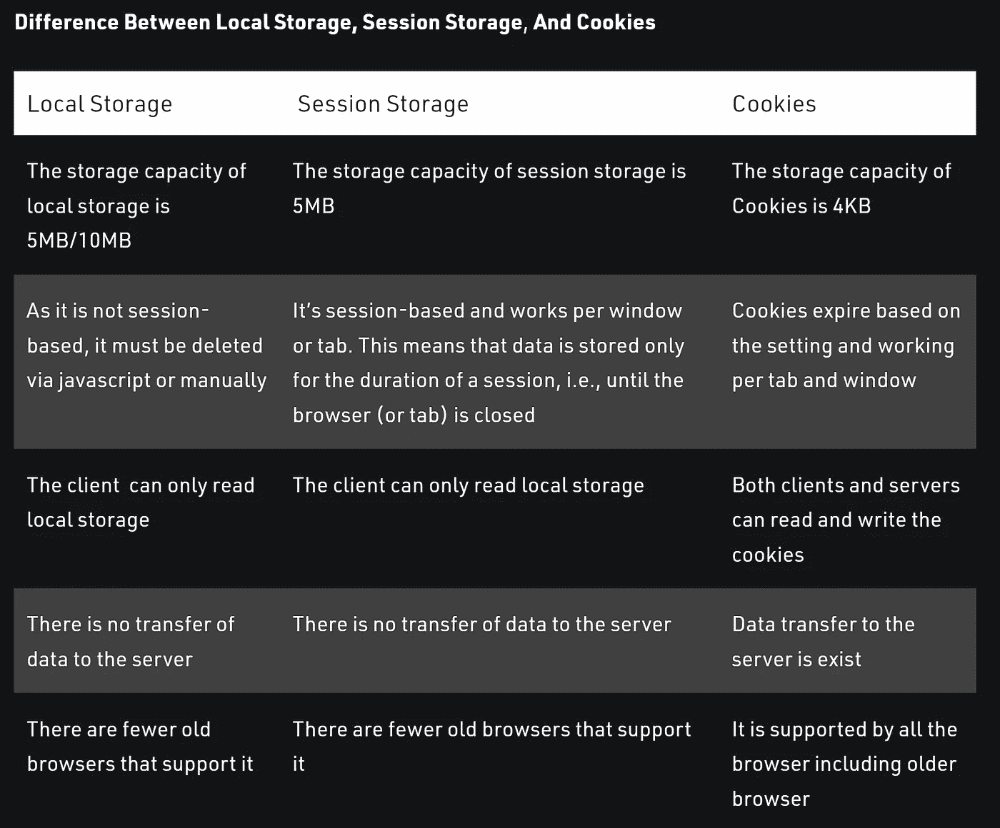
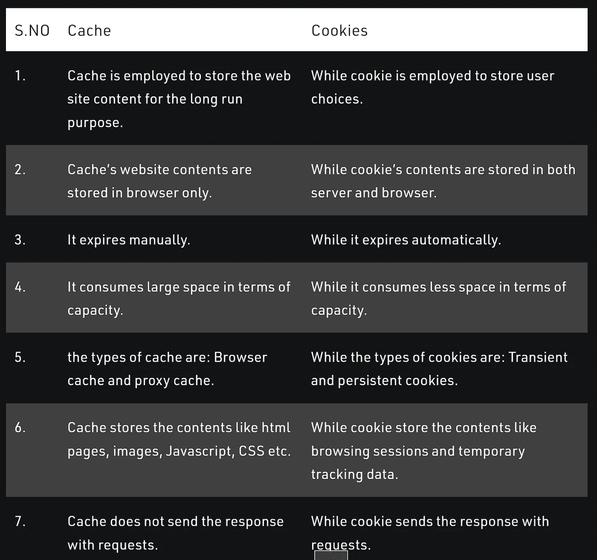

# 简而言之，缓存、Cookies 和网络存储

> 原文：<https://blog.devgenius.io/cache-cookies-and-web-storage-in-a-nutshell-11f9dc02bacc?source=collection_archive---------3----------------------->

## 在[我的技术文章](https://yumingchang1991.medium.com/technical-article-structure-on-medium-954850e1ef4d)中查看我所有的其他帖子

好了，是时候回顾一些必须知道的 web 术语了:缓存、cookies、本地存储和会话存储。

## 隐藏物

缓存用于存储 web 资源，以便用户下次再次访问同一个站点时，可以更快地完成加载。

就网络资源而言，它可以是 HTML 文件、JavaScript 文件、网站中使用的照片、背景中播放的音频或品牌视频/动画等。

如果有客户端缓存，来自客户端的 HTTP 请求会带来一条消息，告诉服务器该用户可以随时访问特定的资源。因此，服务器不必再次发送该资源。

换句话说，缓存不仅通过加快加载速度改善了用户体验，还降低了服务器负载。

## 饼干

Cookies 只是一小段信息，每次都会随 HTTP 请求一起发送。它保存在服务器端和客户端，这样服务器可以识别用户当前的浏览会话是否与他们之前的相同。

它的容量是 4 KB，存储用户的信息。通过查看 cookies 中的信息，网站能够识别用户的行为，从而提供更加个性化的内容。例如，cookies 可能包括:

*   **用户偏好**:浏览语言
*   **浏览会话**:让服务器知道这个用户是否登录
*   添加到购物车的商品
*   访问的页面
*   国际电脑互联网地址
*   任何可以用来描述用户行为的东西

Cookies 的过期时间由其创建者控制，通常只有很短的一段时间。

# 网络存储

## 局部存储器

本地存储是一种更现代的网页存储空间。根据浏览器的不同，它的容量可以达到 5MB/10MB。

存储在本地存储中的信息不会被删除。必须手动删除它们，或者等待 JavaScript 调用`localStorage.clear()`或`localStorage.removeItem(*key*)`。

但是，存储在本地存储中的数据不会通过 HTTP 请求自动发送到服务器。

## 会话存储

与本地存储不同，会话存储中的信息将在会话结束时被删除，例如关闭浏览器。

## 检查浏览器兼容性

由于 web 存储相对较新，所以在实际使用之前检查它的兼容性是一个好习惯。

```
**if (typeof(Storage) !== 'undefined')** {
  // do something with web storage**} else {**
  // do something to let user know their browser does not support web storage**}** 
```

## 本地存储、会话存储和 Cookies 之间的区别



该表由 Geeksforgeeks 创建并拥有



该表由 Geeksforgeek 创建并拥有

# 决定何时使用哪个的简单方法

缓存存储资源，因此当您希望通过将资源推送到客户端存储来改善用户体验时，请使用缓存。

另一方面，Cookies 和网络存储是用来存储数据的。

*   如果数据需要发送到服务器，使用 cookie
*   **使用网络存储，**如果服务器不需要知道存储的数据****

# **快速浏览如何操作每一个**

## **操纵现代网络存储**

**网络存储更加现代化；因此，它有很好的界面供我们使用。我们可以只调用`localStorage`或`sessionStorage`，然后访问我们想要使用的方法:**

*   **`.setItem(key, valiue)`**
*   **`.getItem(key)`**
*   **`.removeItem(key)`**
*   **`.clear()`:这将删除网络存储器中的所有项目**

****注意** : web 存储只保存在客户端；因此，我们不能从 NodeJS 访问本地存储。**

**如果我们需要在前端和后端之间传递数据，请发送 JSON 或使用 cookies。(参见[堆栈溢出的公认答案](https://stackoverflow.com/questions/37182573/saving-into-localstorage-with-nodejs)**

## **操纵 cookies**

**对于 cookies 来说，就很难处理了。好消息是我们大部分时间不需要使用 cookies。**

****客户端脚本****

1.  **我们可以从`document.cookies`访问 cookies**
2.  **我们在纯字符串中将键-值对直接赋值给`document.cookies`，这意味着我们需要解析结果以供进一步分析**

```
document.cookie = 'name=YuMing'
document.cookie = 'lastName=Chang'console.log(document.cookie)
// it prints out below:
// name=YuMing; lastName=Chang
```

****服务器端脚本(ExpressJS)****

**对于后端开发人员来说，好消息是已经有了 cookie 解析器。**

**`const cookieParser = require(cookie-parser)`**

**然后，只需添加 cookieParser 作为所有应用程序可用的资源:**

**`app.use(cookieParser())`**

**之后，我们可以很容易地按照我们定义的路线访问 cookies:**

```
// to Set cookie
**res.cookie(key, value)**// to access a key in a cookie
**res.cookie.***key*// to clear a key in a cookie
**res.clearCookie(key)**
```

**我们在使用 cookies 时需要格外注意；否则，用户可以通过在浏览器控制台中直接键入`document.cookie`来访问 cookie 的内容。**

**为了加强安全性，请在设置 cookies 时添加以下属性作为对象**

```
res.cookie(key, value, {
  **secure: true,
  httpOnly: true,
  sameSite: 'lax'**
}
```

**查看[快递公文](https://expressjs.com/en/5x/api.html#res.cookie)了解更多关于`res.cookie(key, value [, options])`的信息**

## **参考**

*   ****Youtube**:[*JavaScript Cookies vs 本地存储 vs Session*](https://www.youtube.com/watch?v=GihQAC1I39Q) 由 Web Dev 简化**
*   ****文章** : [*本地存储、会话存储和 cookies 的区别*](https://www.geeksforgeeks.org/difference-between-local-storage-session-storage-and-cookies/) 由 Geeksforgeek**
*   ****文章** : [*缓存与 cookies 的区别*](https://www.geeksforgeeks.org/difference-between-cache-and-cookies/) 由 Geeksforgeek**
*   ****文章**:BYJU 的 [*缓存和 cookies 的区别*](https://byjus.com/gate/difference-between-cache-and-cookies/)**
*   ****文章** : [*理解 Cookies 并在 Node.js*](https://www.section.io/engineering-education/what-are-cookies-nodejs/) 中实现**
*   ****stack overflow**:[*NodeJS cookie 解析器不工作*](https://stackoverflow.com/questions/37366457/node-js-cookie-parser-not-working) 作者 Gregory-turtle**