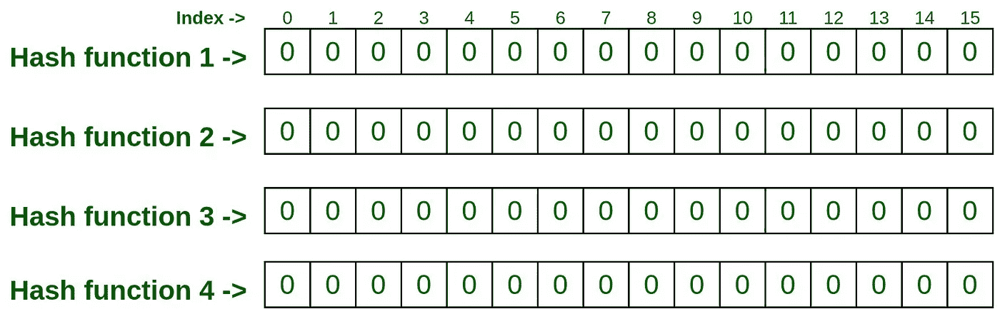
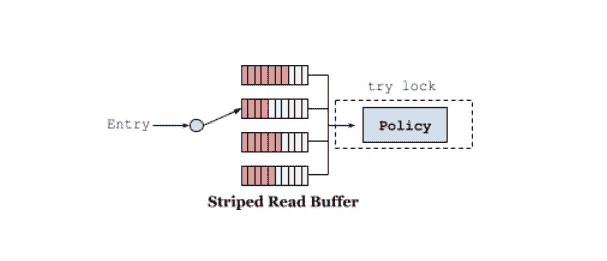
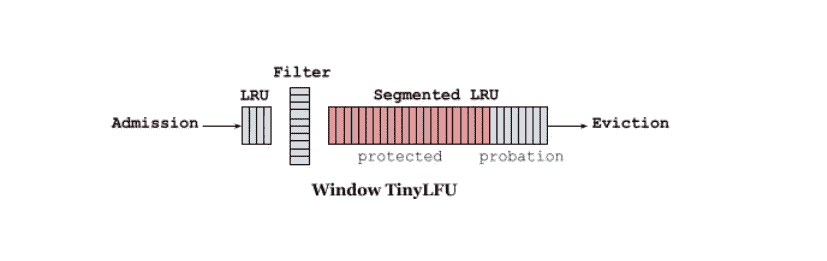
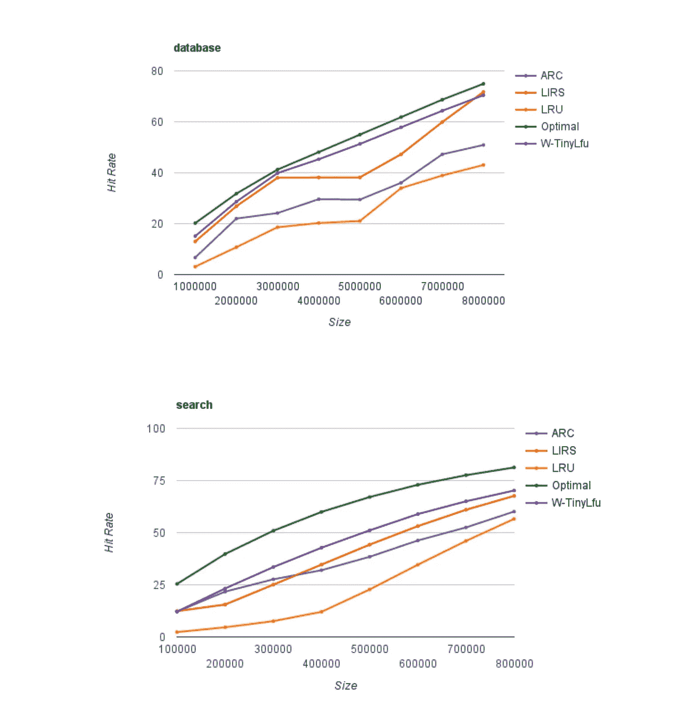

# 现代应用的高速缓存设计

> 原文：<https://blog.devgenius.io/cache-design-for-modern-applications-5d549d1c70a0?source=collection_archive---------1----------------------->


# **什么是缓存？**

根据[维基](https://en.wikipedia.org/wiki/Cache_%28computing%29)的说法，在计算中，缓存是一个高速数据存储层，存储数据的子集，通常是短暂的，以便未来对该数据的请求可以比访问数据的主存储位置更快地得到服务。缓存允许我们有效地重用以前检索或计算的数据。

# **现代缓存库的指导原则**

## **快速访问**

缓存的唯一目的是加快数据访问速度。为了获得良好的性能，高速缓存必须具有以下特性:

*   高**命中率，**这是缓存之外的请求数占总请求数的一部分。
*   内核数量可扩展
*   高读写吞吐量

这些是我们在设计缓存时需要克服的一些挑战。

## **高并发性和抗争用性**

高负载下的缓存性能由其支持的并发级别决定。所有缓存系统都面临争用的问题，因为对缓存的每次访问(get 和 set)都是对某个共享状态的写入。由于这个原因，在大多数缓存中，争用成为一个瓶颈，并最终导致系统变慢。因此，这是设计缓存时要记住的一个重要因素。

## **内存绑定**

缓存的大小总是有限的，只能提供有限的数据量。现在，由于缓存可以包含从几个字节到几十亿字节不等的值，为了明智地处理键，我们可以选择为每个键-值对分配一个**成本**。这意味着当缓存满负荷运行时，一个重的项目可能会取代许多轻的项目。

# 需要一种替代的缓存机制

缓存算法中使用了几种流行的缓存策略。其中最受欢迎的是最近最少缓存(LRU ),它根据最近原则工作，最晚到达的项目将被优先考虑。这个缓存的一个主要缺点是**“这个缓存中的一击奇效”**。这种类型的缓存可能导致在稀疏突发期间踢出真正的项目。

类似地，最少使用(LFU)基于频率原理工作。这种缓存在实际应用中受到很大影响。假设内存中的一个项目在短时间内被重复引用，并且在很长一段时间内不再被访问，那么它将继续享受留在内存中的**【特权】**并占用不必要的空间。

因此，我们需要一种缓存策略，它特别关注所有的可能性，同时强制消除缺点。

# 一种高性能缓存的设计

## **通过锡林浩特的入学政策**

设计缓存时的一个大问题是:**我们应该将什么放入缓存？**这由缓存准入策略来回答。上面我们谈到了流行的政策和它们的缺点。TinyLFU 解决了这些问题。

**TinyLFU** 是一种驱逐无关的准入策略，旨在以极小的内存开销提高命中率。主要的想法是，**只让一个新的项目，如果它的估计高于被驱逐的项目。**使用 **CountMin** 草图完成实施，该草图使用计数器矩阵和多个哈希函数来确定项目的频率。

```
**Glossary : How does a CountMin Sketch work?** CountMin sketch is a probabilistic data structure that serves as a frequency table of events in a stream of data. It uses hash functions to map events to frequencies, but unlike a hash table, it uses only sub-linear space, at the expense of over-counting some events due to collisions.
```



参考:谷歌图片

这种方法让我们通过调整矩阵的宽度和深度，在空间、效率和由于冲突导致的错误率之间进行权衡。**窗口 TinyLFU (W-TinyLFU)，**TinyLFU 的一个变体，使用这个草图作为过滤器，如果一个新条目的频率比必须被驱逐以腾出空间的条目的频率高，则接纳该新条目。这项政策提供了一个准入窗口，让参赛者有机会建立自己的知名度。这避免了连续未命中，尤其是在稀疏突发(LRU 缓存问题)的情况下，条目可能不适合长期保留。为了保持历史的新鲜，定期或递增地执行老化过程，以将所有计数器减半(LFU 缓存的问题)。

## **驱逐政策**

缓存的逐出策略试图估计哪些条目最有可能在短期内再次使用，从而最大化命中率。当缓存达到最大容量时，每个传入的键都应该替换缓存中存在的一个或多个键。因此，驱逐策略旨在找到那些 countMin sketch 估计值低于传入键的键

当新关键字到达时，高速缓存搜索具有最低估计值的关键字，如果该估计值低于输入关键字的估计值，则拒绝该关键字，否则拒绝输入关键字。我们将在**所有组件共同发挥作用**一节中了解一个键的流行度是如何建立的。

## 过期策略

高速缓存还接纳具有到期时间的密钥，在到期时间之后，不管高速缓存存储器的空间可用性如何，这些密钥都被丢弃。所以现在需要一种机制来驱逐过期的密钥并回收空闲空间。为了实现这一点，定期使用一个清道夫线程来清除所有无用的项目。

## 竞争阻力

我们在开始时提到，争用是缓存机制的一个主要威胁，可能会导致整个系统变慢。**实现高命中率需要管理关于缓存中存在什么以及缓存中应该存在什么的元数据。**在线程间平衡缓存的性能和可伸缩性时，这变得非常困难。[***BP-Wrapper***](https://github.com/dgraph-io/ristretto)**解决了这个问题，它讨论了一个系统框架，使得任何替换算法几乎无锁争用。**

**访问被记录到条带化的环形缓冲区中，在该缓冲区中，条带由特定于线程的散列来选择，并且当检测到争用时，条带的数量会增加。当**环形缓冲区**已满时，将调度异步清空，并丢弃对该缓冲区的后续添加，直到空间变得可用(这将导致以速度为代价的有损行为)。**

****

**Ref: HighScalability [dot] com**

**在写入的情况下，使用更传统的并发队列，并且每次更改都计划立即清空。虽然数据丢失是不可接受的，但仍有方法优化写缓冲区。这两种类型的缓冲区都由多个线程写入，但在给定的时间内只由一个线程使用。这种多生产者/单消费者行为允许使用更简单、更有效的算法。**

# **所有组件一起运行**

**我们探讨了高性能缓存所需的策略。现在我们需要看看他们是如何走到一起的。让我们看看进入高速缓冲存储器的密钥的周期是如何操作的:**

**当高速缓存有新条目的空间时，准入策略允许每个键进入其中，而不驱逐任何现有的键。但是，在直接输入密钥之前，它首先被发送给**看门人。**它决定是否需要将密钥发送给准入标准策略。如果看门人允许该密钥，则该策略无论如何都会接纳该密钥(因为我们有可用的内存空间)。在这种情况下，不会发生驱逐。**

**现在，当高速缓存满负荷运行时，会进行上述检查，但在这种情况下，驱逐策略还会决定驱逐哪些键。**

```
**Glossary : How does a Doorkeeper work?** Before we place a key through TinyLFU, the cache uses a bloom filter to first check if the key has been seen before. Only if the key is already present in the bloom filter, it is inserted into the TinyLFU. This is to avoid polluting TinyLFU with a long tail of keys that are not seen more than once.
```

**W-TinyLFU 使用分段 LRU (SLRU)策略进行长期保留。条目从试用段开始，在随后的访问中，它被提升到受保护段(容量上限为 80%)。当受保护段已满时，它驱逐到试用段，这可能触发试用条目被丢弃。这确保了具有小重用间隔的条目(最热的)被保留，而那些不经常被重用的条目(最冷的)有资格被驱逐。**

****

**Ref: HighScalability [dot] com**

# **上述高速缓存设计的现有实现**

## **[咖啡因(爪哇)](https://github.com/ben-manes/caffeine)**

**Caffeine 是一个用 JAVA 编写的高性能接近最优的缓存库。它使用谷歌番石榴启发的 API 提供内存缓存。对于 JAVA 原生结构，它在很大程度上遵循了上述设计。**

## **[里斯特雷托(戈朗)](https://github.com/dgraph-io/ristretto)**

**Ristretto 是一个快速、并发的高速缓存库，主要关注性能和正确性。高速缓存是根据 Dgraph 中无争用高速缓存的需求而构建的。Ristretto 使用 SampledLFU 进行缓存回收。要了解更多信息，请查看他们的官方知识库。**

# **业绩和结论**

**在咖啡因和 ristretto 中，上述缓存设计实现在命中率和速度方面提供了接近最优的性能。**

****

**Ref: HighScalability [dot] com(咖啡因性能)**

# **参考**

1.  **high scalability[dot]com:[http://high scalability . com/blog/2016/1/25/design-of-a-modern-cache . html](http://highscalability.com/blog/2016/1/25/design-of-a-modern-cache.html)**

**2.锡纸:[https://arxiv.org/pdf/1512.00727.pdf](https://arxiv.org/pdf/1512.00727.pdf)**

**3.BP 包装:[https://dgraph.io/blog/refs/bp_wrapper.pdf](https://dgraph.io/blog/refs/bp_wrapper.pdf)**

**4.https://www.youtube.com/watch?v=MUbrERcoyYc**

**5.维基百科文章**