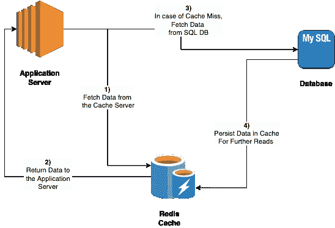

# 缓存 101

> 原文：<https://blog.devgenius.io/caching-101-634ef4f8ed1b?source=collection_archive---------7----------------------->

这篇博客是我们从零开始讨论**云**概念的系列文章的一部分，面向的是入门知识有限的读者。这篇文章属于*中级*系列，因为它涉及到构建一般的缓存原则。

云系列中的一些早期博客如下。

[**负载均衡 101**](/load-balancing-101-8251350c033f)[**AWS 云上的灾难恢复**](/disaster-recovery-on-aws-cloud-building-blocks-e013bffd6244)[**Azure 云上的灾难恢复**](/disaster-recovery-on-azure-cloud-building-blocks-6ff826adbc8b)[**Google 云上的灾难恢复**](/disaster-recovery-on-google-cloud-building-blocks-b2a232a9ec)

# 什么是缓存

高速缓存是一个过程，通过该过程，通过在称为高速缓存的存储位置( ***【本地/远程】*** )存储多个副本来优化对数据 ***(文件、图像、脚本等)*** 的读取访问。缓存旨在通过减少数据库服务器上的读取负载来扩展分布式应用程序的需求，从而改善读取 API 延迟。缓存使用 **TTL(生存时间)**的概念来保持数据刷新，以防止与主数据库服务器不一致。

# 缓存是如何工作的

## 顺序流程

1.  应用服务器在缓存中寻找缓存的资产。在 [**缓存命中场景**](https://www.techopedia.com/definition/6306/cache-hit#:~:text=A%20cache%20hit%20occurs%20when,is%20considered%20a%20cache%20hit.) 的情况下，数据已经存在于远程缓存中。
2.  缓存服务器将数据返回给应用服务器，并加载到业务流中。
3.  如果数据不是以缓存副本的形式出现，则从数据库服务器获取数据。这被称为 [**高速缓存未命中场景。**](https://hazelcast.com/glossary/cache-miss/#:~:text=A%20cache%20miss%20is%20an,successfully%20retrieved%20from%20the%20cache.)
4.  数据被更新回缓存服务器，这取决于所选择的整体缓存策略( [***【直写或延迟加载】***](https://docs.aws.amazon.com/AmazonElastiCache/latest/mem-ug/Strategies.html) )

# 为什么高速缓存更快

就整体易失性而言，高速缓冲存储器的工作方式类似于 RAM 存储器。然而，由于两个主要原因，高速缓冲存储器对于数据访问更快

1.  高速缓存使用 [**静态 RAM**](https://en.wikipedia.org/wiki/Static_random-access_memory) ，不像 [**动态 RAM**](https://en.wikipedia.org/wiki/Dynamic_random-access_memory) 需要刷新。由于刷新时间得到优化，数据访问变得更快。
2.  除了存储数据，高速缓冲存储器还存储进一步处理所需的指令，使整体操作比存储在 RAM 中更快。

# 数据库缓存的分类

## 服务器位置

缓存的数据既可以存储在本地*即与运行的应用程序相同的服务器上，也可以存储在远程服务器 上。*

## ***本地缓存***

*缓存的数据存储在与应用服务器相同的计算实例上。本地缓存提供了更好的 SLA，因为网络往返次数减少了，但是在应用服务器重启的情况下，它会丢失数据。*

## ***远程缓存。***

*缓存的数据存储在远程服务器上，该服务器可以是单个实例，也可以以 [***主从配置运行。***](https://en.wikipedia.org/wiki/Master/slave_(technology)) 远程缓存提供了更好的可用性，并且能够抵御数据丢失，但是基于计算-缓存路径中的网络延迟，整体往返速度较慢。*

## *缓存回收策略*

*根据高速缓存引擎中数据的驱逐/删除，高速缓存可以进一步分为以下类型*

## *先进先出*

*在该策略中，首先加载的缓存数据首先被收回。*

## *最近最少使用*

*在此策略中，基于时间戳最近的缓存数据首先被逐出。就缓存未命中情况而言，这优于 FIFO，并且是一种向后看而不是向前看的策略。*

## *最佳方法*

*在该策略中，将来不会用于最大时间戳的数据首先被替换。因为这需要关于数据访问的知识，所以这个策略更加理论化，并且在真实的客户场景中很难实现。*

# *摘要*

*根据缓存更新策略，缓存可以进一步分为 ***、直写缓存、延迟加载缓存、回写缓存等*** 。然而，这个主题需要一个详细的解释，所以我们将在云系列的后续专家博客中讨论这些内容。*

*无论是公共云还是私有云，缓存都是分布式可扩展部署中的重要组成部分。每个云供应商都提供了一系列缓存解决方案，这些解决方案使用了上述模式的组合。其中比较流行的有以下几种——[**AWS 缓存**](https://aws.amazon.com/caching/aws-caching/) **，** [**Azure 缓存**](https://azure.microsoft.com/en-in/services/cache/) **和** [**GCP 缓存。**](https://cloud.google.com/memorystore)*

**如需反馈，请留言至****Amit[dot]894[at]Gmail[dot]com****或联系*[*https://about.me/amit_raj*](https://about.me/amit_raj)*的任何链接。**