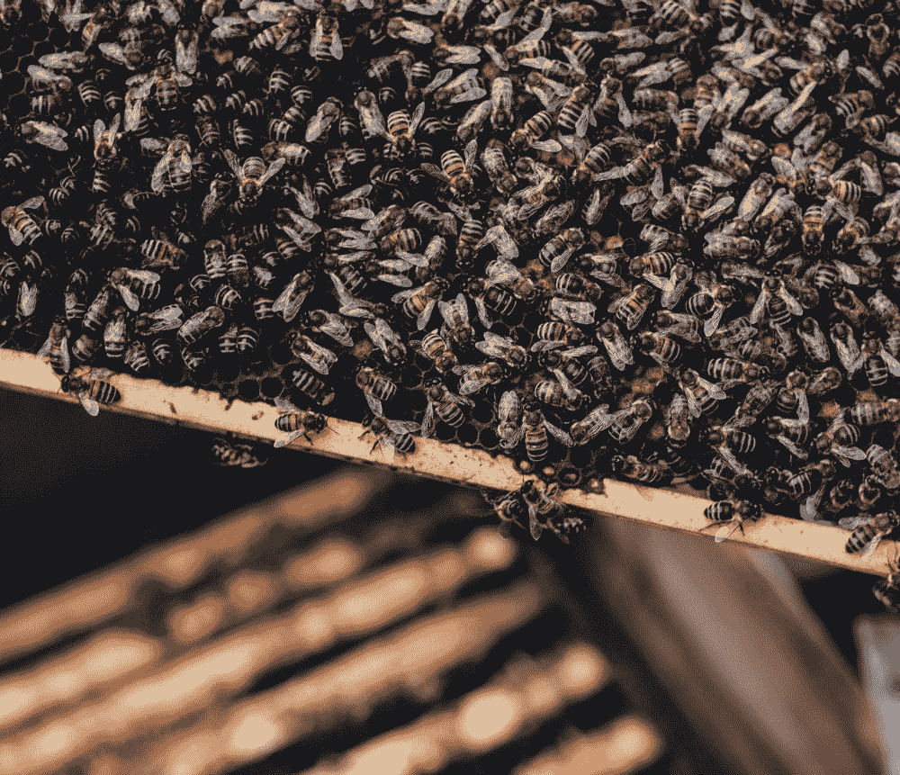
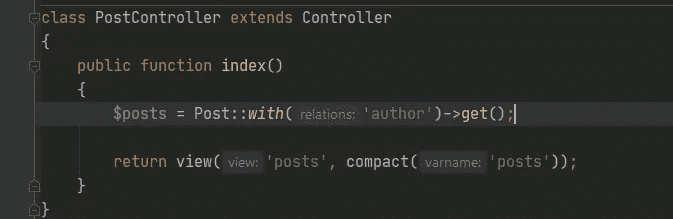
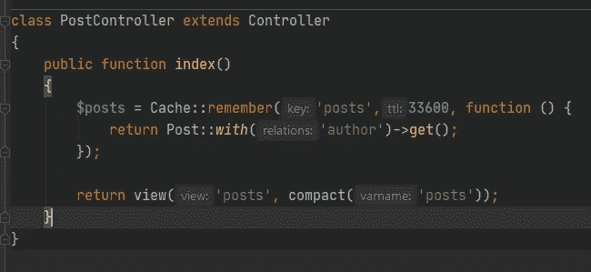

# 在 Laravel 中用 Redis 缓存有说服力的查询

> 原文：<https://blog.devgenius.io/caching-eloquent-queries-with-redis-in-laravel-b8872d8eeb18?source=collection_archive---------0----------------------->



我们都见过许多网站**太慢，**不够快让我们抓狂，我们最终离开了它们，再也不会回来。

想象一下，拥有一个对数据库有大量请求的网站，迟早你将不得不投入大量的计算能力来响应数据库请求，并且你将不得不为此付出大量的金钱。

## 那么，有什么方法可以在请求数量不变的情况下减少数据库查询呢？

是的，**缓存**可以帮助解决这个问题。

如果你使用 Laravel 框架作为你的网站/web 应用程序的后端栈，这是很容易配置的。Laravel 有一些现成的驱动程序，其中一些是:

1.  **文件**
2.  **Redis**
3.  **Memcached**

文件驱动是一个很好的选择，但是如果你想在更大的范围内，更快地做一些事情，你应该使用 Redis 或者 Memcached。

## 在本文中，我们将通过两个简单的步骤来了解高速缓存如何与 Redis 一起工作:

我假设您已经在本地环境中安装并运行了 Laravel 和 Redis。

1.  添加 Redis 配置，并将缓存驱动程序设置为使用 Redis(在。环境文件):


。环境文件

如您所知，Redis 是一个内存中的键值数据库。这是向其添加键和值对的方法:

```
Cache::put($key, $value, $ttl);
Cache::put('foo', 'bar', 600);
```

这将保存值为“bar”的“foo ”,该值将保留 10 分钟(600 秒)。要获得缓存的值，我们可以使用:

```
$foo = Cache::get('foo');
```

这是我们从数据库中检索帖子的方式。



app/Http/PostController.php 文件

2.我们可以在第一次请求后缓存这些帖子，这样我们就不再查询数据库，因为数据将来自 Redis:



app/Http/PostController.php 文件

这将检查缓存中是否存在“posts”键，如果存在，它将使用缓存，否则，它将查询数据库，然后将数据保存到缓存中，以供下一次请求使用 33600 秒。

请记住，当您**创建、更新、删除**一个帖子时，您必须**删除(忘记)带有该键的缓存(在本例中为“posts”**，否则，它将向您显示**旧数据，这些数据将被缓存到 TTL 时间结束**。