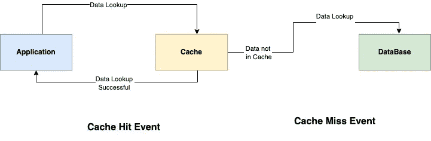
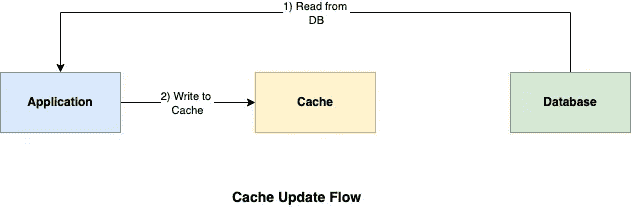
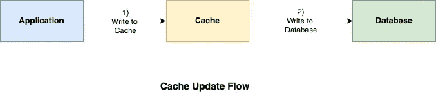

# 缓存策略 101

> 原文：<https://blog.devgenius.io/caching-strategy-101-3bc974d2a6cd?source=collection_archive---------3----------------------->

这篇博客是我们从零开始讨论 101 个概念的系列文章的一部分，读者的入门知识有限。这篇文章属于 ***中级*** 系列，因为它涉及理解**缓存策略的**，该策略主要用于优化对业务数据的读取访问，以获得更好的端到端用户延迟。

101 系列中的一些早期博客如下:

[**CORS 101**](/cors-101-72b462396deb)[**断路器 101**](/circuit-breaker-pattern-101-be2d7fdb656) [**优先级队列 101**](/priority-queues-101-40eb4f6f5ee9) [**异步通信 101**](/async-communication-101-b04d5c95333a)[**数据库设计 101**](/database-design-101-7c019d69b97f)

# 什么是缓存？

正如在早先的博客— [**缓存 101**](/caching-101-634ef4f8ed1b) 中所解释的，缓存是一个过程，通过该过程，通过在被称为缓存的存储位置( ***【本地/远程】*** )存储多个副本来优化对数据 ***(文件、图像、脚本等)*** 的读访问。为了更好地理解缓存工作的基本原理，建议重温以前的博客。在这种情况下，我们将讨论将缓存作为业务应用程序整体架构的一部分来实现的常见设计模式。

# 缓存命中和缓存未命中

所有读取事件都可以根据要获取的键在整个应用程序设计中的位置分为两种类型

*   **缓存命中** —数据驻留在本地/远程缓存服务器中，这种情况下避免了对数据库服务器的冗余调用。
*   **缓存未命中-** 数据仅驻留在数据库服务器中，因此应用程序必须进行额外的网络调用来获取数据。根据所选择的缓存策略，可以通过多种方式将数据更新回缓存服务器。

# 缓存策略

根据数据何时加载到高速缓存中，即在读取操作之前预填充，还是在运行时发生**高速缓存未命中事件**，我们有不同的设计策略。我们将讨论最常见的原则，因为总体设计中的实际实现是以下原则的变体和组合。

## 缓存备用模式

## **顺序流程**

1.  应用程序检查缓存服务器中的读取数据。如果存在，则发生**缓存命中**事件。
2.  在**缓存未命中**事件的情况下，从数据库中读取数据以查询业务流。
3.  读操作后，应用程序使用写操作将数据更新回缓存服务器。

在上述惰性加载模式的变体中，高速缓存服务器代替应用服务器负责在高速缓存未命中的情况下填充数据，并且被称为 [**读通高速缓存。**](https://vijayt.com/post/cache-aside-vs-read-through-cache/)

## 用例

缓存预留技术主要用于**读取繁重的工作负载**，在这种情况下，整个系统可以承受缓存故障和停机。使用延迟加载缓存策略可以改善*数据库创建和更新操作*的整体写入延迟，主要用于具有频繁写入操作的应用程序设计。

然而，使用这种实现的主要缺点是初始客户的第一次缓存未命中和降低的读取性能。

## 直写模式

## **顺序流程**

1.  应用程序检查缓存服务器中的读取数据。如果存在，则发生**缓存命中**事件。
2.  在**缓存更新**事件的情况下，应用程序从外部源读取数据并首先更新缓存。
3.  更新缓存操作后，相同的数据副本被写回数据库，以与数据库保持一致——事实的来源。

写缓存有变化— [**回写缓存**](https://www.geeksforgeeks.org/differentiate-between-write-through-and-write-back-methods/) **、**其中数据库更新发生在额外的延迟之后，以避免写操作中的延迟。 [**写绕缓存**](https://shahriar.svbtle.com/Understanding-writethrough-writearound-and-writeback-caching-with-python) **，**其中只有读取数据的子集被更新回缓存，而不是整个数据集。

## 用例

**直写缓存**建议用于对数据集进行非频繁写入更新的业务用例。考虑到额外的*往返延迟*，这种缓存类型建议将直写缓存与**读缓存**配对，以平衡最终用户的*可靠性和性能需求*。

# 摘要

缓存为额外的系统设计层提供服务，以提高整体*应用性能*，因此对于克服网络传输瓶颈至关重要。如果数据集很小，数据结构简单，并且对业务流程不重要，还建议在应用服务器上使用内存缓存。对于**大规模分布式系统**，不是坚持一个适合所有**的缓存策略**,*功能架构*应该是灵活的，允许缓存的多种变化，这取决于整个时间段内读写操作的频率。

*如需反馈，请留言至****Amit[dot]894[at]Gmail[dot]com****或联系*[*https://about.me/amit_raj*](https://about.me/amit_raj)*的任何链接。*