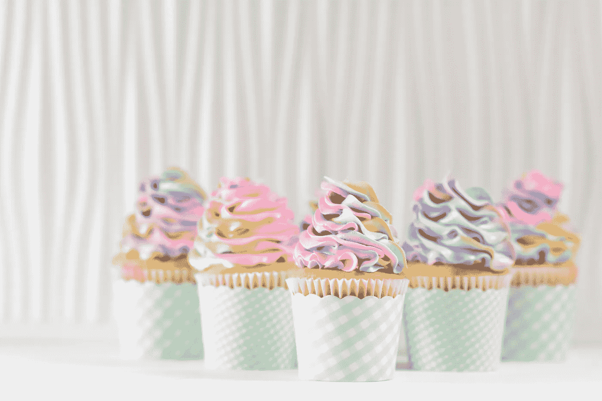
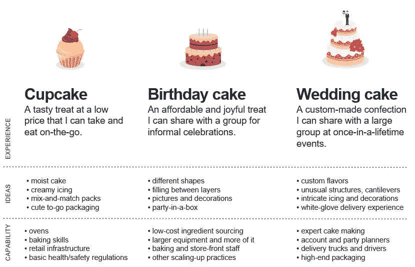

# 蛋糕体验路线图(设计思维)讲解

> 原文：<https://blog.devgenius.io/cake-experience-roadmap-design-thinking-explained-50e74ec5e1fc?source=collection_archive---------2----------------------->

德瓦·威廉姆森在 [Unsplash](https://unsplash.com/search/photos/cupcakes?utm_source=unsplash&utm_medium=referral&utm_content=creditCopyText) 上的照片

你有没有想过蛋糕这个词是怎么用在专业项目中的？它被用在设计思维中，也是以一种正式的方式。设计思维中使用的蛋糕有三种类型:

1.杯型蛋糕，

2.生日蛋糕和

3.结婚蛋糕。

但是这些蛋糕是什么意思，在设计思维的保护伞下是如何使用的？我们都知道，产品不是一蹴而就的，它需要时间来启动、成长和成熟。规划项目时，我们将项目划分为多个阶段。在设计思维中，这就是这些蛋糕发挥作用的地方。这也被称为“蛋糕体验路线图”。这个体验路线图的想法是在所有阶段结束时向用户提供一个有意义和相关的体验。

**一张蛋糕体验路线图:**

**杯型蛋糕:**

纸杯蛋糕是一种价格低廉的美味佳肴，顾客可以随身携带并随时享用。杯形蛋糕是我们知道我们将建立和交付给客户的东西。这些是产品或项目必须具备的特性。设计思想家**知道他们将在我们的产品中构建这些**特性，或者在我们的服务中实现这些特性。一个纸杯蛋糕应该足够锋利，你应该对实现和制作它充满信心。

**生日蛋糕:**

另一方面，生日蛋糕是蛋糕体验路线图的第二阶段。生日蛋糕本身是负担得起的和快乐的，你可以和一群人一起庆祝。生日蛋糕是设计思维团队**认为他们将建造这个**的东西。

**结婚蛋糕:**

婚礼蛋糕是蛋糕体验路线图的第三阶段。这是一个定制的蛋糕，是为一生一次的机会而制作的。创作这样的杰作需要大量的计划和努力。结婚蛋糕应该是模糊的。设计思想家不确定它是否会建成。也许他们建造了这个也许没有。把结婚蛋糕直接送给用户是一个真正的大冒险。因此，我们从纸杯蛋糕到生日蛋糕，最后到结婚蛋糕，一点一点来。

蛋糕体验路线图背后的想法是，顾客从他们得到的成品中获得愉快的体验。纸杯蛋糕、生日蛋糕和结婚蛋糕都可以提供令人愉快的体验，这取决于他们在制作和递送蛋糕上花费的时间和精力。在交付体验路线图时，我们应该关注用户体验，而不是产品的功能。体验路线图应该以用户为中心。蛋糕体验路线图的一个很好的例子就是造车。对于**纸杯蛋糕**，我们可以制造一辆自行车，用户可以骑着它从目的地 A 旅行到 b。对于**生日蛋糕**，我们可以交付一辆带有先进功能的摩托车，例如安装在上面的发动机。最后对于**结婚蛋糕**，我们将汽车交付给用户，这就是成熟的最终产品。所有这些都为用户提供了有意义和相关的体验，用户可以利用这些体验。这只是一个简单的基本例子，可能会因项目而异。