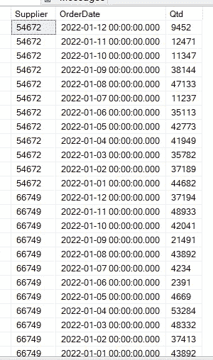
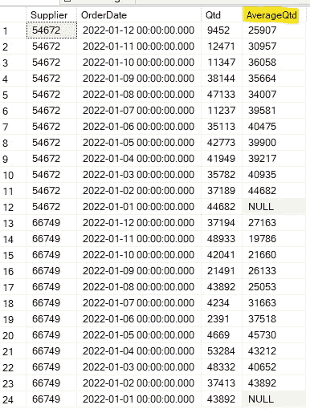

# 在 SQL Server 上计算过去 6 个月的平均值

> 原文：<https://blog.devgenius.io/calculate-the-last-6-months-average-on-sql-server-b8f294c5bbb7?source=collection_archive---------9----------------------->

我最近遇到了一个挑战，在订单和供应商的环境中，有必要计算每个供应商在过去 6 个月中的平均订单量，使用子查询有几种方法可以做到这一点，但目的是做一些简单而不太繁重的事情，因为这种开发产生的查询将是非常需要的。

经过一些研究，我发现了一个使用窗口函数的例子，它基于一个数据字段，根据我们定义的范围进行计算。


Nubelson Fernandes 在 [Unsplash](https://unsplash.com?utm_source=medium&utm_medium=referral) 上的照片

我们用一个例子，让事情变得简单易懂。我将创建一个表，存储每个**供应商**，每个**月**的总订单。

```
CREATE TABLE dbo.totalOrdersMonth (
    Supplier INT,
    OrderDate DATETIME,
    Qtd INT
);
```

我们将向寄存器中插入:

```
INSERT INTO dbo.totalOrdersMonth (Supplier,OrderDate,Qtd)
SELECT 66749, '01-01-2022',43892 UNION ALL
SELECT 66749, '01-02-2022',37413 UNION ALL
SELECT 66749, '01-03-2022',48332 UNION ALL
SELECT 66749, '01-04-2022',53284 UNION ALL
SELECT 66749, '01-05-2022',4669 UNION ALL
SELECT 66749, '01-06-2022',2391 UNION ALL
SELECT 66749, '01-07-2022',4234 UNION ALL
SELECT 66749, '01-08-2022',43892 UNION ALL
SELECT 66749, '01-09-2022',21491 UNION ALL
SELECT 66749, '01-10-2022',42041 UNION ALL
SELECT 66749, '01-11-2022',48933 UNION ALL
SELECT 66749, '01-12-2022',37194 UNION ALL
SELECT 54672, '01-01-2022',44682 UNION ALL
SELECT 54672, '01-02-2022',37189 UNION ALL
SELECT 54672, '01-03-2022',35782 UNION ALL
SELECT 54672, '01-04-2022',41949 UNION ALL
SELECT 54672, '01-05-2022',42773 UNION ALL
SELECT 54672, '01-06-2022',35113 UNION ALL
SELECT 54672, '01-07-2022',11237 UNION ALL
SELECT 54672, '01-08-2022',47133 UNION ALL
SELECT 54672, '01-09-2022',38144 UNION ALL
SELECT 54672, '01-10-2022',11347 UNION ALL
SELECT 54672, '01-11-2022',12471 UNION ALL
SELECT 54672, '01-12-2022',9452
```

现在我们有足够的数据来证明这个函数是有效的:



每个供应商的订单总数

现在，我们使用下面的函数来计算供应商的平均数量，按我们的日期字段排序，然后我们使用…之间的行和前面的行选择计算期间，这将得到最近的 6 个日期。因为我们的日期按月分组，所以我们将得到按月的平均值:

```
SELECT 
 Supplier,
 OrderDate,
 Qtd,
 AVG(Qtd) OVER (
   PARTITION BY Supplier
   ORDER BY 
     OrderDate
     ROWS BETWEEN 6 PRECEDING
     AND 1 PRECEDING
   ) AS AverageQtd
FROM totalOrdersMonth
```

结果:



查询结果

如果您想按月计算平均值、总和或标准差，请记住先对数据进行分组。

如果你需要随时使用一个简单干净的函数而不是大量代码来做这件事，我希望这能对你的工作有所帮助。

不要忘了订阅邮件来接收这些故事，直到下次。