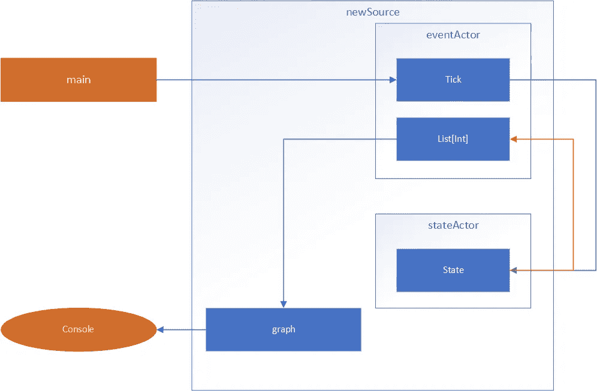

# 使用 Akka 流的移动平均线-第 1 部分

> 原文：<https://blog.devgenius.io/calculating-moving-averages-using-akka-streams-a9844acf9527?source=collection_archive---------6----------------------->

## 数据工程

## 流市场数据的移动平均线函数计算指南


[m.](https://unsplash.com/@m_____me?utm_source=medium&utm_medium=referral) 在 [Unsplash](https://unsplash.com?utm_source=medium&utm_medium=referral) 上拍照

Akka Streams 是一个非常强大的流数据处理工具。它有一个参与者模型，可以在大型企业环境中管理反压力。这就是为什么我决定开发一个功能堆栈，它能够以非常高效的内存使用来处理流式市场数据。现在，让我们言归正传。

这不是关于如何将数据接收到我们的管道中。从众多的交流中有大量的 API。

重要的事情先来。我们一个接一个地得到报价器，所以在第一步，我们需要得到数据，并在某个地方积累它们，以计算下一步移动的移动平均线。它有点像缓冲区，但缓冲区不会是不可变的；所以我们必须使用一个功能相当的缓冲器。我的想法是用一个演员状态。这个状态可以保存并返回移动平均线所需的 tickers。

这个有状态的参与者应该响应两个请求:获取状态和设置状态。

```
case object GetState
case class SetState(newTicker: Int)

class StateActor(interval: Int) extends Actor {
  override def receive: Receive = {
    case GetState => sender() ! *List*[Int]()
    case *SetState*(newTicker) => 
      *context*.become(Stateful(*List*[Int](newTicker)))
  }

  def Stateful(tickers: List[Int]): Receive = {
    case GetState => sender() ! tickers
    case *SetState*(newTicker) =>
      if (tickers.length >= interval)
        *context*.become(Stateful(tickers.tail :+ newTicker))
      else
        *context*.become(Stateful(tickers :+ newTicker))
  }
}
```

这个 actor 被另一个正在等待新节拍的 actor 调用。我已经将这两个参与者分开，这样我们就可以从`stateActor`获得状态数据，并运行我们的 Akka 流图。

```
case class Tick(ticker: Int)class EventActor(stateActor: ActorRef, 
  graph: Graph[FlowShape[List[Int], Float], NotUsed])
  extends Actor with ActorLogging {
  override def receive: Receive = {
    case *Tick*(ticker) =>
      stateActor ! *SetState*(ticker)
      stateActor ! GetState
    case tickers: List[Int] =>
      *Source*(*List*(tickers))
        .via(graph)
        .runWith(Sink
          .*foreach*[Float](x => *println*(s"New MA: **$**x"))
        )
  }
}
```

我已经创建了一个`Tick` case 类，所以我将把来自源代码的新 tickers 发送到我的`eventActor`。每一个 ticker 都会发送到`stateActor`并改变状态。

在得到我们的窗口数据后，我们把它输入到我们的 Akka Streams 管道中，这样我们就可以得到我们的移动平均值。

```
val graph = GraphDSL.create() { implicit builder =>
  val aggregatorShape = builder
    .add(*Flow*[List[Int]].map(x => *average*(x)))
  val filterShape = builder
    .add(*Flow*[List[Int]].filter(x => x.length >= interval))
  val broadcast = builder.add(*Broadcast*[List[Int]](2))
  val printerShape = builder
    .add(Sink.*foreach*[List[Int]](x => 
      *println*(s"Tuple for **$**name MA**$**interval: **$**x")))

  import GraphDSL.Implicits._
  filterShape ~> broadcast ~> aggregatorShape
  broadcast ~> printerShape

  *FlowShape*(filterShape.in, aggregatorShape.out)
}
```

这个图表将把我们的数据打印到控制台上。

我将所有这些步骤包装在一个函数中，这样我们就可以重用它们。

```
def newSource(name: String, interval: Int): ActorRef = { // GRAPH DEFINITION HERE val stateActor = *system*.actorOf(*Props*(
    new StateActor(interval)), s"state**$**name"
  )
  val eventActor = *system*.actorOf(*Props*(
    new EventActor(stateActor, graph)), s"event**$**name"
  )
  eventActor
}
```

这段代码消除了每次计算移动平均值时从 Kafka(或其他排队服务)获取数据的需要。`name`参数用于给我们的演员起独特的名字。从这个 actor 返回的`eventActor`将被源 actor 用来发送 tickers 以触发整个管道。



程序的流程图

在这里，您可以看到谁给谁打电话，以及如何检索信息。

数据源在调用`eventActor`的主线程上，然后`eventActor`调用`stateActor`更新状态。Next 向`stateActor`请求一个新状态，并将这个新状态发送到我们的 Akka 流图来处理它。

在这里阅读第 2 部分[。](https://medium.com/@ali.t.asl/calculating-moving-averages-using-akka-streams-part-2-c41bb1699feb)