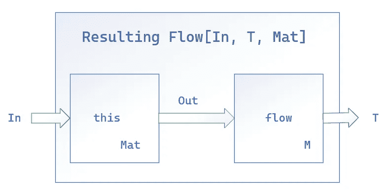

# 使用 Akka 流的移动平均线—第 2 部分

> 原文：<https://blog.devgenius.io/calculating-moving-averages-using-akka-streams-part-2-c41bb1699feb?source=collection_archive---------9----------------------->

## 数据工程

## 流市场数据的移动平均线函数计算指南


[m.](https://unsplash.com/@m_____me?utm_source=medium&utm_medium=referral) 在 [Unsplash](https://unsplash.com?utm_source=medium&utm_medium=referral) 上拍照

kka Streams 是一个非常强大的流数据处理工具。它有一个参与者模型，可以在大型企业环境中管理反压力。这就是为什么我决定开发一个功能堆栈，它能够以非常高效的内存使用来处理流式市场数据。现在，让我们言归正传。

在[上一篇文章](https://medium.com/@ali.t.asl/calculating-moving-averages-using-akka-streams-a9844acf9527)中，我使用了 Akka 流和一个 actor 来实现移动平均。与我将在本文中讨论的方法相比，这种方法在管理方面很差。在这个方法中，我们仍然需要手工设计一个 actor，但是 actor 将被添加到 Akka Streams 管道中，并与之集成。如文件所述:

> 在许多用例中，同时使用 actor 和 streams 可能是合理的:a)当集成现有的基于流或 actor 的 API 时。b)当存在应该跨多个流共享的任何可变状态时。c)当流运行时，有任何可变的状态或逻辑可以被“从外部”影响。

您可以使用两种方法将 actor 集成到 Akka Streams 管道中，要么使用`ask`方法，要么使用`actorRefWithBackpressure`。在`actorRefWithBackpressure`中，我们定义了参与者使用的对象和传播反压力的管道。例如:

```
val sink = Sink.actorRefWithBackpressure(
  receiver,
  onInitMessage = InitMessage,
  ackMessage = AckMessage,
  onCompleteMessage = OnCompleteMessage,
  onFailureMessage = onErrorMessage
)
```

对了，这里我就用`ask`的方法。

实现新管道的第一步是定义一个参与者。

```
class StateActor extends Actor with ActorLogging {
  override def receive: Receive = Stateful(List[Double]())

  def Stateful(numOfTicks: Int, ticks: List[Double]): Receive = {
    case UpdateState(newTick: Double) =>
      log.debug("Updating state.")
      sender() ! UpdateState(ticks)
      if (ticks.length >= numOfTicks) 
        context.become(Stateful(ticks.tail :+ newTick))
      else context.become(Stateful(ticks :+ newTick))
    case _ => log.info("Invalid option!")
  }
}
```

我们的 actor 用每条新消息更新它的状态，如这些文章的第 1 部分所述。响应类型是`UpdateState`，它包含最后一个分笔成交点的列表。

在下一步中，我们需要使用 actor 创建一个 Akka 流。

```
val stateActor = system.actorOf(Props[StateActor],"state")
val stateFlow = Flow[UpdateState].ask[UpdateState](1)(stateActor)
```

首先，我们在之前创建的 actor 系统中创建一个`ActorRef`。然后，我们需要使用提到的 actor 创建一个流。

```
val firstFlow = source.via(Flow[Double].map(tick => {
  println(s"New tick: **$**tick")
  UpdateState(tick)
}))val secondFlow = firstFlow.via(stateFlow)
  .via(Flow[UpdateState].filter(state => state.newTick match {
    case list: List[Double] => list.length == numOfTicks
  }))val thirdFlow = secondFlow
  .to(Sink.foreach[UpdateState](tickList => tickList.newTick match {
    case list: List[Double] => println(list.sum / list.length)
  })).run()
```

管道将消息传递到基于角色的流中。然后，基于消息的长度对此流返回的消息进行过滤。在接收器中，计算滴答列表的平均值并打印到控制台中。

如果我们基于数据类型转换来分析管道，那么`firstFlow`将对应于`Source[Double, NotUsed]#Repr[UpdateState]`或者简单地对应于`Source[UpdateState, NotUsed]`，正如源代码所定义的。

```
final class Source[+Out, +Mat](
    override val traversalBuilder: LinearTraversalBuilder,
    override val shape: SourceShape[Out])
    extends FlowOpsMat[Out, Mat]
    with Graph[SourceShape[Out], Mat] {

  override type Repr[+O] = Source[O, Mat @uncheckedVariance]
  ...
}
```

第二个流将返回与 actor 返回的数据类型相同的类型，以响应我们的请求。

正如文档中所讨论的，在`via`的定义中:

```
**def** via[T, Mat2](flow: Graph[FlowShape[Out, T], Mat2]): Repr[T]
```



组合流返回的物化值将是当前流的物化值。使用`viaMat`方法可以改变这种行为。