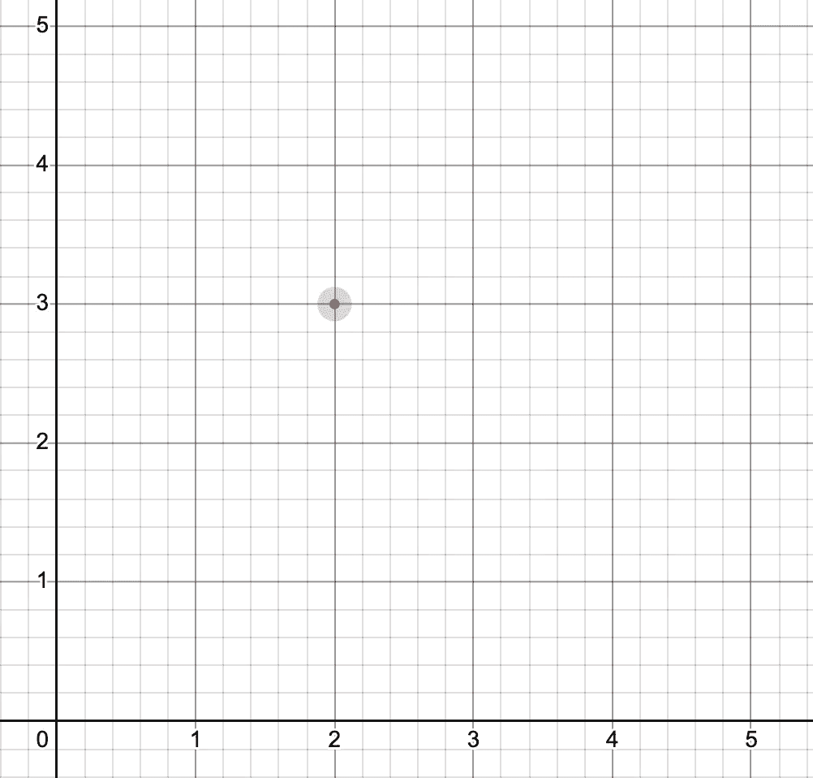
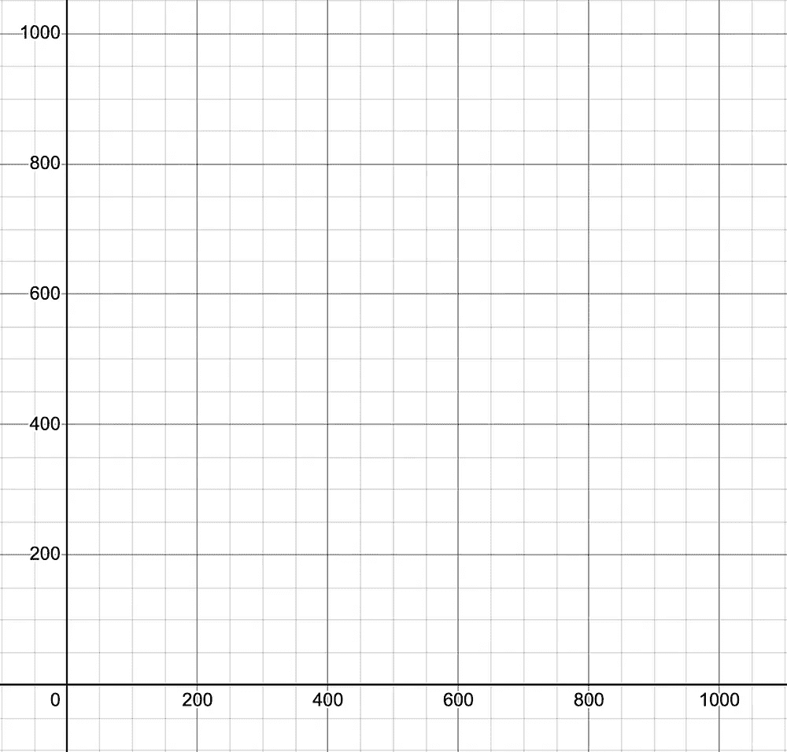
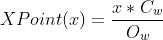
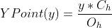
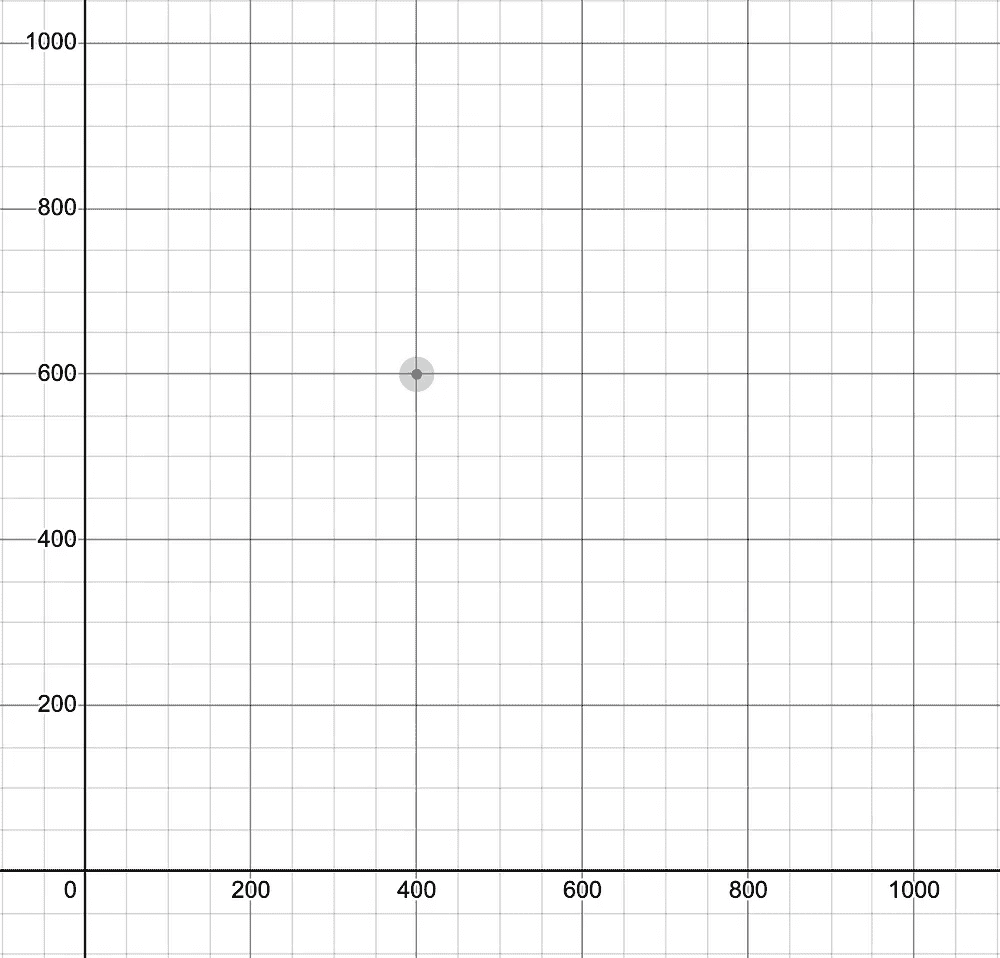
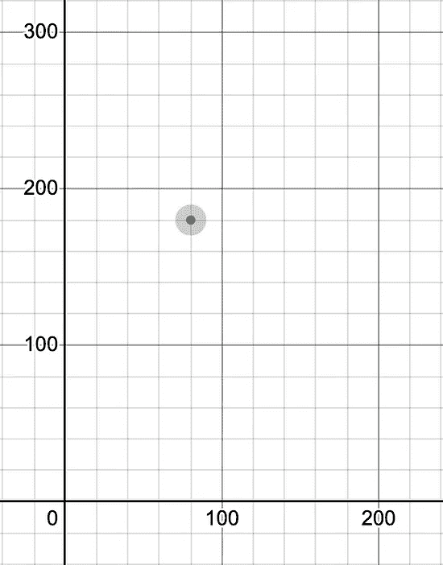
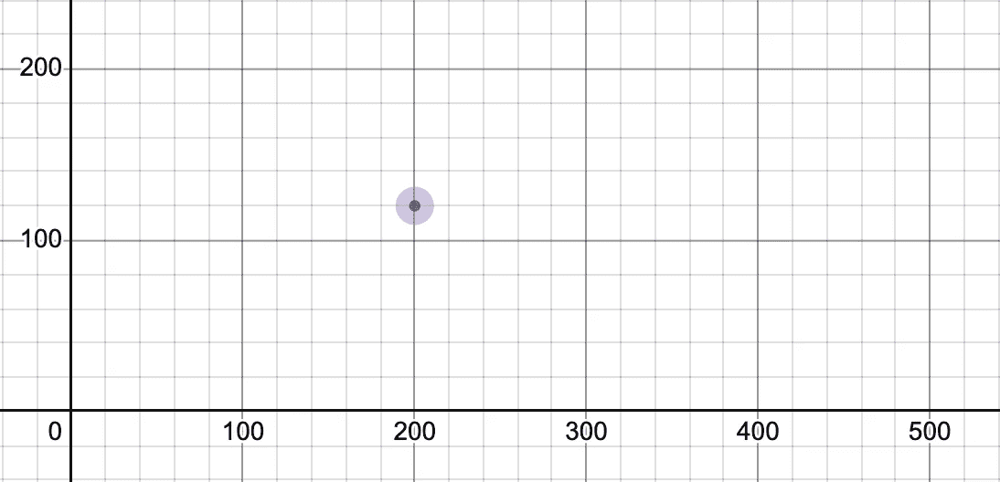
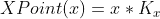
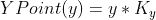

# 根据不同的帧大小计算相对点

> 原文：<https://blog.devgenius.io/calculating-relative-points-from-different-frame-sizes-6d6560615de5?source=collection_archive---------20----------------------->

如果你在你的应用程序/网站中使用代码进行绘制，并且窗口小部件/视图/画布的大小并不总是相同，这将有助于你在不同的屏幕尺寸下保持一致！

这篇文章主要是让我快速找到这些信息的一种方法，毕竟，我在桌子附近的一张纸上有这个公式。但是我想把它放在互联网上的某个地方，我想和大家分享它，因为我正在发表一些关于如何用 Swift 进行基本绘图的文章。

我们将使用一个非常简单的例子来更容易理解这些公式在做什么。

## **让我们从一个例子开始**

我用 Figma 做了一个简单的 SVG 形状，然后我开始用代码在上面画画。此外，我的目标是每个点在每个设备中占据相同的相对位置，不管我的屏幕大小是否改变。

好吧。我们的图像是 5x5(宽 x 高)，SVG 的第一个点是点(x: 2，y: 3)。我们想把它转换成一个 1000x1000(宽 x 高)的框架。



展示两种不同尺寸的两张图表

有了方对方的观点，更容易看到我们的点在哪里，但是我们如何计算我们的点应该在哪里呢？

给定原始和新的帧尺寸以及原始点，下面的公式计算新的点应该在哪里。



x 点公式



y 点公式

*   Ow:原始宽度；
*   哦:原来的身高；
*   Cw:当前宽度；
*   Ch:当前高度；
*   X:点的原始 X 位置；
*   Y:点的原始 Y 位置；

这样，你就能得到正确的相对点。利用前面的例子，我们可以计算点数:

```
From frame (5 x 5) to frame (1000 x 1000)
Original point at (x: 2, y: 3)XPoint(2) = x * Cw / Ow = 2 * 1000 / 5 = 400
YPoint(3) = y * Ch / Oh = 3 * 1000 / 5 = 600
```

这样，我们知道我们的点应该在(x: 400，y: 600)。下图用于比较，第一张图是具有原始帧大小的原始点，第二张图是具有我们刚刚计算的点的新帧大小:



不错！我们拿到了。现在，如果我们想将其转换为不同的大小(如 200x300 和 500x200)，我们知道我们的点将始终停留在我们定义的相对点:



200x300 和 500x200 网格(宽 x 高)

略高于一半高度，略低于一半宽度。整洁！

## 还有什么？

你可能已经意识到，在计算它们的时候，有些数据会重复出现。当我们已经有一个原点和原始尺寸时，我们可以简化公式。从我们之前的示例开始，使用网格为 5x5 的点(x: 2，y: 3 ),我们可以预先计算:

```
Kx = 2/5 = 0,4 // x divided by width
Ky = 3/5 = 0,6 // y divided by height
```

因此，在我们的代码中，不是每次都使用除法，然后乘以框架的宽度或高度，而是可以乘以我们刚刚找到的常数，从而将我们的公式简化为:



x 点公式



y 点公式

其中 K 是我们上面计算的常数。

感谢您的阅读！如果你想联系我，请在[推特](https://twitter.com/LuizPedroGuerra)上添加评论或给我发消息！

此外，我没有找到任何关于这个或另一个名称定义这一点的材料。如果你找到了，我很想读一读！