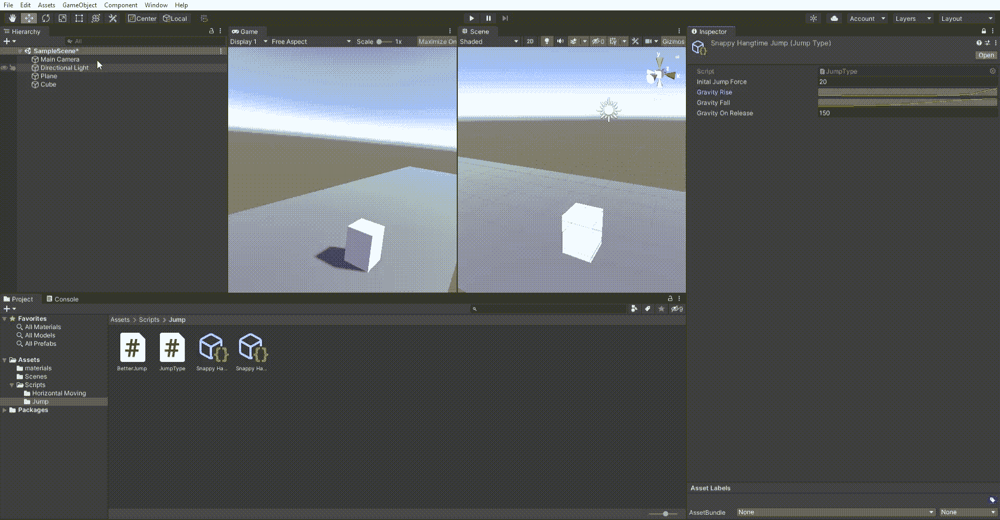

# 计算 Unity 动画曲线下的面积

> 原文：<https://blog.devgenius.io/calculating-the-area-under-an-animationcurve-in-unity-c43132a3abf8?source=collection_archive---------2----------------------->

动画曲线真的很酷，我认为没有足够多的人在谈论它们。这也使得解决与他们相关的问题变得更加复杂。其中一个问题是计算动画曲线下的面积。现在，我喜欢数学，并且已经学了一点。但是我不太喜欢它*那么多*我也没有研究它*那么多……*所以如果你像我一样，这是给你的。



将最大跳跃高度计算为曲线下面积

# TLDR；

为了避免处理疯狂的三次样条和贝塞尔曲线(或者 Unity 内部用于动画曲线的任何东西),你可以做的是将曲线分成许多线性段(步骤)。然后计算这几段的积分之和。根据您的曲线，即使步长相对较小，这也会惊人地接近面积的实际值。给定两点 P0(x0，y0)和 P1(x1，y1 ),计算线性阶梯件下面积的函数为:

```
private float IntegralOnStep(float x0, float y0, float x1, float y1)
    {
        float a = (y1 - y0) / (x1 - x0);
        float b = y0 - a * x0;
        return (a/2* x1*x1 + b*x1) - (a/2 * x0*x0 + b*x0);
    }
```

# 为什么你应该关心

我使用动画曲线做很多变换相关的事情，比如跳跃或者移动。这是因为伟大的*游戏感觉*可以从曲线中产生。例如，跳跃时将重力建模为曲线，或者将加速度控制为曲线。其工作方式是，我们将曲线指定为可以从检查器中设置的参数:

```
[SerializeField] AnimationCurve myAnimationCurve
```

然后在更新函数中，我们可以引用特定时间点的曲线值。通常你想在某个动作发生时设置一个时间戳(比如玩家按下 jump)。它可能看起来像这样:

```
float val = myAnimationCurve.Evaluate(Time.time - timestamp);
```

然后，我们可以根据这个值* Time.deltaTime 来移动玩家。如果你对使用这样的动画曲线来模拟跳跃感兴趣，请查看我关于这个主题的文章:

[](https://gustavcorpas.medium.com/building-a-customizable-jump-in-unity-using-animation-curves-a168a618428d) [## 使用动画曲线在 Unity 中构建可定制的跳转

### 游戏开发非常有趣！但是有多少次你坐下来，脑子里有一个美妙的想法，却从来没有看到…

gustavcorpas.medium.com](https://gustavcorpas.medium.com/building-a-customizable-jump-in-unity-using-animation-curves-a168a618428d) 

假设你现在想知道你在某个时间段内移动了多少。你需要曲线下的面积。在你一开始看到的 gif 图片中，我用这些原则计算了玩家在给定曲线下达到的最大跳跃高度。另一件很酷的事情是在编辑器中使用 **OnDrawGizmosSelected()** 来可视化它。网上有很多关于这方面的信息，所以我不会在这里集中讨论——但是如果这是你第一次听说，你应该去看看，太棒了！

# 计算

如前所述，我们用大量的直线段来近似动画曲线的面积。我们需要选择每个片段的大小。我们称之为步长(0.05f 的值**似乎足够好，0.001f 的值**如果你想要更高的精度)。****

第一步是在动画曲线上找到两个点

```
P0(0, myanimationcurve.Evaluate(0)) and 
P1(stepsize, myanimationcurve.Evaluate(stepsize))
```

我们希望找到这些点所在的线性函数( *y = ax + b* )。我们发现 a(斜率)=(T2 的变化 y)/(T4 的变化 x )或者:
***a =(y1-y0)/(x1-x0)*。**

为了找到*b*(*y*-值，其中 *x* 为 0)您可以想象从一个点 P 减去斜率，即 *a* ， *x* 次，通过线性函数向后移动，直到我们回到 *x* 为 0:

***b = y0 - a * x0***

现在我们有了线性函数，我们需要找到它下面 *x0* 和 *x1* 之间的区域。为此，我们可以对函数进行积分，即面积=积分( *ax +b* )。这样做有一些积分规则，但我们想找到一些函数，当*微分*给出 *ax + b* 时。原来这个函数是这样的:***F(x)= a/2 * x+b * x .***

现在我们可以找到点之间的面积*，就像这样: *F(x1) - F(x0)。* ***(a/2 *(x1)+b * x1)-(a/2 *(x2)+b * x0)。****

将此与一个 *for 循环*结合起来，得到从 0 到某个秒数的面积，如下所示:

```
float sum = 0;
for (int i = 0; i < 1 / stepsize; i++){
     sum += IntegralOnStep(
                 stepsize * i, 
                 mycurve.Evaluate(stepsize * i), stepsize * (i + 1),                                                                                                                                     
                 mycurve.Evaluate(stepsize * (i + 1))
             );
}
private float IntegralOnStep(float x0, float y0, float x1, float y1)
    {
        float a = (y1 - y0) / (x1 - x0);
        float b = y0 - a * x0;
        return (a/2* x1*x1 + b*x1) - (a/2 * x0*x0 + b*x0);
    }
```

或者你可以用其他方式使用它。计算跳跃高度、跑步距离等。

我希望这能引起你的兴趣。干杯！