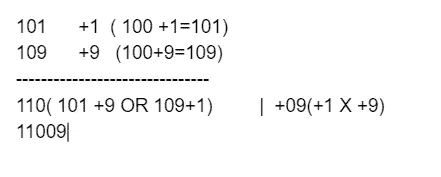

# 使用吠陀数学的计算

> 原文：<https://blog.devgenius.io/calculation-using-vedic-mathematics-abe4b7d55770?source=collection_archive---------11----------------------->

## 快速乘法和平方计算

克里斯蒂安·格雷库在 [Unsplash](https://unsplash.com/?utm_source=unsplash&utm_medium=referral&utm_content=creditCopyText) 上的照片

下面是一些有用的技术，可用于快速计算。

# 增加

> N ***数字更接近于 10 或其幂，如 100、1000 等。***

ex 92X98 或 107*108

***第一个例子— 92 X 98:数字更接近 100。下面是*的步骤**

1.  取差(即 92–100 =-8 和 98–100 =-2)
2.  将步骤 1 -8 中的差值乘以 X -2 = +16
3.  因为我们使用基数为 100，所以保持 16 不变。
4.  减去一个数与另一个数的差，即 92–2 或 98–8 = 90。
5.  作为 100 的基数，我们可以直接使用 90
6.  最终结果将是并排书写，即 9016

***第二个例子— 97 X 98:数字更接近 100。下面是*的步骤**

1.  取差(即 97–100 =-3 和 98–100 =-2)
2.  将步骤 1 -3 中的差值乘以 X -2 = +6
3.  因为我们用基数 100 写 06
4.  减去一个数与另一个数的差，即 98–3 或 97–2 = 95。
5.  作为 100 的基数，我们可以直接用 95
6.  最终结果将是并排写入两者，即 9506

***第三个例子— 101X 109:数字更接近 100。下面是*的步骤**

1.  取差(即 101–100 =+1 和 109–100 =+9)
2.  将步骤 1 中的差值乘以(+1) X (+9)= +9
3.  因为我们用基数 100 写 09
4.  减去一个数与另一个数的差，即 101+9=110 或 109+1 =110。
5.  作为 100 的基数，我们可以直接使用 110
6.  最终结果将是两者并排书写，即 11009

> n 个***2 位数、3 位数或 4 位数***

假设数字是 abc 和 xyz，其中 a 到 f 代表数字

**所以 abc(132)和 xyz(509)的乘法可以通过下面的**来完成

1.  a * x | a * y+x * b | a * z+b * y+c * x | b * z+y * c | c * z
2.  对于上面的例子，步骤 1 中的计算将是-5 | 15 | 19 | 27 | 18
3.  从右到左——写下第一个数字，并将其他数字带到下一组
4.  所以对于 18——写 1，然后结转 8。所以第一个数字是 8
5.  加 1+27= 28。写 8，进位 2。所以最后两个是 88
6.  加 2+19=21。写 1 并携带 2。所以最后三个是 188
7.  加 2+15=17。写 7，进位 1。所以最后四个是 7188。
8.  加 1+5=6。答案是 67188

> ***乘以 11***

假设我们想要 45 *11 的倍数。我们需要的步骤是

1.  将 45 分成两部分 4|5
2.  加 4+5=9
3.  在中间加上这个 4|9|5= 495

# **数字的平方**

> 以 5 结尾的数字

假设我们想得到 65 的平方。这些步骤是

1.  乘以 5*5 = 25(它给出最后两位数)
2.  取第一个数字，即 6。加 1，然后乘以原来的数字。
3.  在这种情况下，它将是 6 * (6+1)= 6*7=42
4.  答案将是 42|25= 4225。

> 50 左右的数字不以 5 结尾

假设我们想要 48 平方。这些步骤是

1.  48= 50–2
2.  取 50，做 5 的平方= 25
3.  25 减去 2 = 25–2 = 23
4.  现在用 50 ie 2 减去数字的平方。平方将是 4
5.  最终答案将是 2300+4=2304

**对于系统设计，机器学习博客在介质上遵循**[**anantech . ai**](https://smverma.medium.com/)**。**