# 暂停函数和流的回调函数(第 1 部分)

> 原文：<https://blog.devgenius.io/callback-function-to-suspend-function-and-flow-part-1-c17e2e523a18?source=collection_archive---------3----------------------->

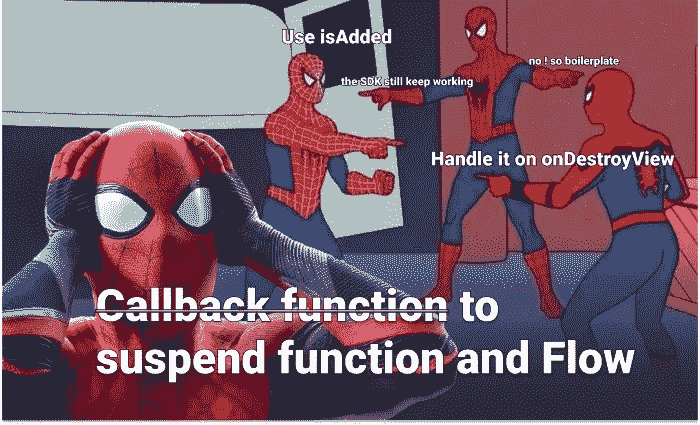

大多数库都实现了协程，它让我们开发更容易、更安全、更符合语法的代码。然而，一些 SDK 或项目功能还没有实现协程。在本文中，我们将把它们迁移到挂起功能和流。

我敢打赌，每个开发人员都遇到过要么片段 AbcFragment 没有附加到活动，要么 NullPointerException 基于上下文的东西。如果你在处理回调的话，在比赛条件下思考和发展是非常困难的。此外，如果你试图并行处理更多的回调，它会变成火箭科学，但我们不是在建造火箭，所以让我们摆脱样板，难以理解的回调。

我将这篇文章分成两部分，但是我们将不得不在这一部分讨论何时使用**暂停函数**或**流**。

事实上，很容易理解如果回调只返回一次数据，你应该选择暂停函数，否则你的回调会多次发出数据。

下面是**暂停功能**和**流程**使用示例；

**暂停功能**

*从 Restful api 获取数据*

*从 LocationApi 获取一个时间位置*

*获取繁重任务的输出，如查看位图、数学计算等。*

*从 Firebase Auth 获取用户令牌*

*将数据保存到文件或从文件中读取*

**流**

*持续获取用户位置*

*从 Socket 获取货币或每次从 Restful API 获取货币*

*从硬件获取传感器数据*

正如你所看到的，很明显，当你想获得数据并继续时，你应该选择暂停功能，不像暂停功能，你想让数据作为一个流，你应该选择流。

# 理解为什么我们应该使用协程

在直接进入最佳解决方案之前，我们必须看到并理解为什么其他解决方案没有效率。我认为这是理解我们为什么应该使用协程的最好方式。

为了理解和解决这个问题，让我们创建我们的超级简单的 SDK。

如您所见，在给定的假持续时间(3 秒)后发出值。

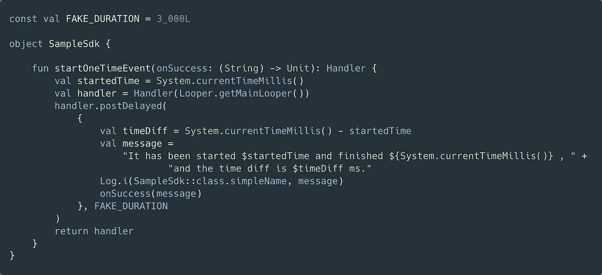

这是视图端的实现。

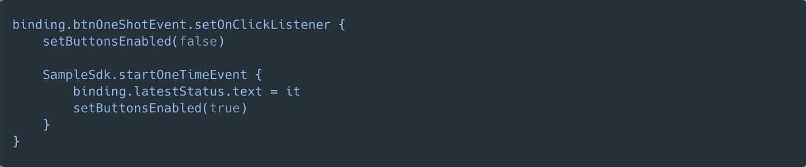

让我们试试吧

很好用吧？但是，如果用户不等待结果就关闭第二个片段，会发生什么呢？

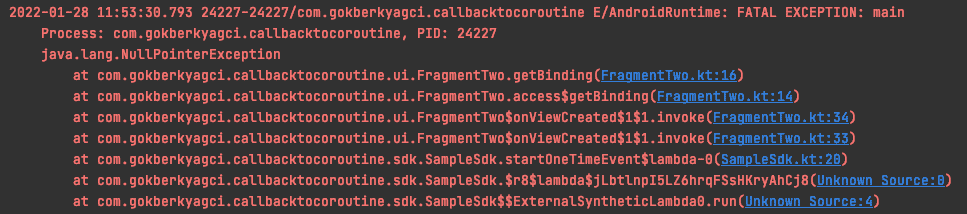

呃，有一个问题是在 FragmentTwo 被销毁后回调会发送结果，那么我们该如何解决这个问题呢？

有解决办法；

**解决方案 1 向 SDK 的回调结果添加 isAdded 条件**

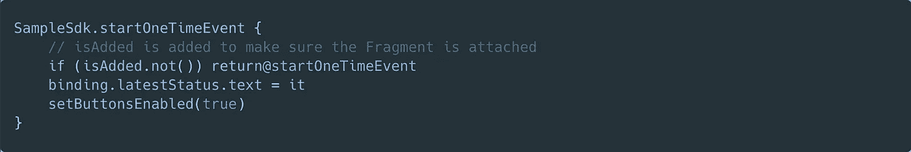

这是修复这类崩溃的一种简单快捷的方法。但是这个解决方案有两个缺点。

1.  开发人员和代码审查人员每次使用 SDK 时都必须记住。
2.  *我们解决了崩溃问题，但 SDK 仍然继续工作，并返回未使用的值，浪费设备资源。*

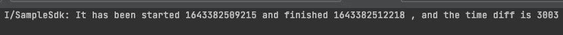

Logcat 输出显示 SDK 的方法继续工作

**解决方案 2 在视图上管理 SDK**

好吧，第一个问题看起来不那么重要，但是第二个问题很烦人，让我们试着解决它。

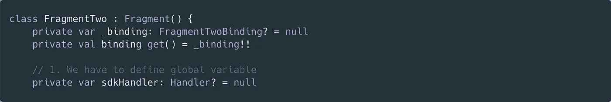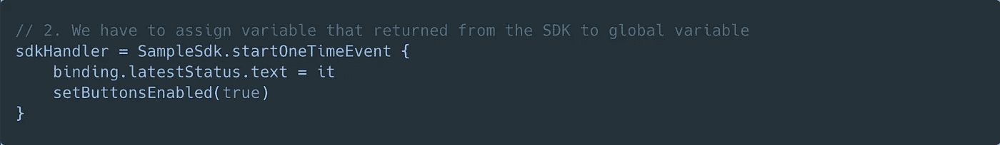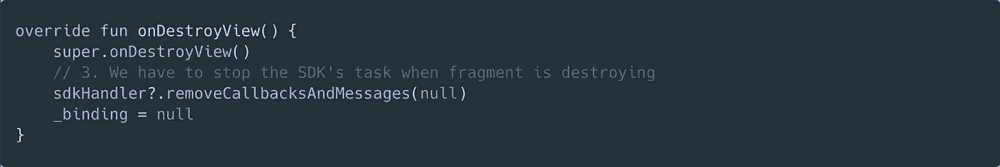

是的，明白了！我们解决了用户设备上的资源浪费问题。然而，这种方法以如此多的样板代码而告终，第一个问题现在看起来如此令人烦恼。

我们试图用传统的方法找到解决办法。我们已经给了 SDK 的管理能力一个视角，但是记住本大叔对蜘蛛侠说的话；

这两种解决方案都在实现 SDK 的视图端承担了很大的责任。但是视图已经有了这么大的责任，那就是绘制和监听视图事件。因此，让我们来减轻这一负担。

如果我们不让蜘蛛侠忙碌起来，他可以用他最好的方式创造更多的英雄事迹..如果我们用图画来观察事物，它可以使工作更加清晰，没有任何问题，对吗？

如果我说有另一种解决方案如此渴望从应用程序的角度或部分角度承担责任，那会怎么样？

是的，我猜你和我想的一样，让我们用协程来实现它。

# 用协程包装回调函数

# **解决方案 3** 挂起协同例程

实现你的回调函数是如此简单，你只需要像下面这样包装它。

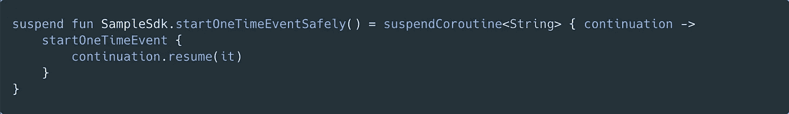

这是我们在视图端的新实现。

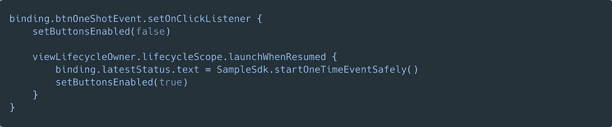

不再有异常和回调。最后，我们修复了它，打算使用它的开发人员不必再注意这些缺陷了。

我们的问题是什么？

1.  *开发人员和代码审查人员每次使用 SDK 时都必须记住。*
2.  *我们解决了崩溃问题，但 SDK 仍然继续工作并返回一个未使用的值，浪费了设备资源。*

是的，我们完全解决了第一个问题。让我们试着看看第二个问题。

Logcat 输出显示 SDK 的方法一直在工作

呃，它还能工作。怎么可能呢？我们如何解决第二个问题？

# 解决方案 4**suspendecancellablecoroutine**

乍一看，Coroutine 的最大优势似乎是使代码更具可读性和安全性。是的，它们当然是强大的优势，但是结构化并发比它们更有优势。

挂起功能必须是协作性的。所有内置的挂起功能都关注并承担开发人员的责任。

举个例子，

如果你查看延迟函数文档，你会发现它并没有阻塞当前线程，并且知道这个取消。

[https://kot Lin . github . io/kot linx . coroutines/kot linx-coroutines-core/kot linx . coroutines/delay . html](https://kotlin.github.io/kotlinx.coroutines/kotlinx-coroutines-core/kotlinx.coroutines/delay.html)

用一个可取消的协程来实现。

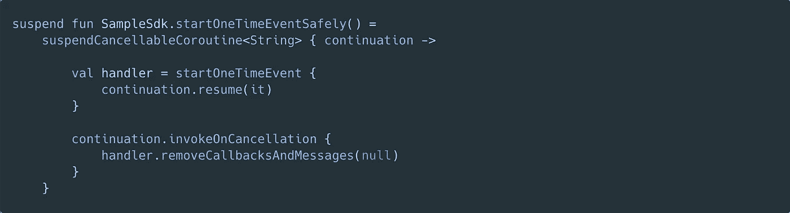

当**一个父作业**被**取消**时，它将取消传播到**子挂起函数**捕捉到**调用取消**并停止 SDK 的任务。并且在视图端与 **suspendCoroutine** 的实现没有区别。

希望对理解协程为什么会发挥作用有所帮助。这是我的教学方法，因为我相信这是理解和记住的最好方法。了解问题所在，然后我们如何以可持续和可靠的方式解决这些问题。

在文章的下一部分，我们将实现**流程**，但是你已经明白了主要的意思。下一篇文章将会尽可能的简短。如果你在评论中遇到困难，请告诉我。