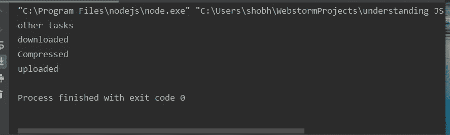

# JavaScript 中的回调

> 原文：<https://blog.devgenius.io/callbacks-in-javascript-dcf32638c2c4?source=collection_archive---------2----------------------->

在这篇文章中，我们将了解什么是回调，以及为什么我们在 JavaScript 中需要回调。

JavaScript 是一种单线程语言。这意味着不同的任务不能同时执行。因此，如果一个任务需要很长时间，比如说(下载一些文件)，那么在下载代码之后提到的所有其他任务都将在这段时间内执行。

我们使用异步 JavaScript(回调、承诺和异步/等待)来系统地执行异步命令。每一种实现异步 java script 的方法都有不同的优缺点。

现在我们将通过下面的例子来理解回调。

这里我们有三个命令

1.  打字开始
2.  打印 mid
3.  印制结束

“mid”仅在 3 秒后打印。让我们看看控制台上的输出

我们观察到 mid 是在 End 之后打印的。这是因为 JavaScript 不会等待 mid 命令，它会处理脚本中指定的其他命令。

现在假设我们正在下载一个文件，首先我们需要下载它，然后压缩它，接着上传它。所以我们将使用下面的代码实现它

所以我们有四个功能上传，下载，压缩和其他任务。

这是输出-

我们观察到，我们的上传和压缩功能甚至在下载发生之前就已经在运行了。

为了解决这个问题，我们使用回调。

这里我们首先调用 download 函数，并将 compress 函数作为参数传递。当下载函数的执行完成时，压缩函数被调用，上传函数作为参数被传递。最后，调用 upload 函数，并且不传递任何其他参数。

我们现在将观察输出-

我们注意到，由于 JavaScript 的性质，与下载无关的其他任务会首先执行。

该文件的所有其他任务都按照我们预期的系统方式执行。

我希望你们喜欢这篇文章。请在这里订阅更多精彩的文章，并请给出一个👏如果你觉得这篇文章信息丰富。