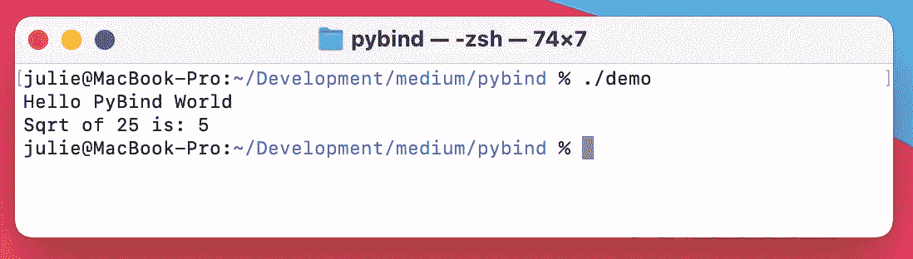
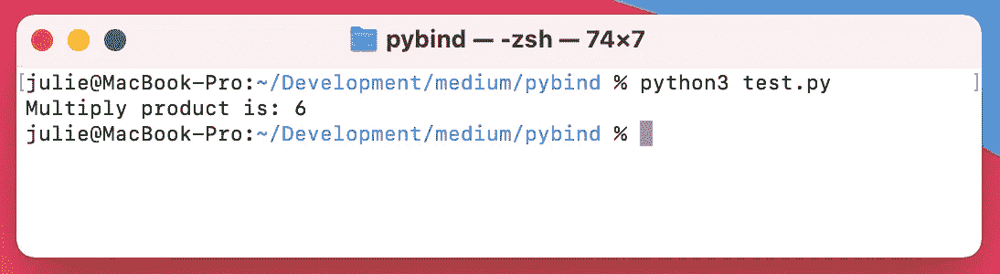

# 使用 PyBind 调用 Python 和 C++代码

> 原文：<https://blog.devgenius.io/calling-python-and-c-code-using-pybind-99ab7fefa685?source=collection_archive---------0----------------------->

## 使用 PyBind11 在 Python 和 C++之间进行调用


由[克里斯托弗·高尔](https://unsplash.com/@cgower?utm_source=unsplash&utm_medium=referral&utm_content=creditCopyText)在 [Unsplash](https://unsplash.com/s/photos/coding?utm_source=unsplash&utm_medium=referral&utm_content=creditCopyText) 上拍摄的照片

你的软件的一个组件是用 C++写的，而另一个组件是用 Python 写的，这种情况有多常见？也许用 Python 编写的函数需要被 C++代码调用，反之亦然？随着软件复杂性的增加，某些特性或组件更适合用不同的语言编写，这可能是一种常见的模式。幸运的是，PyBind11 提供了一种从 C++调用 Python 代码和从 Python 调用 C++代码的简单方法！

PyBind11 是一个只有头文件的库，允许 C++类型在 Python 中公开，反之亦然。本文概述了如何从 C++调用 python 和从 python 调用 C++。

# 1.安装 PyBind

在 MacOS 上，PyBind 可以使用自制软件安装

```
> brew install pybind11
```

在其他平台上，可以使用 pip 安装 PyBind

```
> pip install pybind11
```

# 2.从 C++调用 Python

假设我们想从 C++代码中调用 python。这可以通过将 pybind11 库包含到 C++源文件中来实现。

下面是一个示例`CMakeLists.txt`文件，如果使用 [cmake](https://cmake.org/) 构建 C++应用程序，可以使用该文件。

CMakeLists.txt

现在创建将调用 python 代码的 cpp 源文件。在将 pybind11 名称空间声明为`py`之后，可以使用`py::module::import`调用导入数学模块。python 调用返回的输出是一个`py::object`对象，然后可以将其转换为所需的输出类型，在本例中是一个浮点型。本例中调用的 python 代码是:

```
import math
math.sqrt(25)
```

演示. cpp

通过运行`make`编译 C++代码。运行`demo`可执行文件将产生以下输出:



# 3.从 Python 调用 C++

考虑这样一个场景，需要从 python 调用一个 C++函数。第一步是写出 C++函数，并使用`PYBIND11_MODULE`宏将该函数包装在 python 绑定中。

示例. cpp

下面是一个示例`CMakeLists.txt`文件。该文件将创建在导入绑定时使用的`example.so`目标。

CMakeLists.txt

通过运行`make`编译 C++代码。

python 现在可以使用`example`模块和`multiply`函数了。确保`example.so`文件与 python 文件在同一个目录中，或者在 python `PATH`中。

创建一个将导入`example`模块的`test.py` python 文件:

测试. py

运行 test.py:



# 结论

Pybind11 是一个强大的库，用于创建 python 绑定，从 python 调用 C++代码，从 C++调用 python。希望这份循序渐进的指南能让 PyBind 的入门变得更容易！