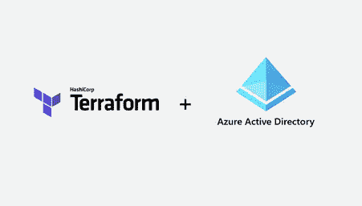
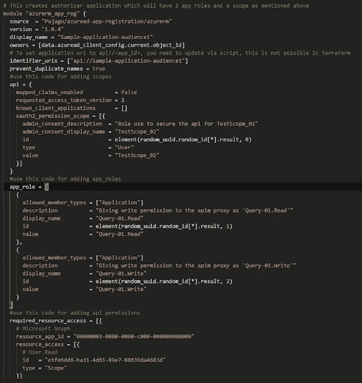
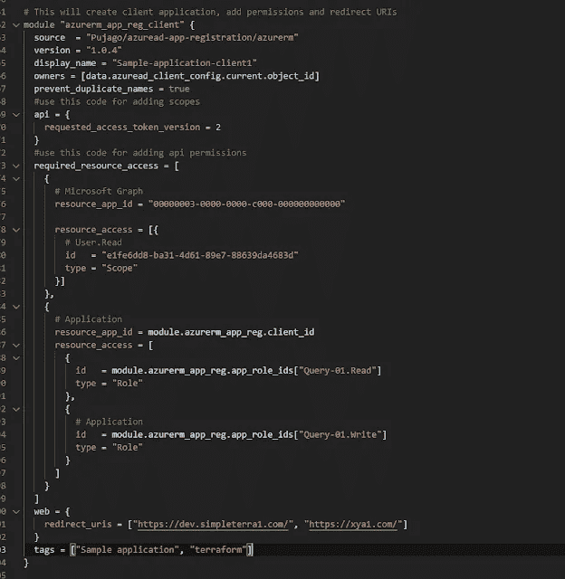
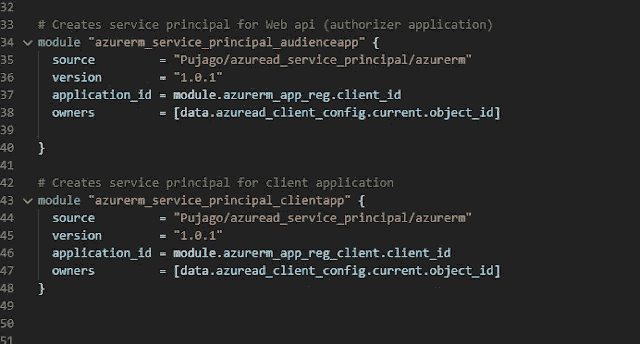
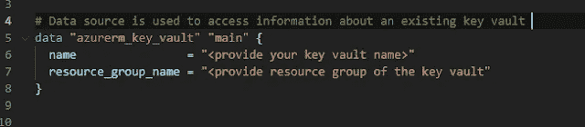
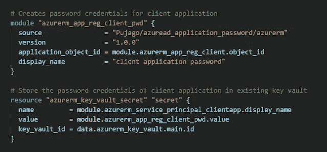
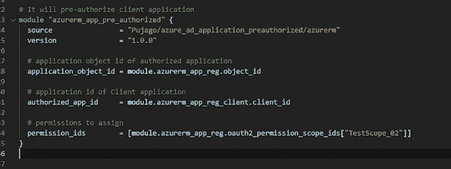

# 为 Azure Active Directory (azuread)调用 Terraform 模块

> 原文：<https://blog.devgenius.io/calling-terraform-modules-for-azure-active-directory-azuread-3f89e4404d22?source=collection_archive---------11----------------------->

Terraform Azure 提供商

Terraform 是最受欢迎的开源“基础设施即代码”工具之一，支持许多云提供商，如 AWS、Azure、Google Cloud 等。有了 terraform 模块，我们可以轻松地创建可重用的基础设施。

Azure AD Terraform 提供程序可以将用户、组、服务主体和应用程序作为代码进行管理。

注意:本文假设你非常熟悉 Terraform 和 Azure AD。

我为以下 azure ad 资源创建了模块，以管理 Azure Active directory 中的应用程序和服务主体:

**azuread_application** —管理 Azure Active Directory 内的应用程序注册。

**以上模块链接:**

[https://registry . terraform . io/modules/puja go/azuread-app-registration/azure RM/latest？tab =输入](https://registry.terraform.io/modules/Pujago/azuread-app-registration/azurerm/latest?tab=inputs)

**azuread _ application _ password**—管理与 Azure Active Directory 中的应用程序相关联的密码凭据。在身份验证过程中，这些也称为客户端机密。

**上述模块的链接:**

[https://registry . terraform . io/modules/puja go/azuread _ application _ password/azure RM/latest？tab =输入](https://registry.terraform.io/modules/Pujago/azuread_application_password/azurerm/latest?tab=inputs)

**azuread _ application _ pre _ authorized**—管理预先授权了指定权限的客户端应用程序，无需用户同意即可访问应用程序的 API。

**上述模块的链接:**

[https://registry . terraform . io/modules/puja go/azure _ ad _ application _ pre authorized/azure RM/latest？tab =输入](https://registry.terraform.io/modules/Pujago/azure_ad_application_preauthorized/azurerm/latest?tab=inputs)

azuread _ service _ principal—管理与 Azure Active Directory 内的应用程序相关联的服务主体。

**上述模块的链接:**

[https://registry . terraform . io/modules/puja go/azuread _ service _ principal/azure RM/latest？tab =输入](https://registry.terraform.io/modules/Pujago/azuread_service_principal/azurerm/latest?tab=inputs)

我已经创建了 Terraform 代码库来使用上面的模块来创建应用程序(在最后提供了 GitHub 的链接)、范围、应用程序角色、重定向 URIs、服务主体、密码凭证、预授权客户端应用程序和 API 权限。

该代码创建了以下场景:

# 创建授权者应用程序(web API /受众应用程序)

授权人应用程序将创建:

1.  **应用程序角色**为“查询-01”。阅读`和`查询-01。写`字
2.  **oauth 2 _ permission _ scope**` test scope _ 01 '
3.  Microsoft Graph“user . read”权限
4.  标识符 uri(#将应用程序 uri 设置为 api// <app_id>，需要通过脚本更新，这在 terraform 中是不可能的)</app_id>

下面的代码片段使用 terraform 模块创建观众应用程序:

[https://registry.terraform.io/modules/Pujago**/azuread-app-registration**/azurerm/latest？tab =输入](https://registry.terraform.io/modules/Pujago/azuread-app-registration/azurerm/latest?tab=inputs)

# 创建授权的应用程序(客户端应用程序)

客户端应用程序将创建:

1.  授予客户端应用程序访问上面创建的 web API 的应用程序权限
2.  Microsoft Graph 用户。读取委托权限
3.  重定向 URIs 或回复 URIs，授权服务器在应用程序成功授权并获得授权码或访问令牌后发送给用户。授权服务器将代码或令牌发送到重定向 URI，因此在应用程序注册过程中注册正确的位置非常重要。

下面的代码片段使用相同的 terraform 模块创建客户端应用程序:

[https://registry.terraform.io/modules/Pujago/**azuread-app-registration**/azure RM/latest？tab =输入](https://registry.terraform.io/modules/Pujago/azuread-app-registration/azurerm/latest?tab=inputs)

# 为授权者和授权应用程序创建服务主体

受众和客户端应用程序的服务主体是使用模块创建的:

[https://registry.terraform.io/modules/Pujago/**azuread _ service _ principal**/azure RM/latest？tab =输入](https://registry.terraform.io/modules/Pujago/azuread_service_principal/azurerm/latest?tab=inputs)

# 为客户端(授权)应用程序创建密码凭据

**为客户端应用程序创建密码凭证并存储在现有的密钥库中**

数据源用于访问有关现有密钥库的信息，代码片段用于创建密码凭据并将密码存储在密钥库中。使用模块创建密码凭据:

[https://registry.terraform.io/modules/Pujago/**azuread _ application _ password**/azure RM/最新？tab =输入](https://registry.terraform.io/modules/Pujago/azuread_application_password/azurerm/latest?tab=inputs)

# 预授权客户端(授权)应用程序

客户端应用程序可以进行预授权，下面的代码片段完成了必要的使用模块:

[https://registry.terraform.io/modules/Pujago/**azure _ ad _ application _ 预授权/**azure RM/最新？tab =输入](https://registry.terraform.io/modules/Pujago/azure_ad_application_preauthorized/azurerm/latest?tab=inputs)

请随意从我的 GitHub 库下载代码，网址是:

【https://github.com/Pujago/Terraform_Calling_module_azuread 

*原载于*[*https://www.leogether.com*](https://www.leogether.com/2022/01/terraform-modules-azuread-app.html)*。*