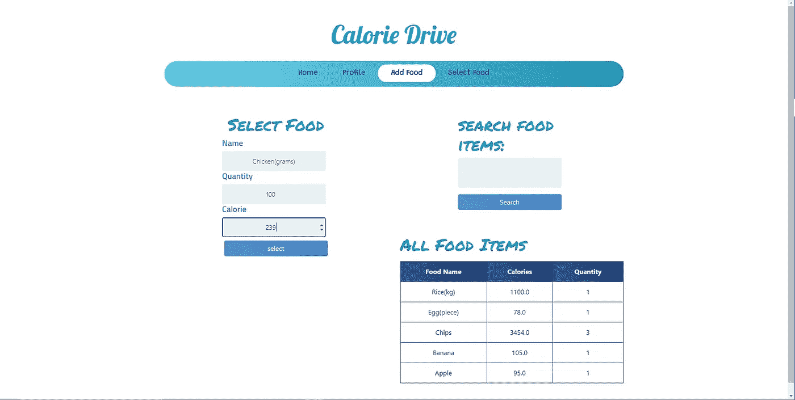

# 使用 Python Django 框架的卡路里跟踪器应用程序

> 原文：<https://blog.devgenius.io/calorie-tracker-app-with-python-django-framework-cc86dc2046e8?source=collection_archive---------0----------------------->


布鲁克·拉克在 [Unsplash](https://unsplash.com?utm_source=medium&utm_medium=referral) 拍摄的照片

保持健康的生活方式已经成为本世纪主要关注的问题之一。根据 2016 年世卫组织的数据，超过 19 亿 18 岁及以上的成年人超重。其中超过 6 . 5 亿人肥胖。随着今年新冠肺炎疫情的爆发，已经证明新冠肺炎对肥胖人群更致命。因此，定期锻炼和健康饮食是人们正在研究的一件重要事情。考虑到这一点，我想用 python Django 制作一个卡路里追踪器怎么样。我已经自学 Django 有一段时间了，所以我认为这将是一个很好的项目来提高我的 Django 技能，而不是跟随项目教程。关于其他事情说得够多了，让我们进入编码部分。这对于 django 初学者来说可能有点难，所以 django 的基础知识将有助于理解。

**要求:**

*   Python(我用的是 3.8.2 版本)
*   Django(我使用的是 3.1 版本)
*   姜戈过滤器

**项目设置:**

我在视窗操作系统上做过这个项目。如果你是在 Mac 或 Linux 上，这个过程几乎是相同的，只是命令行有一些变化，你可以很容易地从互联网上找到。从命令行转到计算机上您喜欢的位置并启动。

```
mkdir calorieapp
cd calorieapp
```

现在，让我们建立 django 项目。我会尽量保持简短，因为你可以很容易地找到设置 django 项目的教程。

```
pipenv install django
pipenv shell(calorieapp-kub3HwmJ) django-admin startproject calorie_app .(calorieapp-kub3HwmJ)python manage.py startapp calories
```

现在让我们安装 django-filter 包，我们稍后会用到它。

```
(calorieapp-kub3HwmJ) pip install django-filter
```

现在在 settings.py 文件中添加应用程序

```
INSTALLED_APPS = [
    'django.contrib.admin',
    'django.contrib.auth',
    'django.contrib.contenttypes',
    'django.contrib.sessions',
    'django.contrib.messages',
    'django.contrib.staticfiles', 

    'calories.apps.CaloriesConfig',
    'django_filters'
]
```

根据您的位置更改时区，您可以在 settings.py 的底部找到。

```
TIME_ZONE = 'Asia/Dacca'
```

现在添加模板文件夹来存储项目的所有模板，我们还需要一个静态文件夹来存储静态文件，如 CSS/JS。

```
(calorieapp-kub3HwmJ) C:\Users\User\Desktop\calorieapp>mkdir templates
(calorieapp-kub3HwmJ) C:\Users\User\Desktop\calorieapp>mkdir static
```

settings.py 文件中需要一个调整，让 django 知道使用我们上面创建的文件。更改“DIRS”并在底部添加静态文件位置。

```
TEMPLATES = [
    {
        'BACKEND': 'django.template.backends.django.DjangoTemplates',
        'DIRS':[os.path.join(BASE_DIR,'templates')], #new
        'APP_DIRS': True,
        'OPTIONS': {
            'context_processors': [
                'django.template.context_processors.debug',
                'django.template.context_processors.request',
                'django.contrib.auth.context_processors.auth',
                'django.contrib.messages.context_processors.messages',
            ],
        },
    },
]STATICFILES_DIRS = [os.path.join(BASE_DIR, 'static')] #new
```

好了，我们无聊的设置结束了，让我们进入有趣的编码部分。


照片由 [Faisal M](https://unsplash.com/@heyfaisal?utm_source=medium&utm_medium=referral) 在 [Unsplash](https://unsplash.com?utm_source=medium&utm_medium=referral) 上拍摄

从 calorie_app/urls.py 文件开始，我们将连接“卡路里”应用程序的 URL。

```
from django.contrib import admin
from django.urls import path,includeurlpatterns = [
    path('admin/', admin.site.urls),
    path('', include('calories.urls')),
]
```

**型号:**

现在转到 calories/models.py 文件并为项目设置模型。

这里我们做了三个模型。我将描述每个模型类的功能。

**食物:**

这个模型用于存储用户想要的所有食物。每个用户都被连接起来，这样用户就可以拥有自己选择的食物库存。

**简介:**

这是主模型，存储了用户跟踪卡路里所需的所有数据。我们有像 calorie_count 这样的字段，用于计算每天的卡路里，food_selected 用于用户选择消费的食物，calorie_goal 用于设置每天的卡路里消耗目标。日期字段用于记录每天的卡路里消耗量。最后一个字段是 all_food_selected_today，用于存储一天中消耗的所有食物。该字段通过一个直通参数连接到 PostFood 类。我将在 views.py 部分解释原因。最后，在通过覆盖模型中的 save 方法保存每个模型实例之前，我执行了一些计算。在这里，每次选择食物时，都会创建 PostFood，并通过一个直通字段连接到 all_food_selected_today。

**后置食物:**

该模型用于与 Profile 类中的 all_food_selected_today 字段的直通连接。它将用于跟踪用户消费的所有食物。更多信息请访问我们的 views.py 部分。

为了使所有的模型在管理仪表板中可见和可访问，我们需要更改 calories/admin.py

```
from django.contrib import admin
from .models import Food,Profile,PostFood
# Register your models here.
class ProfileAdmin(admin.ModelAdmin):
    readonly_fields = ('date',)admin.site.register(Food)
admin.site.register(Profile)
```

现在我们需要迁移我们的数据库。在命令行中

```
python manage.py makemigrations calories
python manage.py migrate
```

**姜戈信号:**

Django signal 是 Django 为我们的项目提供的一个很酷的特性。我以前不知道它，在搜索一个问题后，我在 django docs 中发现了它。事情是这样的，我们每天都要定义一个概要文件模型实例，所以当用户在数据库中注册时，我们也要自动创建一个概要文件实例。姜戈信号的力量来了。首先，让我们在 calories 文件夹中为 signals 创建一个文件，并将其命名为 signals.py

```
from django.db.models.signals import post_save
from django.contrib.auth.models import User
from .models import Profile
def create_profile(sender,instance,created,**kwargs):
    if created:
        Profile.objects.create(person_of=instance)
        print("profile created")post_save.connect(create_profile,sender=User)
```

我们在代码上方导入 post_save、User 和 Profile 模型。简单来说，django 信号在某个东西被改变/创建/删除的时候做某件事情/发送信号。在我们的例子中，这个东西就是我们的用户模型。我们使用 post_save 是因为我们想在用户保存到数据库后做一些事情。这里 create_profile 接受发送者、实例和创建者的参数。Sender 是发送信号的模型，instance 是模型的条件，created 是检查模型是先更新还是先创建。最后，我们通过向 post_save.connect 方法提供参数来连接您的信号。你可以在 django 官方文档中找到关于它的其他信息。为了让信号工作，我们需要在 calories/apps.py 文件中添加两行代码

```
from django.apps import AppConfigclass CaloriesConfig(AppConfig):
    name = 'calories'
    def ready(self): #new
        import calories.signals #new
```

**表格:**

表单是 django 的重要组成部分。对于这个项目，我们需要 4 个表格。所有这些都是在 django forms 的帮助下完成的。首先在 calories 文件夹中创建一个文件，将其命名为 forms.py

我将逐一介绍这些表格。

*   **CreateUserForm:** 用于注册用户。
*   **SelectFoodForm:** 这个用于用户选择他们消费的食物，并希望跟踪。需要注意的一点是在 __init__ 被覆盖的最后。原因？那么，供选择的食物查询集必须是用户添加的食物。所以我们通过 Food . objects . filter(person _ of = user)来过滤食物对象。
*   AddFoodForm: 这是一个简单的表单，用户可以通过它添加食物。所取的字段是名称、数量和卡路里。
*   **ProfileForm:** 另一个简单的表单，用于接收用户关于他们当天卡路里目标的输入。

**过滤器:**

一开始，如果你记得我们安装了 django-filter。现在是使用它的时候了。为了让用户更容易搜索他们添加的食物，我决定添加过滤器。首先，在卡路里文件夹中创建一个文件名 filters.py。然后添加以下代码。

```
import django_filters
from django_filters import CharFilter
from .models import *class FoodFilter(django_filters.FilterSet):
    food_name = CharFilter(field_name = 'name',lookup_expr =      'icontains',label='search food items')
    class Meta:
        model = Food
        fields = ['food_name']
```

Django filter 为我们提供了一个过滤模型的简单选项。这里我按名称过滤了所有的食物。如果你想了解更多关于 django-filters 的信息，你可以从[这里](https://django-filter.readthedocs.io/en/stable/)了解。

**视图:**

现在是项目的一个重要部分。我们的视图将显示在模板中。以下是我们的观点. py

和表格一样，我将对所有的观点做一个简短的介绍。另一件事是我使用 django decorators 让所有的页面只对登录用户可用。

*   **HomePageView:** 这是针对主页上的视图。我们在模型部分提到，我们将每天制作一个简介。因此，为了获得最新的配置文件，我们需要最后一个配置文件对象。然后是每天创建一个个人资料的逻辑。今天的日期与上一个档案的日期一致。如果更大，我们创建一个新的配置文件。现在有趣的部分来了。做这个项目时，我被这个问题难住了。问题是显示用户在一天内选择的所有食物。在 django ManyToMany 关系中，如果您选择了重复的项目，那么在查询时它会将重复的项目显示为只有一个项目。因此，用户每天吃两次鸡蛋，然后分别插入，那么它将只显示一次插入。经过许多困难和搜索互联网，stack-overflow(❤)一段时间以来，我通过在许多关系中的争论了解了姜戈。它挽救了这一天。这在 django 官方文件中很容易解释。你可以在这里查看。我制作了另一个模型 PostFood，并通过参数将它连接到 all_food_selected_today 字段。然后，我可以轻松地查询一天中选择的所有食品。最后，有一些关于卡路里的基本计算，并将其传递给上下文。
*   **注册页面:**注册新用户的简单视图。
*   **LoginPage:** 登录页面的另一个简单视图。
*   **注销页面:**用于注销的视图。
*   **选择 _ 食物:**该视图用于食物选择。在食物选择过程中，我们希望向用户显示他们注册的所有食物。所以我们查询出用户注册的所有食品。然后选菜的表格就传了下去。
*   **add_food:** 该视图用于用户注册食物。像 select_food 一样，我们还传递了所有已经注册的食物，以及我们之前制作的用于过滤食物的过滤器。最后，传递了 AddFoodForm。
*   **update_food:** 用于更新已注册的食品。有时用户可能感觉需要更新食物状态，如卡路里、数量。
*   **delete_food:** 随着更新，用户也可能觉得需要删除某些食物。
*   **个人资料页面:**最后是个人资料主页面。它将显示所有登记的食物，输入当天的卡路里目标，记录过去 7 天的卡路里消耗。为了查询过去 7 天的记录，我使用了 timedelta 函数。使用 timedelta 可以找到 1 周前的日期。然后我们通过 date_gte 和 date_lt 过滤概要文件对象。

所以我们的观点部分结束了。我们最不需要的是视图显示的模板。这部分我不打算解释，因为你可以设计和使用前端作为你的喜好。我用了一些简单的 HTML，CSS 和 bootstrap 进行设计。如果你想看的话，我会在最后链接 github 库。

**网址:**

现在我们只需要将您的视图连接到适当的 url 路径。为此，我们需要一个 urls.py 文件，将该文件放在卡路里文件夹中。然后在卡路里/urls.py 文件中

```
from django.urls import pathfrom .views import HomePageView,LoginPage,LogOutPage,select_food,add_food,RegisterPage,ProfilePage,update_food,delete_foodurlpatterns = [
 path('', HomePageView,name='home'),
 path('login/',LoginPage,name='login'),
 path('logout/',LogOutPage,name='logout'),
 path('select_food/',select_food,name='select_food'),
 path('add_food/',add_food,name='add_food'),
 path('update_food/<str:pk>/',update_food,name='update_food'),
 path('delete_food/<str:pk>/',delete_food,name='delete_food'),
 path('register/',RegisterPage,name='register'),
 path('profile/',ProfilePage,name='profile'),
]
```

要运行我们的本地服务器并进行测试，我们只需要运行

```
python manage.py runserver
```

这是网站上的一些图片。



添加食物页面


选择食物页面


主页


个人资料页面

我们的项目完成了。希望我能帮助别人学到一些新东西。如果你有任何建议，请提出来。这里给出了这个项目的 Github 库[。](https://github.com/Tanmoy-Sarkar/Calorie-Counter-App)