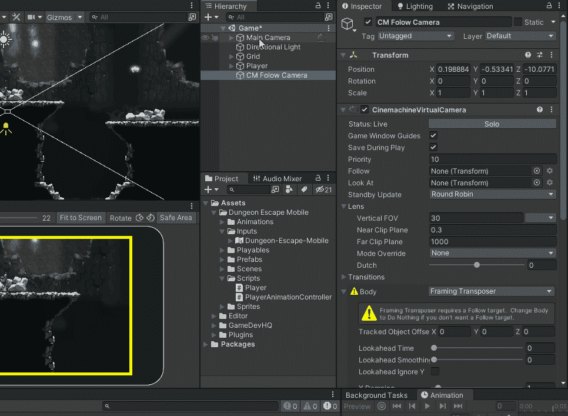

# Unity 中的摄像机跟随系统

> 原文：<https://blog.devgenius.io/camera-follow-system-in-unity-5dd18f3e6818?source=collection_archive---------3----------------------->

## 使用 Cinemachine 跟踪玩家

有许多方法可以设置虚拟相机在游戏中使用。要查看所有可用的不同设置，只需看一下文档。

大多数 2D 游戏使用相机的正交视图。我正在使用透视视图来创建一个视差效果。

有几种不同的虚拟相机可供我使用。我将使用 2D 虚拟相机。列表中的所有相机都是虚拟相机，已经应用到虚拟相机的设置取决于您选择的相机。这也给主摄像头增加了一个 Cinemachine 大脑，它告诉摄像头使用活动虚拟摄像头的设置。

虚拟相机也改变了它在我的场景中的位置，所以我需要改变一些设置来让相机看起来和以前一样。我需要做的第一件事是添加一个玩家作为跟踪的目标。我还确保我使用的是身体的**取景移位器，并且目标设置为什么也不做(2D 相机已经这样设置了)。**

****

**我的相机现在会在游戏中跟随玩家，但是它不是在我喜欢的位置，相机现在位置太低了。**

**有两个主要设置会影响摄像机的位置。跟踪偏移和摄像机距离。我希望相机在-10，距离玩家 10 个单位，所以我将保持它的设置。我希望我的相机在 Y 轴上的初始位置是 1.5，这需要我做一个 0.991 的偏移。摄像机与玩家最初的位置相同。**

****

**当我玩测试游戏时，我的玩家稍微下降，所以我调整这个偏移量来匹配我想要的位置。我复制了玩家的位置，然后退出游戏模式。我将玩家的位置设置为游戏开始时的位置。然后我用我的计算器得到我需要的偏移量，让相机处于我想要的位置。**

****

**我可以调整死区的高度和宽度来防止摄像机移动。我只会在被追踪的物体在死区之外的时候移动。**

****

**通过调整阻尼来改变摄像机的移动速度。**

****

**最后，我可以通过调整软区来让相机抓拍。**

****

**我发现通过设置 Y 阻尼为 4，软区高度为 0.3，我得到了一个不错的效果。这可以在我跳的时候防止相机移动太多，但是也可以在角色跳到一个较低的平台时让相机保持视线。**

****