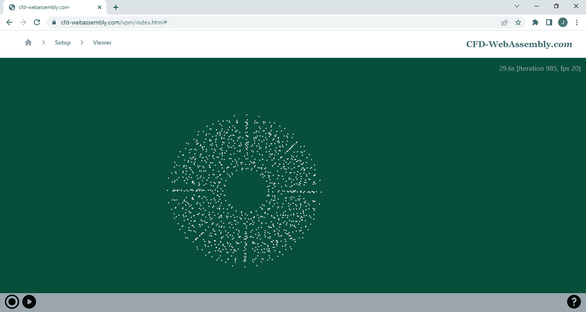
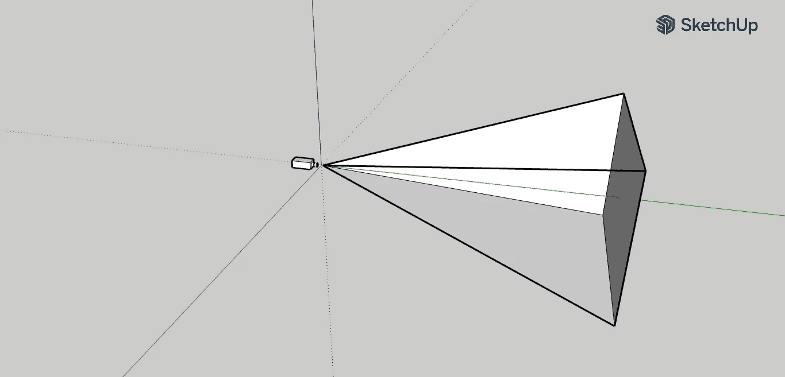
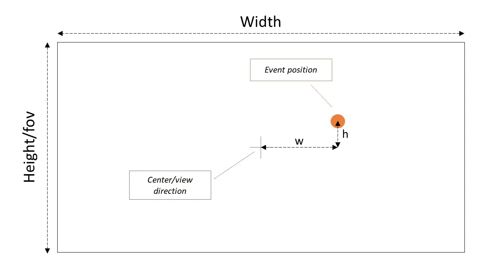

# WebGL 中的相机动态观察、放大、缩小运动

> 原文：<https://blog.devgenius.io/camera-orbit-zoom-in-zoom-out-movements-in-webgl-32cf78e13e42?source=collection_archive---------10----------------------->

帖子[在 Rust](https://julien-decharentenay.medium.com/implementing-a-webassembly-webgl-viewer-using-rust-a6d8a703153d) 中实现 WebAssembly WebGL 查看器描述了使用固定摄像机定义视点、视图和向上方向来实现 WebGL 查看器。这篇文章扩展了 WebGL 查看器，使其包括由鼠标或触摸事件控制的相机动态观察、放大和缩小运动。

这篇文章将会引起那些寻找简单的——天真的——实现这些摄像机运动的人的兴趣。该实现依赖于透视相机投影的使用，并且不适用于平行投影。



涡环模拟视图

这个故事中表达的观点/意见是我自己的。这个故事讲述了我的个人经历和选择，并提供信息，希望它将是有用的，但没有任何保证。

摄像机移动的实现是基于使用变换矩阵来修改摄像机视图矩阵，而不是修改视点、视图和向上方向，因为(a)我的几何技能不是很好,( b)已经使用了 [nalgebra 库](https://www.nalgebra.org/docs/),因此矩阵运算很容易获得。

在实现的早期，必须决定是在 Rust/WebAssembly 还是 JavaScript 中处理鼠标和触摸事件。这里给出的实现在 JavaScript 中附加了事件处理程序，将事件参数传递给 Rust `CameraBuilder`结构的实例进行处理。

# 一些相机处理实现细节

在 Rust `CameraBuilder`结构中管理摄像机操作。该摄像机处理被修改以引入一个`modifier`矩阵，该矩阵在应用`projection`矩阵之前被应用于代表摄像机位置的`view`矩阵。`modifier`矩阵用于在事件提交到`view`矩阵之前存储进行中的事件，并在构建视图投影矩阵以提供给 WebGL 顶点着色器时在渲染步骤之前应用，如`CameraBuilder`实现的摘录所示:

渲染使用 3D 透视投影，如 [WebGL2 3D 透视](https://webgl2fundamentals.org/webgl/lessons/webgl-3d-perspective.html)所述。3D 透视矩阵呈现位于*平截头体*中的元素，如下图所示。



平截头体表示

*平截头体* —参见[维基百科](https://en.wikipedia.org/wiki/Viewing_frustum)——使用沿 *y* 方向的摄像机视场角来定义。使用相机视野，可以将渲染画布中像素的位置与相机视图方向的一组角度相关联，如下图所示。这些角度(仅与透视投影相关)用于将鼠标和触摸事件特征与相机移动相关联。



摄像机透视使用 *z* 轴作为观察方向。因此，定义事件位置的滚转、俯仰和偏航角度使用上图中的约定如下:

```
roll = h / Height * fov
pitch = w / Height * fov
yaw = 0.0
```

# 鼠标事件

鼠标事件——鼠标按下、鼠标移动和鼠标抬起——用于控制相机的动态观察移动，其中相机视图方向根据鼠标移动而改变。当按下鼠标按钮时，会触发动态观察移动，而相机会随着鼠标移动而动态观察，直到松开按钮。动态观察移动由三个鼠标事件触发，如下面的 JavaScript `viewer.vue`摘录所示:

事件处理函数将事件参数重铸为`CameraBuilder`实例的 Rust 方法。这些 Rust 方法创建本地定义的`UserEvent`，在结构`CameraBuilder`(文件`camera.rs`)的方法`handle_user_event`中处理如下:

当按下鼠标按钮时，会触发一个`MouseDown`事件，并提供光标位置——来自 JavaScript `evt.clientX`和`evt.clientY`。该事件记录在 struct 实例变量`mouse_down`中。

当鼠标移动时，类似地触发一个`MouseMove`事件。如果在按下按钮的情况下移动鼠标，则`modifier`矩阵被设置为代表动态观察摄像机移动，其滚动和俯仰角对应于鼠标按下事件和当前鼠标事件之间的高度和宽度。角度的计算和矩阵形式的转换在函数`orbit_matrix4`中完成:

当鼠标被释放时，一个`MouseUp`事件会随着事件发生时光标的位置而被触发。该事件的处理非常类似于鼠标移动，除了摄像机轨道移动被应用到`view`矩阵和`modifier`矩阵被重置为 identity 以指示摄像机轨道移动被应用。

# 车轮事件

鼠标滚轮事件用于控制相机放大和缩小。滚轮事件是无状态事件，当事件发生时，所有事件信息都可用，这不同于具有开始(鼠标按下)、进行中(鼠标移动)和完成(鼠标抬起)事件的鼠标事件。

通过分配画布的`onwheel`属性来处理滚轮事件，如下面的 JavaScript `viewer.vue`摘录所示，其中`evt.clientX`和`evt.clientY`对应于事件发生时的鼠标指针位置，`evt.deltaY`是滚动事件的大小:

与鼠标事件类似，JavaScript 事件处理程序调用带有相关参数的 Rust 方法。Rust 方法定义了一个本地的`UserEvent`来匹配在`CameraBuilder`结构的`handler_user_event`方法中处理的车轮事件:

该方法将对应于缩放事件的矩阵直接应用到视图上，即不使用滚轮事件中使用的临时`modifier`矩阵。

如下所示，缩放事件计算定义了在 *z* 方向上的平移矩阵——相对于摄像机的视图方向。平移幅度与滚动事件的幅度成比例。然后旋转，使平移方向与发生车轮事件的位置相对应的滚动和俯仰角对齐— `evt.clientX`和`evt.clientY`:

# 触摸事件

使用 JavaScript 处理触摸操作[触摸事件](https://developer.mozilla.org/en-US/docs/Web/API/Touch_events)。有四种类型事件:`touchstart`、`touchend`、`touchcancel`和`touchmove`。虽然从表面上看，这些事件类似于鼠标事件，但当支持多点触摸时，会有细微的差异。如果用户用一个手指触摸，添加第二个手指时会触发一个`touchstart`事件。类似地，当手指从触摸屏移开时，触发`touchend`事件，即使有剩余的手指触摸屏幕。

该方法基于 JavaScript 处理触摸事件并将请求转发给`CameraBuilder`结构，如`viewer.vue`的摘录所示:

Rust 方法依赖于`CameraBuilder`结构中的两个变量:`touches_down`存储*开始*触摸特征，`touches`存储*当前*触摸特征。两个变量都是长度相同的数组。它们用于评估用于定义`modifier`矩阵的*开始*和*当前*状态之间的触摸特性变化。

下图所示的`CameraBuilder`结构方法`touch_modify`用于评估与`touches_down`和`touches`列表之间的触摸状态变化相关的摄像机移动。该方法使用辅助静态方法`touch_mid`来计算所有触摸之间的中点，使用`touch_delta`来计算从触摸到中点的平均长度。在*开始*和*当前*状态的触摸之间的中点变化——即元组`(fr_x, fr_y)`和`(to_x, to_y)`之间的中点变化——用于计算轨道运动。平均长度的变化——即`fr_l`和`to_l`之间的变化——用于计算变焦移动。此外，触摸状态之间的方向变化——使用`touch_alpha`评估——用于指定偏航角。

下面显示的`CameraBuilder` struct 方法`touch_apply`用于应用与触摸事件相关的修改。该方法在原理上类似于`MouseUp`事件的处理，除了当新的*事件*开始时，基于当前触摸状态的`touches`列表更新触摸状态的`touches_down`列表。

使用上述方法`touch_modify`和`touch_apply`可以如下实现触摸事件处理器逻辑:

触摸开始和触摸结束事件通过在处理与添加或移除触摸相关的改变之前基于当前触摸状态修改和应用改变而开始。在触摸开始时，新的触摸被添加到*开始*和*当前*触摸的列表中，而在触摸结束时，这些触摸被从触摸列表中删除。

当检测到触摸移动时，仅提供移动的触摸。在调用方法`touch_modify`基于更新的*当前*触摸状态列表更新`modifier`矩阵之前，`on_touch_move`方法更新*当前*触摸状态列表`touches`中的移动触摸。

`on_touch_cancel`方法调用`on_touch_end`方法，并提供取消的触摸列表，即已经中断的触摸，从而完成触摸事件的实现。

# 关于处理窗口大小调整和方向旋转的旁注

这篇文章讨论了触摸事件的处理，以便手机可以用来与模拟和观众互动。屏幕旋转在手机上是一个常见的事件，但事实证明这是一个挑战，因为旋转后动画并没有显示在整个画布上——直到我在 [WebGL2 调整画布大小](https://webgl2fundamentals.org/webgl/lessons/webgl-resizing-the-canvas.html)帖子中发现了解决方案:视口设置需要更新…

在当前的实现中，使用了一种简单的方法，即当观察到屏幕旋转(或调整大小)时，将相机重置到其初始位置。

源代码可从 https://github . com/juliendecharentenay/vortexparticlessimulation 获得，应用程序可从 https://www.cfd-webassembly.com/vpm/index.html[获得](https://www.cfd-webassembly.com/vpm/index.html)。