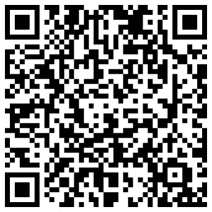
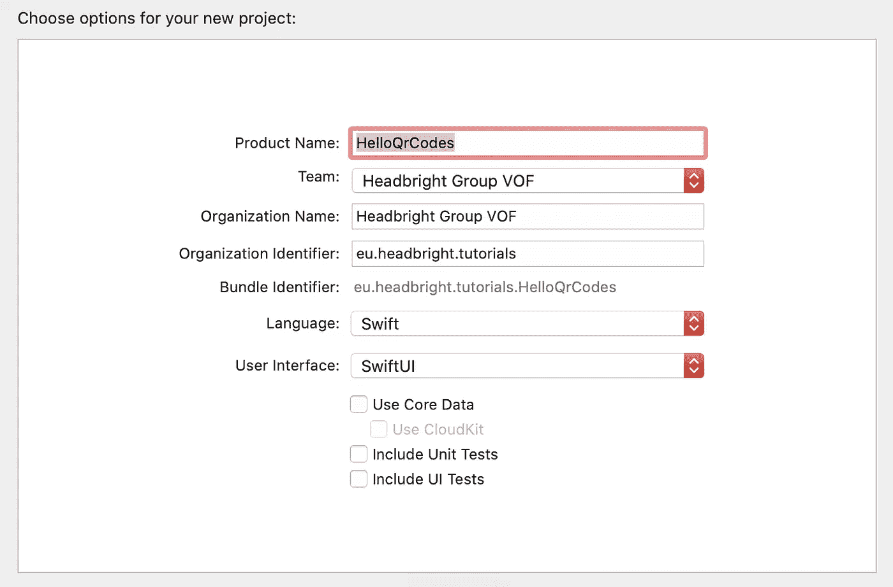
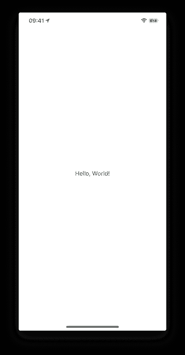
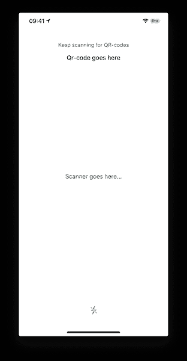
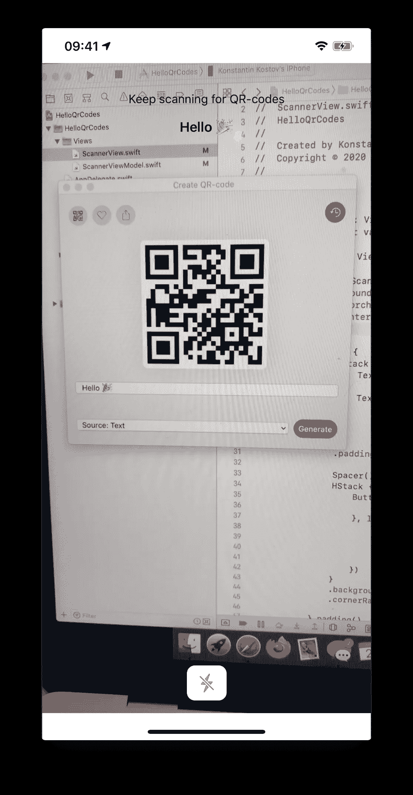
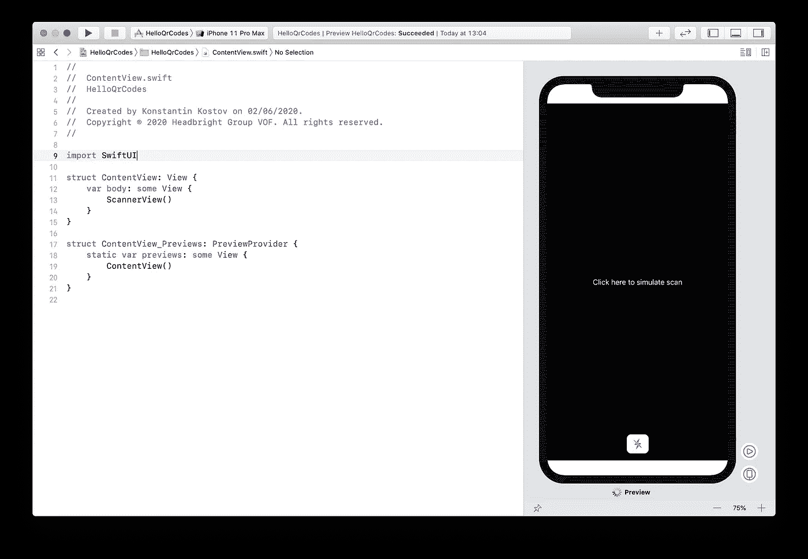

# SwiftUI 中的相机预览和二维码扫描仪

> 原文：<https://blog.devgenius.io/camera-preview-and-a-qr-code-scanner-in-swiftui-48b111155c66?source=collection_archive---------0----------------------->

在这篇文章中，我将指导你使用 SwiftUI 为 iOS 创建一个二维码扫描仪。

我们还将看到如何创建摄像头馈送的预览，并将其用作 SwiftUI 视图。最终结果将与模拟器、Xcode 的实时预览以及 UI 测试兼容！

# **什么是二维码？**

QR 码代表快速响应码。它们包含少量信息，以计算机和移动设备可以理解的方式呈现。QR 码是一种 2D 条形码，称为矩阵码。存在一些变体，如阿兹特克代码或数据矩阵代码。二维码通常是这样的:



由 [Kodos](https://apps.apple.com/app/kodos/id1504012725) 制作——一个漂亮的二维码制作应用程序

# 入门指南

让我们从在 Xcode 中创建新的 iOS 应用程序项目开始。您需要选择单视图应用程序模板，并确保用户界面技术设置为 **SwiftUI** 。



在 Xcode 中创建新的 Xcode 单视图应用程序



运行项目以确保一切都已设置好

# 准备布局

扫描仪屏幕的布局可能取决于您特定的应用程序用例，因此我们将创建一个非常简单的视图，允许我们查看相机预览、任何检测到的 QR 码的值以及一个开关手电筒的按钮。



创建 ScannerViewModel，它将保存视图的状态

扫描间隔是一个变量，它允许我们控制多长时间重新扫描一次二维码。如果我们想提供连续扫描功能，这是很有用的。

`torchIsOn`字段保存设备手电筒的当前状态。本教程假设手电筒总是可用的。

`lastQrCode`字段将保存最后检测到的 QR 码值的字符串值。当用户扫描时，该字段将更新为最后扫描的二维码。

最后是一个函数`onFoundQrCode`，每当检测到新的二维码时，我们的二维码扫描仪都会调用这个函数。

现在让我们创建 ScannerView 布局

我们将使用 ZStack 创建一个布局，显示相机视图的扫描仪将在后面看到，占据整个屏幕，在它的顶部，我们将布局一些界面元素，如带有最近扫描的二维码或手电筒按钮的气球。

# 关于相机视图

我们将创建一个视图，显示来自设备摄像头的馈送。理想情况下，我们还希望能够使用 SwiftUI 定位摄像机视图。

我们将要使用的大部分功能来自于 [AVFoundation](https://developer.apple.com/av-foundation/) 框架。目前，它不提供任何现成的 SwiftUI 视图，我们将创建一个传统的 UIView，并将其作为一个 UIViewRepresentable 嵌入我们的 SwiftUI 应用程序中。

我们将设置一个`AVCaptureSession`，它将使用设备背面的摄像头作为输入，使用一个`AVCaptureMetadataOutput`作为输出，允许我们接收从摄像头输入识别的元数据对象流。这些元数据对象就是我们要收集的实际二维码值。

由于我们将在 SwiftUI 布局中使用相机视图，如果实现与模拟器配合良好，这将是理想的(因此 SwiftUI 预览功能将工作)。由于模拟器缺少物理摄像机设备，我们将在摄像机视图中嵌入一个后备。

# 代表

代理将负责处理元数据输出，检查是否找到了 QR 码，并将该 QR 码值通知父视图。

最值得注意的是，我们的委托对象将采用`AVCaptureMetadataOutputObjectsDelegate`协议，以便监听在摄像机提要中检测到的新的元数据对象。

代理还将利用我们在视图模型中准备的扫描间隔。只要捕获会话处于活动状态，并且二维码图像在摄像机画面中，就会不断检测到新的元数据对象。为此，我们将跳过帧，每个扫描间隔只通知父视图一次。

# 摄像机回顾

相机预览是我们将要用来显示来自相机的实时反馈(或模拟器的模拟值)的`UIView`。这是一个`UIKit`视图，最终将在 SwiftUI 布局中使用`UIViewRepresentable`呈现。

该视图是为给定的`AVCaptureSession`创建的，包括一个基于 CoreAnimation 的`AVCaptureVideoPreviewLayer`，使我们能够预览摄像机会话的视觉输出。这就是用户最终将看到的“相机预览”。当相机不可用时，我们将用一个简单的`UILabel`来代替视频预览，显示我们提供的模拟数据内容。

这意味着二维码扫描可以在 Xcode、模拟器或 UI 测试的预览或实时视图中“模拟”。

# 就快完成了，创建了 UIViewRepresentable

我们需要的最后一部分是在 SwiftUI 中显示 CameraPreview 视图的方法。这可以通过实现框架提供的`UIViewRepresentable`协议来实现。

该协议的目的是让我们将 SwiftUI 状态和生命周期事件转换成 UIKit。例如，在 SwiftUI 视图中，当它们的状态改变时，它们经常被销毁和重新创建，而在 UIKit 中，UIView 通常被保存和更新。

我们最起码需要的是:

*   创建一个 CameraView 并将其与一个`AVCaptureSession`相关联。
*   检查我们是否在一个真实的设备上运行，如果是，请求访问摄像机的许可。

*💡记得在* `*Info.plist*` *文件中添加* `*NSCameraUsageDescription*` *键，否则使用相机会导致死机。*

*   当 SwiftUI 视图更新时，我们需要确保 CameraView 也将更新它的布局。
*   当 SwiftUI 准备移除和销毁 QrCodeScannerView 时，我们需要正确地处置捕获会话。

让我们通过添加以下内容来调整 QrCodeScannerView:

*   请求允许使用摄像机的能力
*   将 SwiftUI 视图中的扫描间隔设置为修改器的能力。
*   设置模拟数据以便在模拟或 UI 测试期间使用的能力。
*   控制设备手电筒光线的能力。

以下是扫描仪视图的完整实现:

# 结束了

现在我们可以在 SwiftUI 布局中使用 QrCodeScannerView。用以下内容替换文本视图:

```
QrCodeScannerView()
.found(r: **self**.viewModel.onFoundQrCode)
.torchLight(isOn: **self**.viewModel.torchIsOn)
.interval(delay: **self**.viewModel.scanInterval)
```

Tadaa🎉



向 macOS 的 Kodos 应用程序问好！

