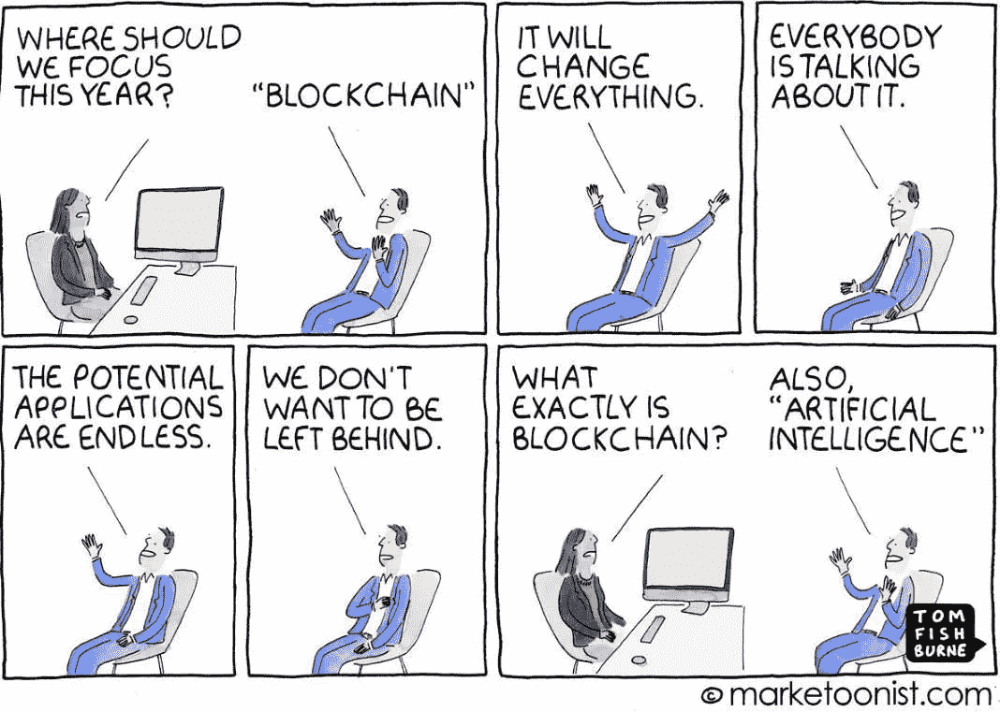
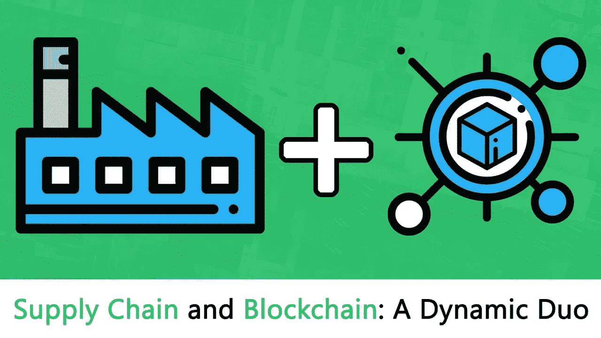
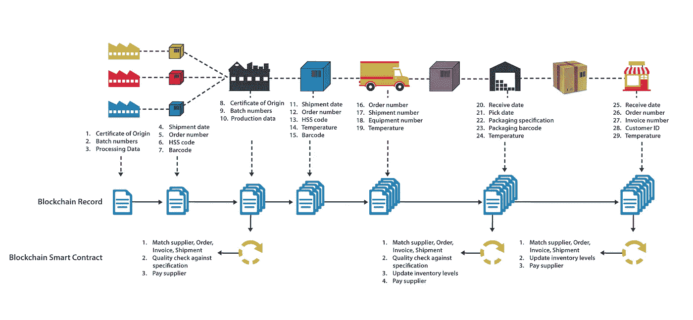

# 区块链真的能解决供应链问题吗？

> 原文：<https://blog.devgenius.io/can-blockchain-really-solve-supply-chain-problems-1e3e494e4f4c?source=collection_archive---------28----------------------->

当 2008 年中本聪发表比特币[论文](https://www.bitcoin.com/bitcoin.pdf)时，除了彻底改变金融业，还催生了区块链的概念。这种特殊的技术已经迅速进入其他行业，现在这已经成为一种趋势或炒作。人们经常把这和 90 年代的互联网时代相提并论。区块链据称正在改变银行、农业、物流、医疗保健、选举、制造和供应链行业。是的，即使是供应链，这一传统领域，也很晚才赶上技术世界，仍然使用陈旧的技术，在某些情况下，没有使用任何技术。你仍然看到成堆的文件和大量的文书工作，没有任何可追溯性或跟踪。一项最新的复杂技术正在迅速进入许多行业。

简而言之，区块链是使用加密技术链接的不断增长的区块集。然而，这些块存储在分布式网络中，即分散的网络中。这里强调分散的方面。这是区块链真正流行的根本区别。因为它是分散的，没有一个实体或公司控制数据。由于这项技术中嵌入了加密技术，记录无法被篡改。区块链数据库是使用对等技术管理的(想想在对等网络上运行的位流)。交易是通过大规模协作来认证的，所以很难被黑客攻击，除非你控制了运行区块链网络的 50%以上的系统。

那么这对供应链行业有什么吸引力呢？基本上，供应链是产品生命周期中涉及的一组实体。例如，考虑一个简单的棉 t 恤的供应链。从生产棉花的棉田开始。棉花被运送到纺织厂，在那里生产织物。制成的织物被运送到另一个工厂，在那里织物被染色。有色织物被送到工厂，在那里制作服装。这些服装然后被送到批发商那里的商店。这是它的一个非常简单的版本，但它可能涉及更多的中间方，一个产品通常涉及更多的原材料。想象一部手机，里面有很多零件。每个零件都经过一系列实体，然后被送到工厂进行最终组装。现在，如果你想看到手机的整个供应链，你可以想象一下制造手机每一部分所涉及的实体数量，以及每一步所完成的过程，并跟踪该步骤的细节(如该步骤是何时完成的，是谁完成的)。

有了所有这些可用的数据，就可以打开如此多的用例，因为现在您可以看到整个事件链，这些事件发生在产品制造过程中，也发生在产品销售给客户之前。您可以轻松检测假冒商品，了解产品的质量和年代。

为了建立这种类型的可见性，一些公司已经尝试这样做了，他们建立了跟踪详细事件的系统。但是，正如您所看到的，整个供应链中涉及多个公司，一个实体通常无法看到端到端的步骤。例如，在亚马逊，你可以看到产品的详细跟踪历史。在这里，您可以看到当物品从仓库运出时，运送包裹的承运商以及包裹经过的一系列地点和设施。由于亚马逊控制了这部分链，他们建立了一个集中式系统，并要求承运人在包裹运输过程中发送事件。如果有一家公司可以控制产品的生命周期，它可以使用传统的数据库建立一个集中的系统，并可以要求其他实体添加他们的事件。这种模式的主要问题是，有一个控制数据的中央实体，所有其他实体都必须与之交互。因此，本质上每个实体都信任中央实体能够正确存储数据。该实体必须确保构建一个可扩展的系统，并应用一套正确的机制来限制对数据的访问，以便黑客或其他未经授权的来源不会篡改数据。有了这些问题，你可以开始看到区块链如何帮助解决这些问题。

在上面的例子中，我们做了一个在现实世界中通常不成立的主要假设。假设有一个中心实体要求供应链中的其他实体向他们的系统添加数据。总的来说，即使是主要的零售商或品牌也不了解农场或工厂。例如，一个主要的巧克力品牌不会有生产和加工可可的确切细节。区块链的主要优势是不需要中央实体。它需要的只是一个区块链网络，任何人都可以在其中添加块。当然，它仍然需要一个跨这些实体共享的公共网络。但这与让一方创建一个网站或 API，让其他人添加他们的事件是非常不同的。现在，你可以有多个集中的实体，可以控制网络的一部分。每个实体不需要信任其他实体，在这个世界上每个人都是平等的。通常，比特币或以太坊使用公共区块链模型，任何拥有足够计算资源的人都可以加入网络。有权限的区块链要求将权限添加到网络。即使有许可的区块链，将实体添加到网络中会容易得多，每个实体都可以将它们的事件添加到网络中。由于区块链的技术中内置了加密技术，他们不需要担心黑客获得访问权限等。他们需要关心的只是创建一种向区块链网络添加事件的方式。这无疑消除了许多障碍，让供应链中的所有各方都参与进来，参与到这种公共模式中，提高流程的可见性。

区块链提供的另一个主要优势是，智能合约是区块链定义的一部分。正如我上面提到的，不同的实体将他们的事件添加到区块链中，智能合同基本上为事件创建了一个定义。这确保了添加到网络中的事件遵循一组准则。由于所有这些都捆绑在一起成为区块链的概念，这使得非技术行业更容易在日常运营中适应和使用区块链。沃尔玛、雀巢是少数几个已经在少数产品上实施这种模式的公司，并且看到了这种技术的明显优势。

有了这些，区块链会改造供应链行业吗？我希望它会，随着足够的宣传和能见度，更多的公司将开始注意到它，并希望走向使用它，使供应链更加透明和可信。