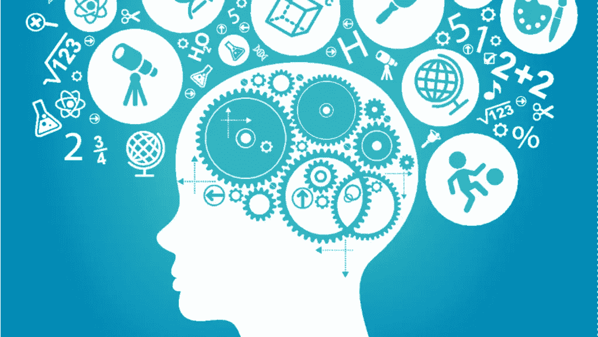

# Java 可以用于机器学习/人工智能吗？

> 原文：<https://blog.devgenius.io/can-java-be-used-for-machine-learning-artificial-intelligence-42b122d1747e?source=collection_archive---------0----------------------->

当我们在机器语言和人工智能领域谈论计算机语言时，我们听说 Python 和 R 是要学习的语言。大多数人不知道 Java 也可以用于人工智能、人工智能或数据科学。

我在读硕士的时候，论文选择了 Java 实现机器学习算法。我必须使用我选择的任何语言实现一个老年人跌倒检测系统。我论文的题目是:

> “使用身体部位跟踪和加速度的新型混合跌倒检测技术”。

我可以选择用 Python(一种我正在学习的语言)、R(一种我从未用过的语言)或 Java(一种我精通的语言)来做这件事。知道 Java 不是这个领域的主流语言，我把它作为一个挑战，开始用 MySQL 数据库支持的 Java 实现我的项目。

同一篇论文在 IEEE 会议上被接受。阅读更多信息:

 [## 我关于机器学习的论文在 IEEE 会议上被接受了

### Ahmed Ahsan Khan，Abeer Alsadoon，Shatha Habeeb Jafer，P.W.C. Prasad，Oday D. Jerew，Paul Manoranjan，“一种新的混血儿…

medium.com](https://medium.com/dev-genius/my-paper-on-machine-learning-got-accepted-at-ieee-conference-dbf6fe281456) 

## 为什么是 Java？

作为最古老的领先开源语言之一，我认为 Java 可以提供一些东西，我没有错。在搜索与这个领域相关的 Java 库时，我找到了一长串我可以使用的库。我下载了 Java 机器学习库(JavaML ),它提供了一组用 Java 实现的机器学习算法。我用 SVM(支持向量机)算法来证明我的论文。

提到这一点的原因是，如果你对实现 ML、AI 或数据科学算法感兴趣，并且你来自 Java 开发背景，那么你不需要学习 Python 或 Ruby 就可以做到这一点。正如我在[的上一篇文章](https://medium.com/@ahmedahsankhan/is-java-obsolete-1a77d3bbe92d)中提到的，Java 支持任何领域的开发，数据科学也不例外。借助第三方开源库，任何 Java 开发人员都可以实现数据科学算法来完成工作。Python 或 Ruby 各有优势，但你不需要专门为了执行数据科学或机器学习相关算法而学习它。希望这能澄清一个误解，即对于数据科学，你必须学习 Python 和 Ruby。

快乐阅读。