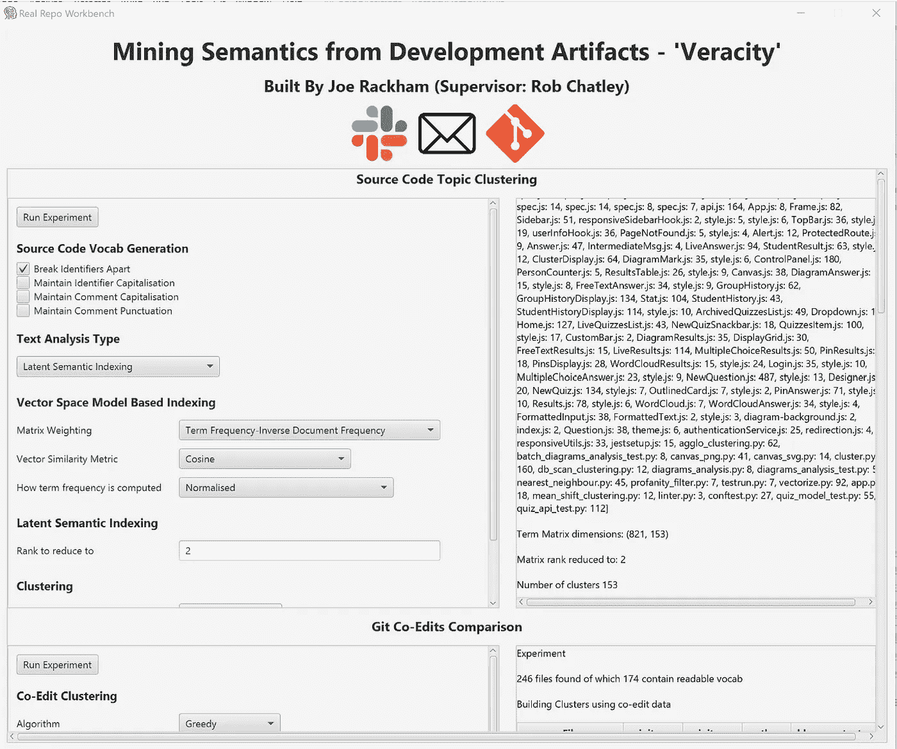
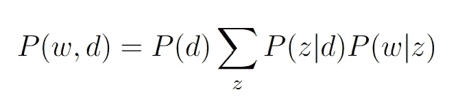
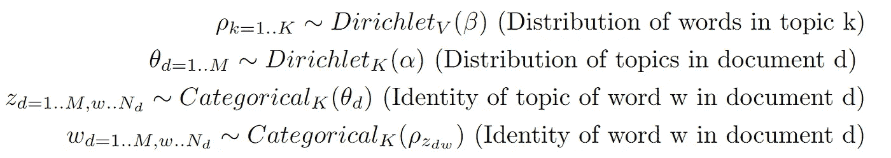
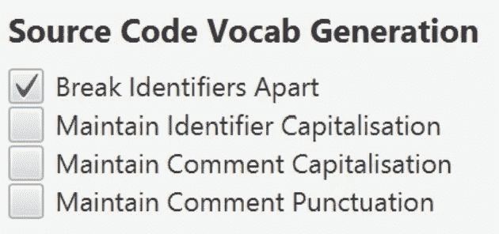
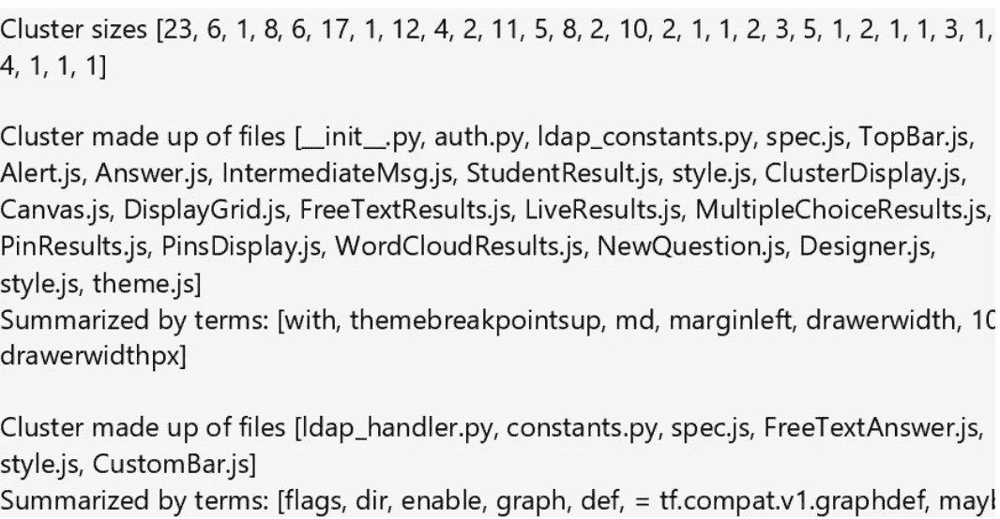
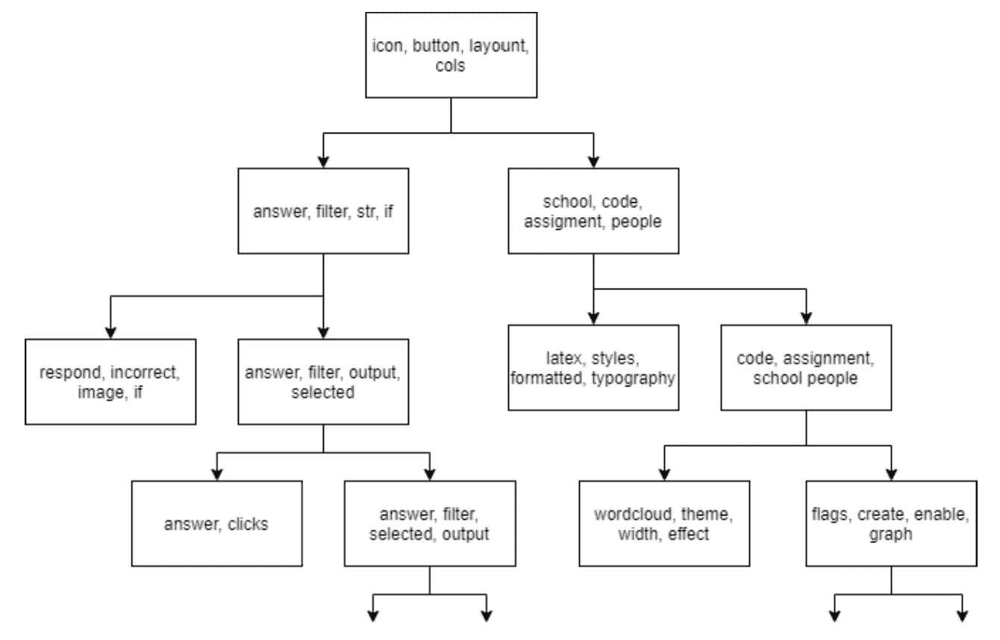
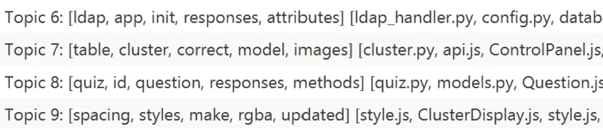

# NLP 可以按主题分组源代码吗？

> 原文：<https://blog.devgenius.io/can-nlp-group-source-code-by-topic-3e4a52f78ac1?source=collection_archive---------14----------------------->

## 有没有一种方法可以自动计算出代码是关于什么的？

弗洛里安·奥利佛在 [Unsplash](https://unsplash.com?utm_source=medium&utm_medium=referral) 上拍摄的照片

项目文件系统中文件的排列通常与它们之间的语义关系没有什么相似之处。当开发人员在处理任务时，他们经常需要编辑彼此相距很远的文件。先前的研究致力于从源代码中提取语义主题。我研究了这些方法以及我自己的修改和扩展如何提取源代码工件之间的关系，并提供关于它们的有意义的语义描述。

为了便于实验，我构建了一个工作台，它提供了一系列选项来交换或调整应用于源代码的方法:

## 从源代码中提取词汇表

人与人之间的交流发生在源代码的两个地方，标识符和注释。根据项目的不同，注释可能使用自然语言，也可能不太结构化。源代码词汇表是通过查找我为几种最流行的编程语言编写的一系列正则表达式模式的匹配来提取的。通过工作台，可以看到各种选项，从而可以确定流程的最佳变体。这些问题包括标识符名称是否应该拆分成单独的单词，以及是否应该保持大写和标点符号。

这种方法的明显缺点是受限于有限的语言集。工作台还内置了一种与语言无关的方法来进行比较。只搜索泛型赋值(x = …)和函数调用(f(…))的模式，标识符在任何大写或非字母数字字符处被分开。

## 文本分析方法 1:潜在语义分析

在我的背景研究中，我遇到了使用一种叫做[潜在语义分析](https://en.wikipedia.org/wiki/Latent_semantic_analysis)的方法从文档语料库中提取主题。LSA 从源词汇库中构建文档术语频率矩阵，然后使用称为奇异值分解的矩阵压缩操作，在相同的向量空间中为术语和文档构建小维向量。然后，这些向量的相似性可用于聚类文档，并确定哪些术语最能描述它们。工作台提供了许多选项来修改背景研究中的方法。可以调整向量的维度以及用于计算相似性的向量度量。还有各种可以应用于文档术语矩阵的加权度量。

## 文本分析方法 2:概率潜在语义分析

[概率 LSA](https://en.wikipedia.org/wiki/Probabilistic_latent_semantic_analysis) 不是使用线性代数来建模语料库，而是使用概率来捕捉语义内容。这种方法背后的直觉是，选择主题的数量作为超参数，所有共现的概率可以建模如下:

使用迭代期望最大化算法来学习 P(z|d)和 P(w|z)的实际值，该算法为语料库的似然性找到局部最小值。在这个模型中，文档和术语不与单个主题匹配，相反，它们可以与多个主题相关。这使得该模型能够捕捉标准 LSA 无法处理的多义词(多重含义)。LSA 是确定性的，而 PLSI 可以在不同的迭代中产生不同的主题分配。该模型的一个局限性是主题的数量必须手动选择。然而，LSI 需要选择降阶项向量矩阵的秩，这仍然影响最终输出，但是更加不透明。

## 文本分析方法三:潜在狄利克雷分配

潜在的狄利克雷分配也使用固定数量的主题上的概率来对语料库建模。然而，模型更复杂，概率值依赖于实际分布。

学习各种分布(相关的单词概率、单词的主题以及每个文档的主题混合)可以通过各种方法来实现。工作台使用一个库，该库使用“变分贝叶斯抽样”方法来查找值。

## 应用

为了测试这些方法，我将工作台指向了我以前的一个项目。这个项目是一个 Python 和 React web 应用程序，允许讲师运行测验，所有学生都可以使用他们的移动设备参与。

我认为主题提取的主要用途是帮助理解项目。工件应该按照语义，而不是功能来分组。如果产生的主题是有意义的，并且术语被选择来准确地描述它们，它们可以作为开发者的有用工具。在整个调查中，从源代码生成 vocab 的某种配置被证明是最有效的。如果不去除大小写和标点符号，多个主题将会被相同的单词有效地描述。类似的划分也会发生，除非是复合词的标识符被分开。正如人们所预料的，使用特定于语言的模式从源代码中提取词汇表比语言无关的选项执行得更好。

vocab 生成的最佳配置

一个一致的问题是广泛使用图书馆的影响。在“真实性”中，React 库被大量使用，但关键的是，不是所有的文件。在文档由混合主题表示的模型中，UI 工件通常由一个主题组成，主题由 React 标识符表示，如“Grid”和“spacing”。就像从源代码中提取词汇所需的特定于语言的正则表达式模式集一样，这种技术也可以更新为过滤掉库关键字。虽然它们的存在确实限制了输出的有用性，但这会极大地限制工作台的灵活性。

## 使用方法 1:潜在语义分析

在这三个国家中，LSA 拥有调整该方法最多的参数，也拥有这些参数与实际产出本身之间最不透明的关系。

为了准确起见，我的初始配置将 97 个文件组合成一个大集群。随着聚类相似性阈值和矩阵秩的调整，输出通常由相当大和相当小的主题组组成，而不是均匀大小的聚类。对于降低的等级，最好的结果是阈值为 0.6，初始值为 10，这里聚类的大小相对均匀，一些语义似乎已经被捕获。一些主题使用语义相关的词进行描述，如测验、房间、年份、新(测验在房间中进行，可以在应用程序中新建)或答案、回应、不正确。还有一些相关的文件被归在一起。测验中的一种问题涉及绘制图表，然后通过 ML 聚集在一起，尽管在后端和前端之间分开，但与应用程序这一部分相关的许多代码都聚集在一起。

除了将文件分组为平面簇之外，我还使用凝聚聚类方法构建了一个树状图。树不平衡；人们可以看到与应用程序的小部分相关的集群，如渲染 latex 或构建没有分支的词云。树状图有助于开发人员理解项目的原子部分是什么，以及它们是如何组合在一起的。

## 测试方法 2:概率潜在语义分析

应用 PLSA 而不是标准 LSA 的主要区别在于主题的数量必须手动选择。另一个区别是，每个文件都是由多个主题组成的，而不仅仅是分配给一个主题。输出似乎立即捕获了一些语义信息，下面的截图显示了由语义相关的词描述的主题，如 styles & rgba 和 quiz，question & responses。除了术语之外，输出还包括最能代表该主题的文件。在某些情况下，这些是与术语有明确链接的强相关文件，然而，有时输出看起来更随机。

由“真实性”产生的一个主题用术语描述:测试、浅层、预期、描述、显示，最典型的是 Sidebar.js，它呈现 Web-Apps 侧栏，vectorize.py，它为 ML 分析准备 png 图像，以及 LiveResults.js，它显示对测验的响应。最初，期望值最大化算法的 50 次迭代用于优化模型。这是一个合理的值，增加它不会对输出质量产生明显的影响。

## 测试方法 3:潜在狄利克雷分配

从该技术的第一次应用及其默认配置开始，输出到工作台的主题描述就由语义相关的单词组成。主题标题也是与项目相关的东西；为了保证准确性，输出中经常出现诸如测验、答案、正确等词。潜在的狄利克雷分配也需要选择固定数量的主题。直觉上，理想的主题数量取决于项目的规模。随着主题数量接近文件数量，模型捕获的主题分布接近每个文档一个主题。

对于由大约 150 个代码文件组成的真实性来说，合适的主题数量大约是 10-20 个。较小的项目，我测试的工作台只需要 5-10 个。准确性的一个组成部分是一组工具，通过各种方法对手绘图像执行聚类。当主题的数量被设置为 10 时，其中一个由单词(聚类、模型、图像、图像、相似性)来描述。同样，在 20 个主题中，有一个被描述为(测验、问题、响应、添加、响应)。

## 总结想法

人们认为，这些技术将有助于捕获存储库中存在的语义主题，并提供有助于理解代码库的描述。应用到我的项目中，每个后续的模型都产生了更好的输出质量，即由语义相关的文件组成的组，并由表示其内容的术语来描述。然而，即使在最好的模型下，一些输出看起来也不合理。在这个领域还需要进一步的工作，以便我们能够自信地确定代码库中的语义主题。

乔·拉克姆