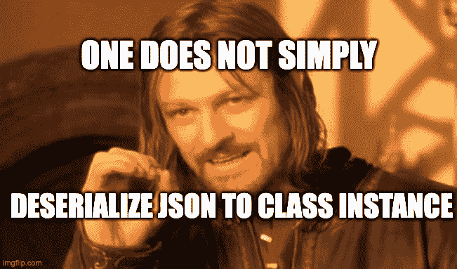

# Python 可以做类型化 JSON 序列化吗？

> 原文：<https://blog.devgenius.io/can-python-do-type-safe-json-serialization-77e4d73ccd08?source=collection_archive---------2----------------------->

## 创建 Python 类型的 JSON 序列化库



## 序

大约两年前，我的朋友让我帮助他们建立一个平台，简化个人之间的二手物品捐赠过程，同时允许每个人匿名。听起来是很高尚的事业，所以我当然乐意帮忙。

他们让我帮助他们开始这个项目，构建数据层和 REST API。我推荐使用 Python 作为编程语言，因为他们没有太多的编程经验，我认为这会让他们很快上手。

我不是 python 开发人员，也没有多少使用 python 的经验。
实际上这些年来我的主要编程语言是 Java，
所以动态类型语言并不是我习惯使用的语言。

当我开始编写数据模型和 DB CRUD 操作时，我希望找到一个众所周知的解决方案，将类实例序列化到 JSON 并返回，同时保持反序列化对象的运行时类型，类似于 Java 中的 *Gson* 或 *Jackson* 。我惊讶地发现，我在努力寻找这个问题的综合解决方案。

我决定将此作为一个挑战，创建一个 Python JSON 类型化序列化库— **Jsonic** (参见 [Jsonic Github 库](https://github.com/OrrBin/Jsonic))

在本文中，我将介绍我在 Python 中使用类型化序列化过程所做的一些初步尝试，由此创建了 *Jsonic* 。

## 问题定义

创建一个 Python JSON 序列化库，支持将类 *C* 的具体对象 *O1* 序列化为 JSON 字典表示 *J* ，并将 *J* 反序列化回类 *C* 的具体对象 *O2* ，使得 *O1 === O2* ，
其中 *O1 === O2* 定义为:

对于 *O1* 的每个实例属性 *F1* ，在 *O2* 中有一个与 *F1* 同名的实例属性 *F2* ，它支持:

1.  如果 *F1* 的类型为 *int* 或 *str* ，则 *F1 == F2*
2.  如果 *F1* 是一个类实例，那么 *F1=== F2*

为了简单起见，我们将忽略 F1 是*字典、列表、元组、集合、复杂*
或除 *int、str* 之外的任何其他类型的情况(我们将支持嵌套类)。

## 第一次尝试——幼稚的方法

首先，让我们定义一个简单的类，我们将用它来测试我们的序列化和反序列化逻辑:

图 1

我们的*用户*类有 3 个字段:*姓名、id* 和*年龄*，还有一个名为*描述*的方法，该方法以字符串形式返回用户的描述。
让我们尝试序列化和反序列化*用户*实例的简单方法:

在这个解决方案中，我们使用 Python 的[*json*](https://docs.python.org/3/library/json.html)*dumps*函数将*用户*实例序列化为 JSON 字符串表示，*加载*函数将 JSON 字符串反序列化回*用户*实例*。*

*   看起来 *json.dumps* 对我们的用例非常适用，因为它的输出是格式良好的 json(第 11 行)，但是我们的目标是将*用户*实例序列化为 JSON *dict* 表示，而不是 JSON 字符串。你可以在第 8 行看到*转储*给我们一个*字符串*输出。
*   json.loads 返回类 *User，*的类型 *dict(第 17 行)*的一个实例，这是我们的目标所要求的。
*   当试图调用*deserialized _ User . describe*时，我们得到一个异常，因为 *deserialized_user* 是 *dict* 而不是类 *User* 的实例，并且它没有名为 *describe 的实例方法。*
*   *json.dumps(self，****default = lambda o:o . _ _ dict _ _****)*[*default*argument](https://docs.python.org/3/library/json.html#json.dumps)定义遇到无法序列化的对象时要调用的函数。我们传递 ***lambda o: o.__dict__，*** 为这些情况返回对象的 __dict__ 属性。我们稍后将回到这个论点。

我们的第一种方法失败了，但是我们可以尝试利用 Python 内置的[*JSON*](https://docs.python.org/3/library/json.html)*序列化来完成我们的目标。*

## *第二次尝试—反序列化类方法*

*我们可以利用 python[** * kwargs*](https://book.pythontips.com/en/latest/args_and_kwargs.html)*功能，这允许您的函数接受任意数量的关键字参数，
与 [***字典解包*](https://python-reference.readthedocs.io/en/latest/docs/operators/dict_unpack.html) 相结合，从 *json.loads* 调用返回的*字典*中创建一个*用户*实例**

**图 4**

**我们向我们的用户类添加了两个方法:**

*   ***序列化—* 我们使用 *json.dumps* 将*用户*实例序列化为 json 字符串，然后使用 *json.loads* 将其反序列化为 JSON 字典。这种序列化逻辑非常适合我们的用例**
*   ***反序列化* —这是一个类方法，它获取*用户*实例的 *dict* JSON 表示，并使用*用户*类构造函数构造新的*用户*实例，该构造函数现在接受任意数量的命名参数。它将作为参数得到的解压后的 dict 传递给构造函数。
    对于具有值{"name": "Bob "，" id": 1，" age": 18}的字典，类似的*用户*实例启动调用将是:**

```
**User(name: Bob, id: 1, age: 18)**
```

**让我们测试我们的代码:**

*   **我们创建*用户*实例，然后我们将其序列化为 JSON(第 5 行)，我们确实得到了 JSON *dict* 表示，而不是我们的目标所要求的 *str* (第 8 行)**
*   **然后我们使用反序列化方法将 JSON *dict* 反序列化回*用户*实例(第 13 行)，我们确实得到了*用户*类的实例(第 17 行)。
    我们调用 describe 方法，这次它像预期的那样工作(第 19-20 行)**

**我们的解决方案适用于我们的用例，但是让我们测试另一个用例，在我们的*用户*类中嵌套*地址*类:**

**图 7**

**让我们测试一下本课程的解决方案**

*   ***deserialized_user* 确实是用户类实例(第 22 行)**
*   **但是*deserialized _ user*Address 属性是 dict 而不是 *Address* 实例(第 25 行)，因此我们不能调用*deserialized _ user . Address . describe()*(第 27–28 行)**
*   **我们的解决方案不适用于嵌套类。让我们试着解决这个问题**

**当反序列化用户实例时，我们首先将地址实例显式反序列化为变量，并将其传递给用户类构造函数，以及: *name，id，age* 参数**

**图 10**

**让我们测试新的反序列化方法**

*   ***deserialized_user* 和之前一样是类 *User* 的实例(第 8 行)**
*   **但是现在*deserialized _ user . Address*也确实是所需的 *Address* 类的实例(第 11 行)，因此我们可以调用*deserialized _ user . Address . describe()(第 16–17 行)***

**serialize 方法实际上不需要类实例的任何状态，可以很容易地从实例方法转换为接收对象并将其序列化的函数。但是当有嵌套类时，*反序列化*方法确实需要每个类的显式实现。**

**虽然这种方法可行，但很容易看出它不可伸缩。
我们将需要为我们希望能够反序列化的每个类实现*反序列化*方法。**

**让我们尝试收集我们所学的知识，并尝试最后第三次尝试来支持嵌套类的序列化和反序列化，而不需要每个类中的 boiler plate 代码。**

## **第三次尝试—在递归中序列化类型名和反序列化**

**先从序列化说起。我们的序列化基于 [*json.dumps*](https://docs.python.org/3/library/json.html#json.dumps) 。
*json.dumps* 有一个名为 default 的重要参数，在官方文档中描述如下:**

> **如果指定， ***默认的*** 应该是一个函数，为那些不能被序列化的对象调用。它应该返回该对象的 JSON 可编码版本，或者引发一个`[TypeError](https://docs.python.org/3/library/exceptions.html#TypeError)`。如果未指定，则引发`[TypeError](https://docs.python.org/3/library/exceptions.html#TypeError)`。**

**到目前为止，我们传递了一个简单地返回 object *__dict__* 属性的函数。我们可以更好地利用默认参数，并传递一个自定义函数来处理序列化类实例。
让我们尝试创建 *serialize* 函数，该函数获取对象并将其序列化为一个 *dict* ，就像我们之前所做的那样，但是使用完全限定的类名为每个序列化的类实例添加了一个属性，因此我们可以在反序列化时初始化相关类的实例**

*   ***serialize*function*:*我们的 *serialize* function 与我们之前所做的非常相似，但是我们不传递只将 o.__dict__ 返回给 *json.dumps* 缺省参数的函数，该函数将被调用，否则无法被序列化。相反，我们传递我们的 *_serialize_object* 函数**
*   ***_serialize_object* 函数:该函数返回填充了对象属性的*字典*，但是它添加了一个重要的属性，即 Objects 类的完全限定名( *type_name)。*这将允许我们在反序列化这个 JSON 时理解它应该被反序列化成什么类。**
*   ***_full_type_name* 函数:从对象中提取其完全限定的类型名，包括其模块和类名。我们将使用这个限定符来获取相关的类，并在反序列化时创建它的实例**

**让我们看看当使用新的 *serialize* 函数序列化用户实例时，我们得到了什么输出**

**我们可以看到，除了针对用户*及其嵌套的*地址*的 *_serialized_type* 之外，我们还获得了 JSON 中所有期望的字段。
*__main__* 是模块的名称，*是地址，用户*是类名。***

*让我们试着创建*反序列化*函数，它将接受由*序列化*函数创建的 JSON *字典*，并将其反序列化回类实例*

1.  *首先，我们验证名为 *_serialized_type* 的属性是否存在，否则我们不知道要反序列化到哪个类中。如果它丢失了，我们将引发类型错误。*
2.  *在第 6–7 行中，我们获得了完全限定的类型名，然后使用 *_get_type_by_name* 函数提取类对象本身(我不会详细介绍这个函数的实现)*
3.  *在第 9–17 行，我们用所有的对象项创建了 *deserialized_dict* ，将键映射到反序列化的值。我们跳过了 *_serialized_type* 项，对于 dict 类型的项，我们进行递归调用来反序列化它们的值。对于其他类型，我们只使用实际值(记住，为了简单起见，我们只处理 int 和 str 项类型)*
4.  *第 20 行检索我们的类构造函数的签名。在第 19–31 行，我们创建了初始化字典，将每个类构造函数参数映射到它的反序列化值。我们将跳过 *self* 参数(第 23–24 行)，以及 *args* 和 *kwargs* 参数(第 25–27 行)。
    如果反序列化值 dict 缺少某个构造函数参数的值，我们将引发 *AttributeError* (第 29–30 行)*
5.  *最后，在第 33–35 行，我们使用我们的 *cls* initiator 初始化并返回类实例，传递初始化 *dict，*将构造函数参数名映射到相应的反序列化值*

*让我们测试一下我们的反序列化方法*

*它正如我们所希望的那样工作！
*deserialized_user* 是类 user(第 5 行)的实例*deserialized _ User . Address*是类 *Address* (第 8 行)
的实例在第 10–11 行我们可以看到*deserialized _ User . describe*的输出与我们预期的一样，在第 13–14 行我们可以看到*deserialized _ User . Address . describe*也与预期的一样！*

# *结论*

*我们已经成功地解决了我们为自己定义的问题。
对于具有 *str* 和 *int* 属性的嵌套类，我们的 *serialize* 和 *deserialize* 函数支持将类实例序列化为 JSON 并返回到同一类的新创建的实例。
不像我们第二次尝试的那样，每个等级都需要锅炉钢板代码。*

*这个问题被高度简化了。如果您想了解我是如何处理其他需求的，请访问 Jsonic Github 库:*

*   *更多内置类型，如 *list* 、 *dict* 等等*
*   *允许为特定类型注册自定义序列化程序，比如 *datetime**
*   *支持与 Java *瞬态*字段类似的功能，该字段不应该是序列化的一部分*
*   *运行类型反序列化类型验证(反序列化类实例时，传递反序列化实例的预期类型，如果它与反序列化结果类型不匹配，则引发错误)*
*   *JSON 字符串而不是 JSON 字典表示的序列化/反序列化过程*
*   *支持序列化未传递给构造函数但仍应序列化的属性，自定义构造函数参数名称映射到相应的类属性和*

*要在您自己的项目中使用 Jsonic:*

```
*pip install py-jsonic*
```

*请随意通读 [Jsonic Github 库](https://github.com/OrrBin/Jsonic)，如果您对如何改进 Jsonic 有好的想法，请贡献代码。*

*感谢阅读，下期再见！*