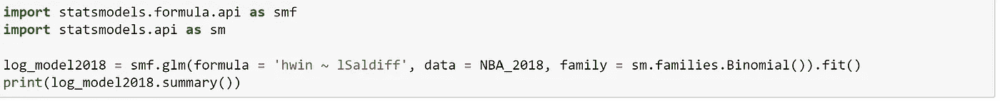
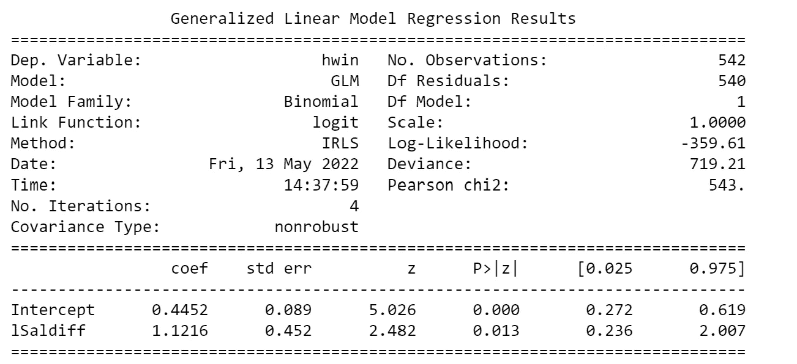

# 团队花费可以用来打庄家吗？

> 原文：<https://blog.devgenius.io/can-team-spending-be-used-to-beat-the-bookmaker-696614c00fc4?source=collection_archive---------18----------------------->

随着体育博彩越来越受欢迎，篮球爱好者坚持认为他们对这项运动的了解足以获利。但是跑赢一个体育博彩平台有多容易？让我们找出答案。

# 数据清理

NBAmod 数据库

为了使文章简短，我跳过了数据清理步骤，将简单解释上面的数据框是如何使用 Pandas 生成的。首先，NBA 比赛水平数据取自 NBA 的网站。我在赛季 ID 栏上用了一些过滤器来隔离 2018/19 赛季，在 gameID 上过滤来排除季前赛。该数据集中的比赛列如下所示:

我使用字符串分割来区分球队，然后可以使用 np.where 语句根据“@”或“vs”来确定哪支球队是某场比赛的主队或客场队。这为我提供了 NBAmod 数据框中的我的主页和访问者列。NBA 比赛数据框显示了每支球队的得分，因此我随后根据我的 where 语句将该值分配给主队或客场队，并使用加/减列来确定对手的得分。最后，我可以减去主队和客场得分来创建列“hwin ”,如果主队赢了，它是一个二进制值 1，如果客场赢了，它是 0。举个简单的例子，在上表的索引 5 中，亚特兰大(ATL)是主队，印第安纳是客场。在这场比赛中亚特兰大得了 80 分，所以从正负上，我可以确定印第安纳得了 81 分。

列“hteamsal”和“ateamsal”代表每支球队支付给球员的累计工资，取自:[https://www.spotrac.com/nba/contracts/](https://www.spotrac.com/nba/contracts/)

我导入了每支球队的工资，然后通过将工资合并到我在“主场”的游戏级别数据框中来设置“hteamsal ”,然后再次合并到“客场”来生成“ateamsal”列。最后，hwinodds 和 awinodds 是 Bet365 分配给每个队的十进制投注赔率，相同的合并过程被应用于创建最终的数据帧。

所以现在我们有一个结果，簿记员的赔率，和工资。有了这些基本信息，我们能否创建一个比 Bet365 更能预测游戏结果的简单模型？让我们找出答案。

# 数据处理和准备

为了创建一个可用的模型，我们首先需要将簿记员的赔率转换成每个团队获胜的概率。要将小数赔率转换成概率，只需用小数赔率除以 1。对于有二元结果的运动，一旦你找到了其中一个概率，你就可以从一个概率中减去那个概率来得到另一个结果，代码如下所示。在这种情况下，Phwin 是 Bet365 赋予主队获胜的概率，Pawin 是他们赋予客队获胜的概率。

我们将使用对数回归，这需要二元结果，以便根据 2018 年的结果(上半季)预测 2019 年的结果(下半季)。因此，我创建了两个类‘A’代表客场队获胜，而‘H’代表主队获胜。实际结果存储在下面显示的一个名为“winteam”的列中，Bet365 预测的结果存储在一个名为“bookPred”的列中，并根据十进制赔率确定哪个队获胜的概率更高。最后，由于高值和团队支出之间的差异，工资值通常对回归模型有很大的影响，因此为了提高我们模型的准确性，我创建了列“lSaldiff ”,它采用主队累积工资对客场队累积工资的记录。作为我们模型的一个特征，这将比两个团队之间简单的工资差异更好。

为了使这个模型具有预测性，我们将使用 2018 年的数据作为我们的训练集来开发对数回归模型，如下所示。

这个模型意味着什么？嗯，基于对数工资比率，我们可以使用下面的公式来开发我们自己对获胜团队的预测，其中“a”是我们的对数回归模型的截距，“b”是“lSaldiff”特征的系数。

由于我们将主队薪资除以客场，因此该公式将根据薪资比率给出主队获胜的概率，并且为了获得客场获胜的概率，我们可以利用概率之和必须等于 1 的特性。请注意，我不是将这些系数应用于 2018 年的数据，而是将它们应用于整个数据集，根据 2018 年游戏中训练模型的信息来预测 2019 年游戏的结果。

最后，类似于 Bet365 概率，我可以通过选择基于较高概率的获胜团队来确定模型认为哪个团队将获胜。

# 模型分析

我们打败庄家了吗？让我们找出答案。

通过对 2019 年的比赛进行隔离，我们可以通过检查“winteam”列中的值是否与“bookPred”和“logitPred”中的获胜球队相匹配，来确定簿记员和逻辑回归模型的正确预测。因为这些值要么是 0，要么是 1，所以对数据帧上的这些列取平均值将给出每个模型做出的正确预测的百分比。在这种情况下，Bet365 正确预测了 68.75%的比赛结果，我们的简单模型正确预测了 58.72%的比赛结果。另一种评估模型性能的方法是使用 Briar 评分。Briar 分数是结果和预测概率之间的平方差之和，其值介于 0 和 1 之间。接近 0 的值表示该模型正确预测了几乎所有结果，在二元结果情况下接近 0.5 表示该模型类似于基于随机机会的预测，接近 1 的值将对我们的钱包非常不利。

因此，正如我们所见，我们的简单模型比随机预测一支球队稍好，但远远超过 Bet365 的表现。

# 关闭警告

所以，我们的模型是非常基本的，你的第一个想法可能和我的一样:如果我们开发一个基于更多预测的更复杂的模型，我们可以胜过 Bet365。这是许多体育赌徒犯的致命错误。无论我们的模型有多复杂，如果我们排除球队拥有的专有数据，我们可以假设体育博彩市场是有效的。这意味着所有公开可用的数据都被 Bet365s 数百名数据科学家用来开发复杂的模型，通过访问相同的数据，我们最多可以匹配他们的预测。这意味着，虽然我们可以生成一个很好的模型并赚一些钱，但随着时间的推移，我们失去这些钱的可能性很高，所以即使我们知道回归，也几乎不可能在市场上获得一致的利润。同样，我们可能会在股票市场上赚一些钱，但我们必须警惕不要过于自信，因为击败有效市场是很困难的，即使我们利用了一种模式，有效市场理论表明，随着时间的推移，市场将调整以适应并消除该模式所利用的低效率。

因此，虽然体育博彩可能很有趣:不要把它变成一个全职的职业生涯，风险根本不值得回报。