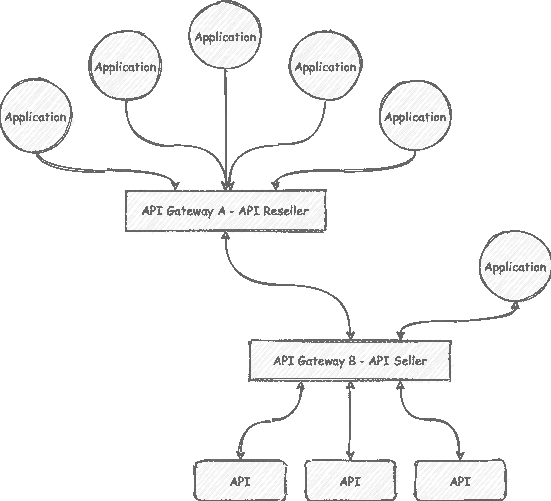
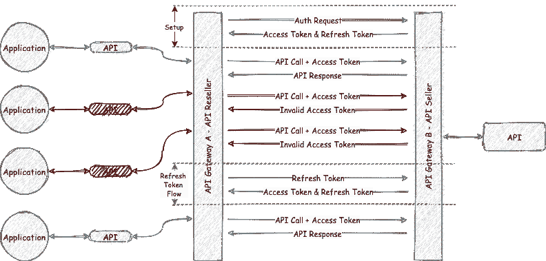
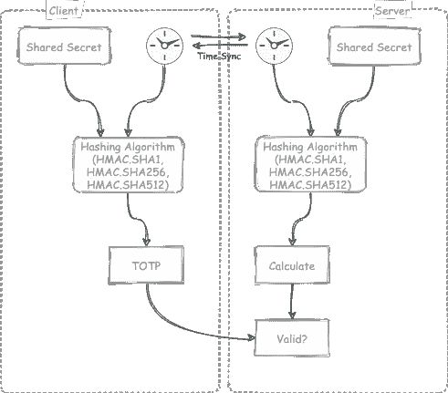
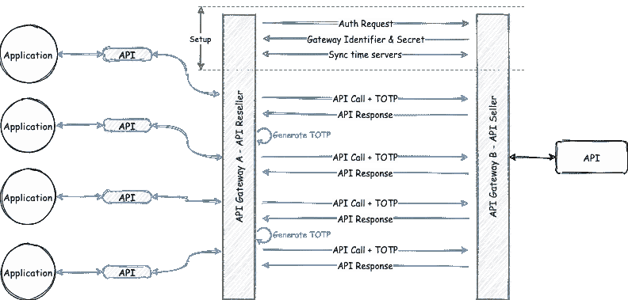

# TOTP 可以作为更新代币的替代方案吗？

> 原文：<https://blog.devgenius.io/can-totp-be-used-as-an-alternative-to-refresh-tokens-5b992b28e45e?source=collection_archive---------2----------------------->

由 [Unsplash](https://unsplash.com/?utm_source=unsplash&utm_medium=referral&utm_content=creditCopyText) 上的 [MinuteKEY](https://unsplash.com/@minutekey?utm_source=unsplash&utm_medium=referral&utm_content=creditCopyText) 拍摄

如果您使用过 API，那么您对 oAuth2 和刷新令牌并不陌生。虽然有很多方法可以保护 API，但 oAuth2 一直是 API 的杜蕾斯，如果使用正确，oAuth2 几乎在 98%的时间里都不会让 API 失望。

oAuth2 是一个用途广泛、久经沙场的框架，在保护和安全共享资源方面具有不可估量的价值。然而，在我之前的一次约会中，我遇到了一个情况，事情进展得并不顺利。目标是探索使用完全不同的方法解决问题的可能性。让我提醒您注意一个非常具体的场景，它涉及一个 API 销售者和一个 API 经销商，确切地说是一个中心辐射模型。

中心辐射模型— API 中心和网关

从 API 网关 B 的角度来看，API 网关 A 只是另一个应用程序。但实际上，API Gateway A 是 API Gateway B 的 API 的经销商。这具有重要意义。因为网关 B 将网关 A 视为单个应用程序，所以网关 A 被给予一组凭据来使用网关 B 上的资源。这造成了一种相当独特的情况，如果处理不当，这种情况可能会升级为竞争情况。

让我们看一下上面的场景，网关 A 将从网关 B 获得一个访问令牌和一个刷新令牌，并开始为其客户提供服务。该接入令牌必须用于服务网关 A 的许多客户的许多应用，他们向这些客户转售网关 b 的 API。在某个时刻，接入令牌将到期，网关 A 将必须启动刷新令牌流，在该过程中，可能需要几毫秒到几秒的时间，可能会发生两种情况。

1.  所有需要网关 B 的 API 调用都将失败
2.  所有需要网关 B 的 API 调用将排队等待，直到令牌被刷新。这是一个更好的选择，因为刷新很快，API 调用不会超时，或者更糟的是不会变成 SlowDDoS。

如果情况处理不当，可能会出现另一种情况。想象一下，如果令牌的刷新是由网关 A 上的每个服务随意完成的，随后需要消耗网关 B 上的资源，这将导致竞争情况，其中每个服务同时刷新令牌，并最终以死锁结束。

消除这个问题的一种可能性是使用具有长 TTL 的令牌，但这是一个巨大的安全风险，因此是一个很大的否定。其他不太吸引人的选择是使用基本身份验证，并通过使用 VPN 或双向 SSL 来保护网络通道。但我觉得还有别的办法，所以听我说完。

我的建议是在社交上拉开代币更新流程的距离，你知道，保持疫情和所有的主题。与其使用需要客户机和服务器通信的刷新令牌，为什么不独立完成呢？

TOTP 已经存在很长时间了，但它主要在 2FA 中使用。如果我们可以用它来代替刷新令牌流呢？奇迹发生了，如果你不知道什么是 TOTP，不知道你在谷歌认证器上使用的密码，也不知道你登录脸书时使用的密码，是的。TOTP 的工作原理是同步客户端和服务器的时钟，拥有一个共享的秘密，并使用像 HMAC 这样的哈希算法。SHA512 生成一次性代码。一旦系统时钟同步并且共享了秘密，这些代码就可以由客户机生成，而无需与服务器通信。

现在让我们看看这将如何解决我们最初的问题。网关 A 将启动并与网关 B 通信，在初始授权后，网关 A 将获得一个秘密，而不是访问令牌和刷新令牌。此外，系统时钟必须同步。这种方法的缺点是，服务器必须维护不同的时间段以及应用程序细节，以计算正确的时间步长，从而在服务器端生成 TOTP。在这个初始步骤之后，客户机可以继续生成 TOTPs，而无需与服务器通信。

TOTP 在滑动时间窗口上工作，代码在给定的时间内有效，并且服务器还被配置为考虑时间上的微小差异(考虑任何网络延迟等)。因此，即使您设计您的解决方案来为每个 API 调用生成一个 TOTP，在一个给定的时间窗口内，对于一个给定的秘密，哈希算法将给出相同的 TOTP。在下面的代码片段中，TOTP 生成器被配置为 30 秒的时间窗口，如您所见，在 30 秒内生成的 TOTP 值是相同的。当然，你也可以决定在一次使用后使代码无效，我的意思是它被称为 OTP。

因此，即使两个应用程序同时生成 TOTPs，也不会导致死锁情况。当使用刷新令牌时，如果两个应用程序同时刷新同一个令牌，可能会导致死锁。这种方法的另一个好处是命中网关 B 的 API 调用的数量将会减少，因为令牌的刷新将在客户端完成。

现在，为了正确地测试这一点，我快速地将两个 spring boot 应用程序组合在一起，模拟网关 A 和网关 B，网关 A 将拥有来自网关 B 的一组证书，并与网关 A 上的三个应用程序共享，使用三个并发线程来访问网关 B 上的资源。您可以在此处找到完整的源代码。结果很有希望。

这些结果是在 10 分钟内捕获的，TOTP 终止时间为 30 秒。三个应用设法共享相同的秘密，并且仍然设法刷新和访问网关 B 上的资源，而没有遇到竞争情况。

我不打算宣称这个解决方案是完美的，但它显示出了希望，它解决了我面临的一个特定问题，而我无法使用刷新令牌来解决这个问题。更重要的是，我想把这个想法说出来，这样我就可以发起一场讨论，如果这可以点燃一团火焰，可以建立一些坚实的东西和一个真正的解决方案，那么我很乐意成为解决方案的一部分。

[1]https://tools.ietf.org/html/rfc6238 TOTP:基于时间的一次性密码算法，

[2]基于时间的 Java 一次性密码(MFA)库，【https://github.com/samdjstevens/java-totp 

[3][https://github.com/charith26/TOTPDemo](https://github.com/charith26/TOTPDemo)