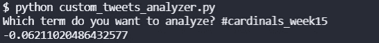
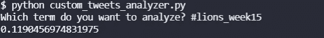

# 推特情绪能预测 NFL 比赛吗:狮子第 15 周的红雀队

> 原文：<https://blog.devgenius.io/can-twitter-sentiment-predict-nfl-games-cardinals-at-lions-week-15-e87ad8ace99a?source=collection_archive---------15----------------------->

## 我们 NFL 推特情绪系列的第四部分——中场休息版

[图片来自法语维基百科](https://fr.wikipedia.org/wiki/Fichier:Logo_Detroit_Lions_2003.svg)

*更新:这次推特是对的！*

在过去的几周里，我们一直在对相当多的 NFL 比赛进行情感分析。首先是第 12 周的[布朗队对乌鸦队](https://medium.com/@ytang07/natural-language-processing-on-tweets-browns-vs-ravens-prediction-4eb0ca165189)，然后是第 13 周的[牛仔队对圣徒队](https://medium.com/@ytang07/natural-language-processing-on-tweets-browns-vs-ravens-prediction-4eb0ca165189)，然后是第 14 周的[红雀队的](https://medium.com/@ytang07/natural-language-processing-on-tweets-browns-vs-ravens-prediction-4eb0ca165189)公羊队。赛前推特情绪较高的球队目前为止 3 场 0 胜。这一次，我在比赛开始前与朋友一起吃午饭，所以我打算做一个后来的比赛，我仍然可能会这样做，但狮队比赛的红雀队将成为一个有趣的比赛。

关于我们如何获取这些推文和情绪的指南，请查看[如何使用 Twitter API](https://pythonalgos.com/2021/12/02/search-twitter-from-your-command-line-with-python/) 和[对推文进行情绪分析(星巴克的例子)](https://pythonalgos.com/2021/11/29/twitter-sentiment-for-stocks-starbucks-11-29-21/)。

## 狮周 15 的红雀队:上半场解说

这场比赛中红雀队的赔率是 10 比 3，狮子队的赔率是 1 比 11 比 1。到目前为止，这场比赛是一场精彩的表演。这个上半年出乎所有人的意料。我不记得上次看到狮子队在中场休息时领先是什么时候了，更不用说 17 比 0 领先了。狮子队获得了本赛季的第一次红区停赛，自 2018 年以来，红雀队还没有在上半年被拒之门外。

狮子队以一个射门得分开始了半强有力的比赛，随后是两次漂亮的达阵。红雀队只是没有像红雀队那样打球。他们刚刚从上周输给公羊队的一场比赛中走出来，无论是从推特上的情绪还是从统计数据来看，他们都被预测会赢。看看这些球队的半场推特情绪能不能预测这场比赛。

## 半场推特情绪，狮周 15 红雀队

不出所料，推特上关于红雀队的话题沸沸扬扬。没有一个粉丝开心。这支 10 比 3 的球队落后 17 分，半场就被淘汰出局？我预计会有相当负面的情绪，但情绪实际上只有-0.06 的轻微负面。

第 15 周半场时红雀队的情绪——作者图片

我想狮子队的球迷会更高兴，他们的球队在半场时得到了 17 分，戈夫投了几个漂亮的球，防守也很好。然而，他们的推特人气并没有那么高。才坐在 0.12。

第 15 周中场休息时的狮子情绪——作者图片

让我们看看中场休息时的情绪是否更能反映获胜的可能性。众所周知，狮子队在下半场踢得不好，开始的几分钟看起来也不怎么样。

如果你觉得这篇文章很有趣，请在 Twitter 上分享！要无限制使用 Medium，请立即注册成为 [Medium 会员](https://medium.com/@ytang07/membership)。想了解更多关于自然语言、足球和推特的文章，记得关注我，唐。