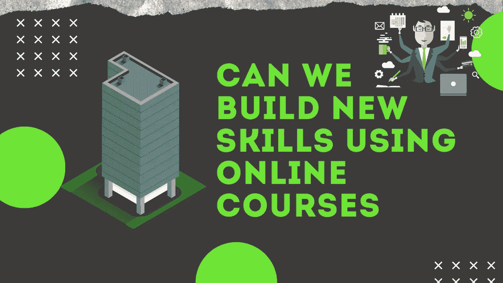

# 我们能通过在线课程发展新技能吗？

> 原文：<https://blog.devgenius.io/can-we-develop-new-skills-through-online-courses-daf63e23e649?source=collection_archive---------8----------------------->

> 一般来说，我们过去常常花钱上新课程，以探索新的兴趣或发展一项专业技能。世界上有很多人负担不起这些课程。今天，我将讨论“我们能否通过在线课程开发新技能”。我是计算机专业的学生，因此，我将从技术技能的角度来讨论

在开始讨论之前，你应该了解一些我们经常认为是先决条件的事情，但实际上不是。有许多事情被高估了

# 被高估的事情

*   证书
*   大学教育
*   包装

证书:这是一张花费了我们父母几乎所有积蓄或你收入的文件。我们身处 21 世纪，你申请的每家公司或你梦想工作的公司都会询问你的技能以及你在这方面的能力。并不是“这个人有知名平台的证书，我们应该聘用他/她”。他们自己通过问一些问题/在你面前保留一些工业场景来证明你。这不是一张纸可以证明/判断的。

大专学历:大家都认为如果加盟名校，休息由“品牌因素”照顾。作为一名大学生，我可以说“大学被高估了”。大学唯一能比在线课程做得更好的是，它引入了一种环境，在这种环境中你可以了解各种文化，以及如何与不同类型的人相处。说到教学，我更喜欢自学和 24/7 辅助的在线学习。

大学各走各的速度。他们不可能让每个学生都明白。所以，学得快的人是在浪费时间，他们可以选择其他课程。迟钝的学习者需要更多的时间来理解。但是学院有固定的一学期的时间。

包:我见过很多人为了好的工资单，跳进自己不感兴趣的领域/进入收费很高的学院。这样做了之后，他们有时可能不得不后悔。这主要是因为来自父母的压力。如果人们看到你偏离了他们已经看到很久的道路，他们就会开始评判你。你读的大学不能评判你的工资单。

我听说有人在三四级大学学习，进入我们梦想的高薪跨国公司。

# 我们能通过在线课程发展新技能吗？

回到我们的主要方面。是的，我们可以通过在线课程发展新技能。

在上课之前，你必须做大量的研究。你不应该考虑费用或品牌因素来评判一门课程。

现场体验:想学 ML。没有经过适当的研究，我选择了一个 15000 卢比的课程。我完成了课程，但是我不确定他们教我的概念，而且他们没有提到/教我课程的先决条件。是有时间限制的。

后来，我想再试一次。在和我的朋友聊天时，他提到了另一个平台。在那里，我发现他们教我从像 python，SQL 和 NoSQL，Flask，统计，ML，DL，NLP 和聊天机器人项目的基础开始。该课程提供 30 个项目的就业援助。这个球场的费用大约是 3000 到 4000 印度卢比。

# 怎么选课？

*   检查是否从基础开始。
*   关于课程和教师的研究。
*   检查它是否是预算友好的。
*   检查是否有时间限制或终身访问课程。
*   它应该包含项目
*   试着考虑一个有安置帮助(不是安置保证)和实时支持和疑问澄清会议的课程。

# 如果你在预算中找不到课程怎么办？

去 youtube.com 吧。YouTube 是大多数人都可以获得的最佳资源之一。YouTube 的问题是它不是以有序/分类的方式。你能做的是:

*   从你认为最好的平台上复制课程大纲。
*   试着为你想学的技能找到最好的 YouTube 资源。
*   试着制作你自己的播放列表。
*   尝试加入社团。这样，如果你有疑问，你可以从他们那里得到帮助。
*   尝试与 LinkedIn 中的人联系。试着和他们保持联系，也许他们中的一些人能对你的职业生涯有所帮助。