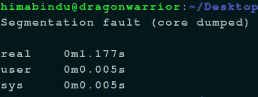
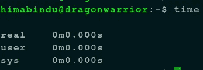

# 一个数组中可以有超过 1000000 个元素吗？是的，但是…

> 原文：<https://blog.devgenius.io/can-we-have-more-than-1000000-elements-in-an-array-yes-but-7a5c4e5b460a?source=collection_archive---------4----------------------->

在 C 语言中，它给出了“分段错误:核心转储”



这是我在完成算法设计和分析的作业时发现的有趣的事情。我必须为二分搜索法写一个算法(用任何编程语言)并分析它的时间复杂度。

我通常更喜欢 python，但在这里我想使用递归，因为 python 的最大深度递归只有 1000，所以我用 C 来实现它。

你可能想知道为什么我需要 1000 多次递归调用来证明我的二分搜索算法运行正常。是的，我可以用小数字证明。

但是我想在我的终端中使用“时间”工具来实际计算时间，并根据我的算法的速度显示出来。所以，我不得不用 C 来表示。



那时我才知道，在拥有一个大小为 10，000，000 的数组后，C 不能再多处理一个空间。上面写着“分段故障:核心转储”。我可以停在这里，只使用 10，000，000 个元素进行分析。但我很好奇为什么 C 不会允许拥有超过 10，000，000。

然后在谷歌上搜索了一番，并对我的代码进行了几次测试之后。我知道我们需要函数是“静态的”,以便在包含该函数的数组中有超过 10，000，000 个元素。

如果你声明一个函数是“静态的”,你就只能把这么大的数组放在函数中。这告诉编译器把它放在堆内存中，而不是堆栈中。这样，随着现代 RAM 的大小以千兆字节计，你不会有任何麻烦。

另一种方法是在任何函数外部声明、定义和初始化数组，使其成为一个全局变量。这也迫使它进入堆，避免堆栈溢出。

我选择了第一个选项，因为我很少使用全局变量，因为我认为当我们使用全局变量时，这不是一个干净的代码。

```
#include <stdio.h> int binarySearch(int array[], int low, int high, int key) {
   if (high >= low) {
        int mid = low + (high - low) / 2;
        if (array[mid] == key)  return mid;
        if (array[mid] > key) return binarySearch(array, low, mid - 1, key);
        return binarySearch(array, mid + 1, high, key);
   }
   return -1;
}

int main(void)
{  
   static int array[10000000];

   int size;
   printf("Enter size of array: ");
   scanf("%d", &size);
   for(int i = 1; i <= size; i++){
       array[i] = i;
   }

   int key;
   printf("Enter key: ");
   scanf("%d", &key);
   int result = binarySearch(array, 1, size, key);
   (result == -1)? printf("Element is not present in array")
                 : printf("Element is present at index %d", result);
   return 0;
}
```

所以，耶，耶，耶，耶，完成了。如果您想查看输出，请点击这里！

```
himabindu@dragonwarrior:~/Desktop/College/AA/AA-Lab$ time ./a.out
Enter size of array: 10000000
Enter key: 57000
Element is present at index 57000real 0m6.737s
user 0m0.045s
sys 0m0.020s
```

就是这样。感谢你阅读我的博客。

快乐学习🎈