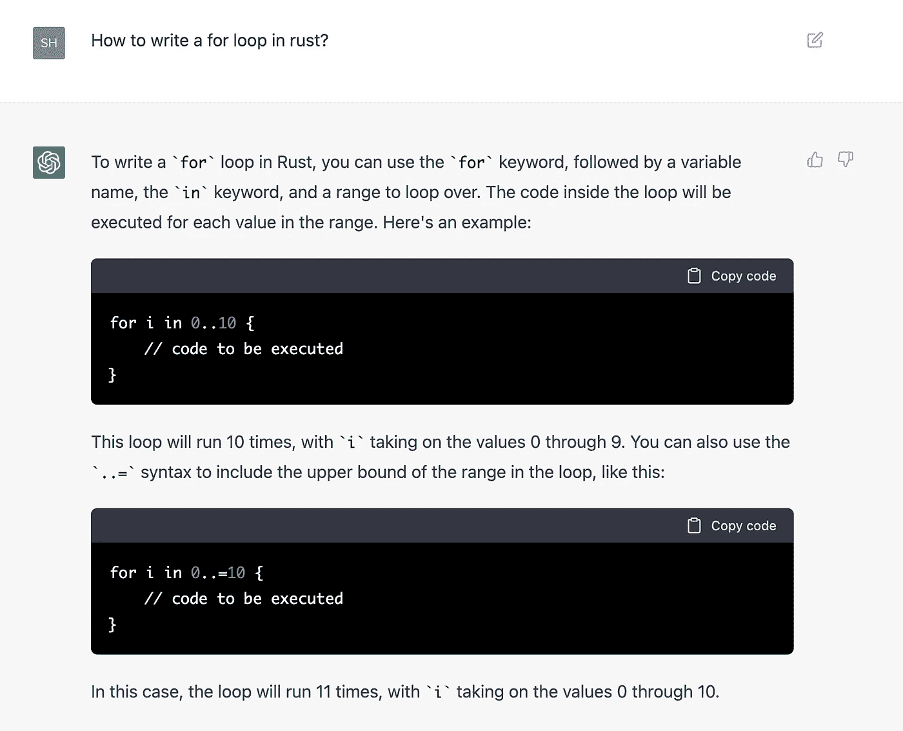

# 用 ChatGPT 可以快速学会 Rust 吗？

> 原文：<https://blog.devgenius.io/can-we-learn-rust-quickly-with-chatgpt-1f7295bf6114?source=collection_archive---------4----------------------->

OpenAI 发布了聊天机器人 ChatGPT，可以回答编程问题。自从我学习 Rust 以来，我经历了几个棘手的问题，我将用 ChatGPT 来尝试，看看它是否能教会我这些。

首先，让我们从简单的开始，如何迭代一个循环:



看起来合法，让我们试试更难的东西。Rust 中如何迭代一个向量？下面是答案。

要在 Rust 中迭代`Vec`的元素，可以使用`for`循环和`.iter()`方法来获得向量的迭代器。这里有一个例子:

```
let vec = vec![1, 2, 3];

for element in vec.iter() {
    // code to be executed
}
```

这将迭代 vector 的元素，并对每个元素执行循环中的代码。在循环的每次迭代中,`element`变量将被设置为向量中的当前元素。

或者，您可以使用带有`.next()`方法的`while`循环来迭代向量的元素。这里有一个例子:

```
let mut vec = vec![1, 2, 3];

while let Some(element) = vec.next() {
    // code to be executed
}
```

该代码还将迭代 vector 的元素，并对每个元素执行循环中的代码。在循环的每次迭代中,`element`变量将被设置为向量中的当前元素。

这两种方法都可以让您访问向量的元素，但是它们在迭代实现的方式上有所不同。`for`循环更简洁，通常更容易阅读，但是`while`循环可以更灵活，因为它允许您手动控制迭代。

这看起来真的很酷，现在让我们认真起来。Rust 中 nalgebra 矩阵如何修改块中的值？开始了。

要修改 Rust 中`nalgebra`框中矩阵的值，可以使用`mut`关键字使矩阵可变，然后使用索引来访问和修改单个元素。这里有一个例子:

```
use nalgebra::Matrix3;

let mut m = Matrix3::new(1, 2, 3,
                         4, 5, 6,
                         7, 8, 9);

// Modify the element at row 0, column 2
m[(0, 2)] = 10;

// Modify the element at row 1, column 1
m[(1, 1)] = 11;
```

在这段代码中，我们用给定的值创建一个新的`Matrix3`，然后使用索引来修改指定位置的元素。`(0, 2)`和`(1, 1)`分别是要修改的元素的行和列索引。

注意，为了修改矩阵，必须使用`mut`关键字将它标记为可变的。否则，您将得到一个编译时错误。

一旦您修改了矩阵的元素，您可以使用`println!`宏或`debug`方法将其打印出来，并验证所做的更改。这里有一个例子:

```
use nalgebra::Matrix3;

let mut m = Matrix3::new(1, 2, 3,
                         4, 5, 6,
                         7, 8, 9);

// Modify the element at row 0, column 2
m[(0, 2)] = 10;

// Modify the element at row 1, column 1
m[(1, 1)] = 11;

// Print the matrix to the console
println!("{:?}", m);
```

这将把矩阵打印到控制台，并显示您对元素所做的更改。您也可以使用`debug`方法通过`println!`宏打印矩阵，如下所示:

```
use nalgebra::Matrix3;

let mut m = Matrix3::new(1, 2, 3,
                         4, 5, 6,
                         7, 8, 9);

// Modify the element at row 0, column 2
m[(0, 2)] = 10;

// Modify the element at row 1, column 1
m[(1, 1)] = 11;

// Print the matrix to the console
println!("{:?}", m.debug());
```

这段代码将产生与前一个例子相同的输出，但是它使用了`debug`方法来打印矩阵。这两种方法都有效，您可以选择使用哪一种。

好吧，这不是不合理的，但不完全是我在寻找的答案。让我们试试别的东西。Rust 中 ndarray 矩阵如何转化为 nalgebra 矩阵？

要在 Rust 中将一个矩阵从`ndarray`格转换到`nalgebra`格，可以使用`nalgebra`提供的`try_from`方法。`try_from`方法获取对`ndarray`矩阵的引用，并返回一个包含转换后的`nalgebra`矩阵的`Result`，如果转换失败，则返回一个错误。这里有一个例子:

```
use ndarray::Array2;
use nalgebra::{Matrix, Matrix3, Dynamic, U3};
use std::convert::TryFrom;

let a = Array2::<f64>::zeros((3, 3));

let m: Matrix3<f64> = Matrix3::try_from(&a).unwrap();
```

上面的代码虽然在 Rust 中不起作用，参考[这个链接](https://play.rust-lang.org/?version=stable&mode=debug&edition=2021&gist=e3cfb1e6e88ec76f4eb48c2d8fbe0717)。

它还说:

您也可以使用`nalgebra`提供的`into`方法将`Array2`直接转换为`Matrix`。该方法获得`Array2`的所有权，并返回具有相同元素值和形状的`Matrix`。这里有一个例子:

```
use ndarray::Array2;
use nalgebra::{Matrix, Matrix3, Dynamic, U3};

let a = Array2::<f64>::zeros((3, 3));

let m: Matrix3<f64> = Matrix3::from_shape_vec((3, 3), a.into_raw_vec()).unwrap();
```

上面的代码块有语法错误…我修改到下面，它实际上工作

```
use ndarray::Array2;
use nalgebra::{Matrix, Matrix3, Dynamic, U3};

fn main() {
    let a = Array2::<f64>::zeros((3, 3));
    let m: Matrix3<f64> = Matrix3::from_vec(a.clone().into_raw_vec());
    println!("a {:?}", a);
    println!("m {:?}", m);
}
```

我刚刚学到了一些新东西，因为我没有想到先把 ndarray 转换成 vector，然后再转换成 nalgebra。*免责声明:我对 ndarray 和 nalgebra 都不是很熟悉。*

让我们试试更抽象的东西。如何在 Rust 中迭代一个向量而不消耗它？答案在下面。

要在 Rust 中迭代`Vec`的元素而不消耗它，可以使用`iter()`方法获得一个借用 vector 的迭代器。这里有一个例子:

```
let vec = vec![1, 2, 3];

for element in vec.iter() {
    // code to be executed
}
```

这将迭代 vector 的元素，并对每个元素执行循环中的代码。在循环的每次迭代中，`element`变量将被设置为从向量到当前元素的引用。

注意，`iter()`方法返回一个借用向量的迭代器，而不是消耗它。这意味着这个向量在循环之后仍然可以使用，您可以像往常一样继续使用它。

或者，您可以使用一个带有`.next()`方法的`while`循环来迭代一个向量的元素，而不消耗它。这里有一个例子:

```
let vec = vec![1, 2, 3];

let mut iter = vec.iter();

while let Some(element) = iter.next() {
    // code to be executed
}
```

该代码还将迭代 vector 的元素，并对每个元素执行循环中的代码。在循环的每一次迭代中，`element`变量将被设置为从向量到当前元素的引用。

`while`循环方法允许你手动控制迭代，并且在如何迭代向量元素上给你更多的灵活性。然而，它通常比使用`iter()`方法的`for`循环更冗长，更难阅读。选择哪种方法更适合您的特定需求取决于您。

它好像理解了 Rust 里的所有权模型！

在 ChatGPT 的这个小实验之后，我的结论如下。对于一些基本的功能，它比 stackoverflow 更好，因为 ChatGPT 包含了更多的场景和详细的解释。然而，有时它没有意识到它生成的代码有语法错误。不管怎样，我认为 ChatGPT 是一个好的开始，现在除了 stackoverflow 之外，我又多了一个工具来磨练我的编程技能！