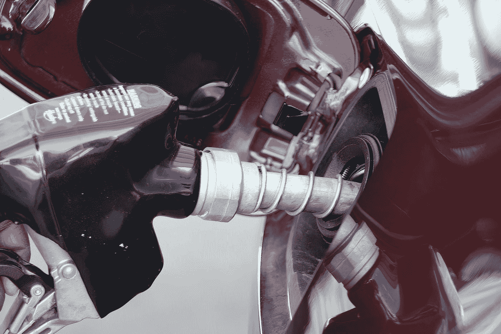
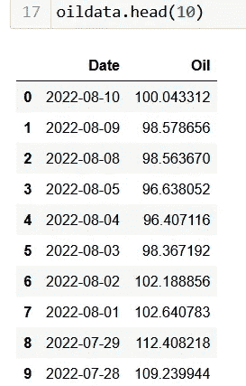
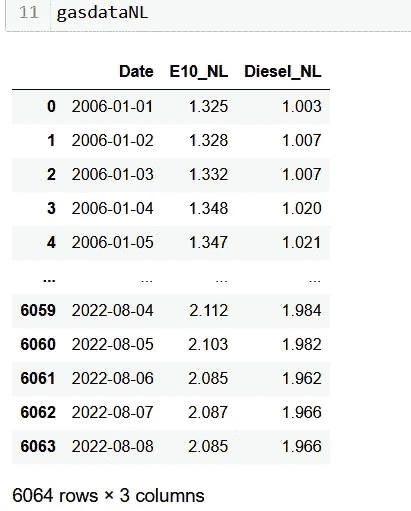
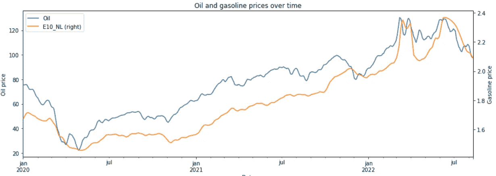
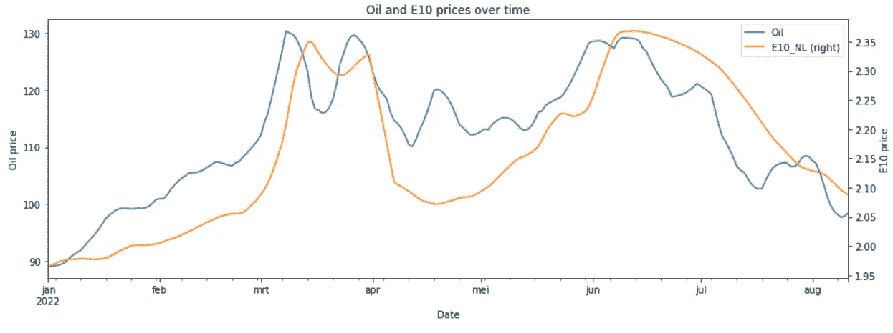
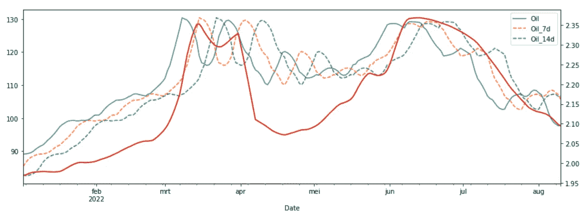
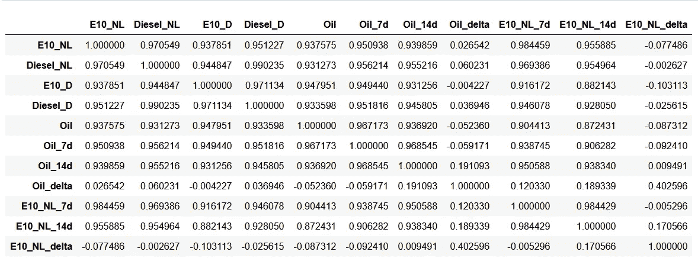
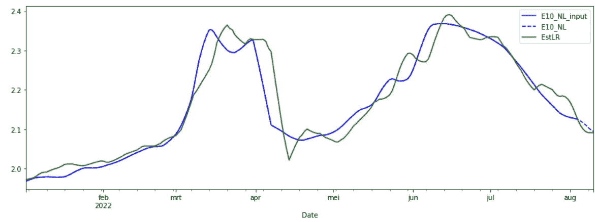
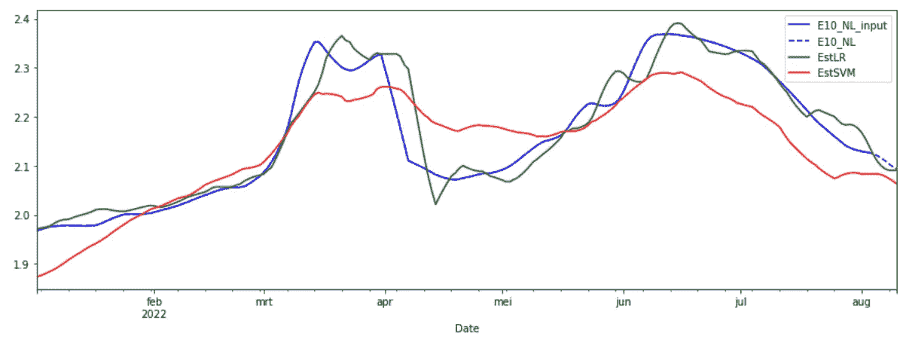
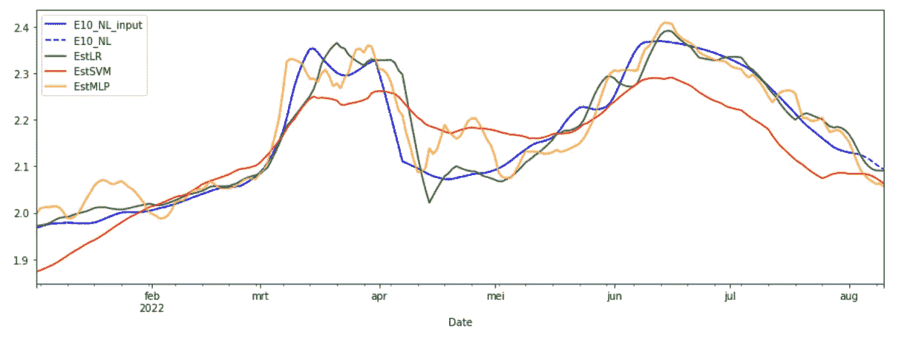

# 我们能预测燃料价格吗？

> 原文：<https://blog.devgenius.io/can-we-predict-fuel-prices-25e6a6660a1c?source=collection_archive---------18----------------------->

## 燃料价格时涨时跌(大多是上涨)。我们能预测会发生什么吗？让我们试试 Python 和 scikit-learn。

道恩·麦克唐纳在 [Unsplash](https://unsplash.com?utm_source=medium&utm_medium=referral) 拍摄的照片

汽油(E10)的价格时涨时跌。能源危机极大地影响了这些价格。据称它高度依赖于石油价格，跟随石油价格的上升趋势比跟随下降趋势要快。我们将看看这种说法是否属实，以及我们能否预测未来几天的燃料价格。

因此，首先我们将收集我们的数据(石油和燃料价格)。第二步是分析这两者之间是否存在(视觉上的)相关性。最后，我们将尝试构建 E10 价格的预测器。

## 获取石油和燃料价格

很容易找到最近几周/几个月的当前价格和图表。找到底层的表格数据有点困难。关于油价，我在 investing.com 的[上找到了。当你在网站上有一个免费帐户时，可以下载历史数据(每天，每周，每月)。](https://www.investing.com/commodities/brent-oil-historical-data)

当你点击上面的链接，你会看到一个关于布伦特原油期货信息的页面。布伦特原油是世界上两个主要的石油交易场所之一(另一个是 WTI)。期货是一种合同，规定了石油交易的价值、价格和日期。它是当前油价的一个很好的指标。

investing.com 截图

确保点击“历史数据”选项卡。在“下载数据”按钮的右侧，您可以指定想要下载的时间段，在左侧，您可以指定想要每日、每周还是每月的数据。时光倒流 30 多年是有可能的。

当您指定下载周期和数据频率时，您可以下载数据并接收 CSV 文件中的信息:

石油价格数据示例(作者截图)

就目前的目的而言，这种获取数据的方式很好。当需要经常检索数据时，应该自动进行检索，例如使用 BeautifoulSoup4。

由于我对荷兰 E10 的价格感兴趣，燃料价格将以欧元为单位。布伦特原油期货以美元计价。欧元对美元的汇率在分析期间会发生变化，所以我们需要一种货币。在这种情况下，我选择了欧元，需要将美元价格转换为欧元。

汇率也可以在 investing.com 上找到[。下载这个数据等于油价。](https://www.investing.com/currencies/eur-usd-historical-data)

所以现在我们有两个 CSV 文件，一个是石油期货价格，另一个是汇率。我们将用 Pandas 导入这些，应用更改率并执行一些数据清理:

在第 4 行和第 5 行中，两个 CSV 都被导入到一个 panda 数据框架中，其中欧元兑美元汇率数据框架的列以“`_USD`”为后缀。两个 CSV 都有一些相同的列名，我们需要能够区分它们。这些数据帧在日期列上合并。

在第 7 行中，用欧元计算未来价格，在第 9 行中，日期的字符串表示被转换成一个`datetime`对象。在第 8 行中，设置了正确的区域设置，以确保正确解释月份缩写。日期列包含月份的三个字母缩写，这些缩写因地区而异。最后，第 10 行保留了所需的列，并给出了适用的列名。`Oildata` 长相如下:

每数据油价(作者截图)

现在我们有了历史油价，下一步是获得 E10 的价格。在荷兰，国家统计局(CBS)每天跟踪[汽油价格](https://opendata.cbs.nl/statline/#/CBS/nl/dataset/80416NED/table)。

荷兰汽油价格(截图网站 CBS)

有一个下载 CBS 数据的 python 库(`[cbsodata](https://www.cbs.nl/en-gb/our-services/open-data/statline-as-open-data/quick-start-guide)`)由 CBS 维护。下载大型表格可能需要一些时间。因为大多数表不会频繁改变，所以我开发了一个引入缓存的`cbsodata`包装器。

方法`get_cbs_odata()`返回两个 dataframes，第一个包含数据，第二个包含表和列的描述。参数`cache`决定是否使用本地缓存。第 13 到 15 行对所有包含字符串的列执行 string `strip()`函数。添加这一点是因为大多数字符串列都与空格对齐，删除这些空格会使数据更易于使用。

在这个方法的帮助下，我们检索汽油价格，然后清理这些数据:

为了将日期转换成`datetime`对象，我们需要 Duch 语言环境，因为 date 列包含荷兰的日和月名称(“2022 woensdag 13 juli”)。我们只保留 E10 和柴油价格:

荷兰汽油价格数据(作者截图)

## 组合数据

下一步是结合石油和汽油数据框架。在前面的步骤中，两个表都获得了一个日期为`datetime`对象的列。这使得合并表变得很容易:

第 1 行合并列'【T1]'上的数据帧。用于合并的列由`on`参数指定。两个表中都使用了指定的名称(如果合并键在两个数据集中有不同的列名，您可以使用`left_on` en `right_on`)。默认情况下，merge 函数只返回两个表中都存在的键(在本例中为日期)。通过指定`how=’outer’`，所有键都是结果的一部分，如果它只出现在两个表中的一个表中也是如此。这确保了在一个数据集中有一行缺失的情况下，我们得到一个最终的数据帧，每个数据都有一行。

第 2 行重新对表进行采样，以便在第一个日期和最后一个日期之间的每一天。它只对数据帧的索引有效。缺少的日期将被添加，出现多次的日期将被合并。`max()`选择一个日期出现多次时的最大列值。在这个数据框架中，这种情况很可能不会发生，但是当我们将它重新采样为 weeks 时，七天将被分组为一行，并且需要一个值选择器。还有用于例如最小值和平均值的值选择器。

现在，interpolate()函数通过在缺失值周围的可用值之间执行线性回归来填充缺失的列值(许多函数要求填充所有列)。最后，`rolling(7).mean()`通过计算 7 个值范围内的平均值来平滑数据。这将消除数据中的噪声。最后一行删除 2020 年 1 月 1 日之前的所有日期。

## 旁注:德国燃料价格

本文使用了荷兰的燃料价格，但也可以对其他国家进行计算。例如，德国的历史价格可在[finanzen.net](https://www.finanzen.net/rohstoffe/super-benzinpreis/historisch)网站上获得。

## 首次分析

该看数据了:

石油价格在 20 至 130 欧元之间，而 E10 的价格在 1.50 至 2.50 欧元之间。将这些标绘在同一个轴上会使图表变得无用，因为 E10 的价格将显示为一条近乎平坦的线，因为 y 范围是由油价决定的。引入辅助 y 轴解决了这个问题。

第 1 行绘制了石油价格，并使用了第 2 行中命名的左侧 y 轴。第 3 行绘制了 E10 价格，重用了第一个图中的`matplotlib` 轴，并在右侧添加了一个辅助 y 轴(参数`secondary_y=True`)。第二个轴在第 4 行中命名，而第 5 行为该图添加了一个标题。

油价和汽油价格对比(图片由作者提供)

从图表中我们可以看到，E10 的价格大致跟随油价，但有一点延迟。与油价相比，它也更平稳一些。放大到 2022 年可以更好地揭示这一点:

油价和汽油价格对比[2022](图片由作者提供)

E10 价格紧随 3 月份价格飙升之后，略有延迟。Juli/àu gust 的周期表明，当下跌时，它也跟着下跌。从这两个时期来看，油价上涨导致 E10 价格上涨的速度似乎比油价下跌更快。添加两个延时版本的油价(7 天和 14 天延时)证实了这一点:

比较时移序列(图片由作者提供)

当上涨时，红线似乎与橙色虚线(延迟 7 天的油价)一致，当下跌时，红线似乎与绿色虚线(延迟 14 天的油价)一致。这证实了汽油价格跟随油价上涨比跟随油价下跌更快的假设。

## 预测价格

但是现在蛋糕上的樱桃。能否预测未来一段时间 E10 的价格？数据可以解释为一个时间序列，可以用几个特征(油价，延迟价格)来扩展。但是用回归这样简单的模型也是可能的。要计算的值(E10 价格)和提到的特性之间似乎有明显的相关性。

但首先是时候使用熊猫数据框的`corr()`功能来看看不同特征之间的相关性了:

相关性分析(图片由作者提供)

我们最感兴趣的是显示 E10 价格和其他列之间相关性的顶行。_7d 和 _14d 列是时移列(7 天和 14 天)。_delta 列包含 7 天前和 14 天前的价格之间的价格差值。

相关性最高的是油价、延迟的油价和延迟的 E10 价格。与δ值的相关性很小。使用我们想要预测的值的延迟版本是可能的，但是减少了我们可以预测的时间段。在这种情况下，我们需要 7 天前的 E10 价格，因此我们只能预测未来 7 天的价格(或者我们需要使用预测值的延迟版本)。

## 数据准备

在我们可以应用机器学习之前，我们需要准备我们的测试数据。

使用了`gas_data` 数据帧的副本。在第 3 行中，我们定义了将被用作特性的列名。第 5 行标识了目标列，即我们将尝试预测的值。数据帧的最后 7 个值不会添加到`X`(特征)和`y`(目标值)数据集中。这阻止了我们使用我们想要预测的值作为模型的输入。

## 回归

`statsmodel`包包含了[普通最小二乘](https://en.wikipedia.org/wiki/Ordinary_least_squares) (OLS)回归技术的实现。OLS 通过最小化误差平方和来拟合特征的线性函数。维基百科对 OLS 有很好的描述。

在以下 4 行代码中创建了 OLS 模型，对其进行了训练并用于预测接下来的 7 个值:

第 2 行创建了一个 OLS 模型，`fit()`方法训练这个模型并找到最合适的。在第 4 行中，模型用于预测目标值，也用于我们没有用于训练的 7 个条目。预测值存储在名为“`EstLR`”的新列中。

实际值和预测值(作者截图)

我们可以计算均方根误差(RMSE)来检验这个预测有多好。RMSE 是`0.025`，这意味着一个非常好的预测。图形形式的实际值和期望值:

将实际值与预测值进行比较(由作者创建)

蓝线表示实际值，虚线部分表示最近七天在培训阶段没有使用的值。绿线是预测值。绿线确实很好地跟随了蓝线。4 月份的延迟下降是由于消费税的变化。这些价格是由政府降低的，而且模型无法预测，因为它只关注石油和 E10 的历史价格。总的来说，我对预测的质量感到惊喜。基于这个结果，当 E10 价格预测在未来七天下降时，我有信心推迟给我的车加油。

## 支持向量机

支持向量机(SVM)是一种用于分类和回归目的的监督机器学习算法..SVM 的工作原理是找到一个将数据集分成两个或更多类的超平面。因此，它主要用于分类，但也适用于回归。

将来自 SVM 的估计值添加到比较图中显示，它表现较差，并且低估了 E10 的价格。

## 多层感知器

最后测试的算法是[多层感知器(MLP)](https://en.wikipedia.org/wiki/Multilayer_perceptron) 。MLP 是由多层[感知器](https://en.wikipedia.org/wiki/Perceptron)组成的神经网络。它至少有一个输入层、一个输出层和一个隐藏层。它使用监督训练和反向传播来确定模型中的所有权重。

与前两种算法相比，实现 MLP 要复杂一些:

找到正确的层数和感知器是一个反复试验的过程。在这种情况下，64 个感知器的三个隐藏层似乎给出了最佳结果:

比较预测结果(图片由作者提供)

总的来说，MLP 的预测似乎和回归一样好。查看[误差指标](https://scikit-learn.org/stable/modules/model_evaluation.html)，我们看到 LR 稍微好一点:

模型的评分标准(图片由作者提供)

因此，查看这些模型结果，可以相对较好地预测 E10 的价格。使用回归或神经网络会产生足以用于决策的预测。

包含本文所有代码的笔记本可以在我的 [github 页面](https://github.com/lmeulen/FuelPrices/)上找到。它还包括一组用于计算和预测的 CSV 文件。

## 最后的话

我希望你喜欢这篇文章。要获得更多灵感，请查看我的其他文章:

*   [太阳能电池板发电分析](https://towardsdatascience.com/solar-panel-power-generation-analysis-7011cc078900)
*   [对 CSV 文件中的列执行功能](https://towardsdev.com/perform-a-function-on-columns-in-a-csv-file-a889ef02ca03)
*   [根据活动跟踪器的日志创建热图](https://towardsdatascience.com/create-a-heatmap-from-the-logs-of-your-activity-tracker-c9fc7ace1657)
*   [使用 Python 的并行 web 请求](https://towardsdatascience.com/parallel-web-requests-in-python-4d30cc7b8989)
*   [所有公共交通工具都通向乌得勒支，而不是罗马](https://towardsdatascience.com/all-public-transport-leads-to-utrecht-not-rome-bb9674600e81)

**如果您喜欢这篇文章，请点击关注按钮。**

*免责声明:本文包含的观点和意见仅归作者所有。*