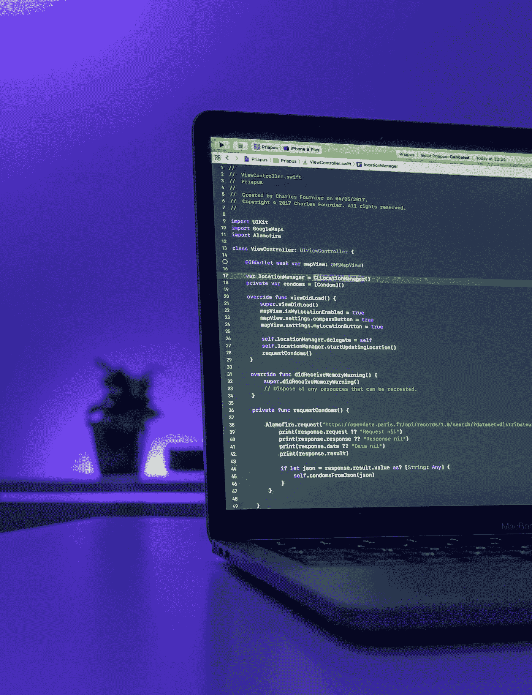

# 你能成为全栈开发者吗？

> 原文：<https://blog.devgenius.io/can-you-be-a-fullstack-developer-a3a1ccb84a4f?source=collection_archive---------10----------------------->

查尔斯-阿德里安·福涅尔在 [Unsplash](https://unsplash.com?utm_source=medium&utm_medium=referral) 上拍摄的照片

上周我在思考全栈思维，我决定写一篇关于“全栈开发者”概念的短文，尤其是在 web 开发中。

事实上，我是被下面这条推文激怒而写下这篇文章的

【https://twitter.com/catalinmpit/status/1236253599627436033 

这勾起了我对去年经历的一些事情的回忆。

我参加了一个研讨会，导师问每个人我们每天的工作是什么。我*有点自豪地*回答说我是 web 应用程序的全栈开发人员。他略带讽刺地回答道:“好吧，如果我什么都不知道，我会问你的。”我听懂了他的“笑话”，第一时间，我想，“*是的，他是对的。术语****full stack developer****似乎是一个模糊的、可能会引起误解的术语"*。我感到有点惭愧。此外，我是唯一一个自称全栈开发者的人，这也于事无补。:)

但是过了几天，我意识到这个主讲人和我有同样的问题。他的职位是“*安全专家*”他在社区里很出名，甚至曾经主演过一部电视剧，但是他对自己角色的描述也很模糊。他可能既不是太空火箭的安全人员，也不从事政治地理研究。他不太可能是一个检查加密算法安全性的数学家，我们每天都用加密算法来实现安全的互联网连接。

在我看来，我的**心态**可能源自我在软件行业多年的亲身经历。我开始开发网站的时候，软件还没有今天这么复杂。那个时候，每个 web 开发人员都是一个完整的堆栈。你只需*抓取*任何 PHP 或 ASP 框架来编写后端和前端代码。

不幸的是，如今，编写一个工作良好的软件变得更加困难。例如，在 web 开发的理想世界中，你应该对 UX、web 设计、可访问性、信息架构、响应性设计、单个浏览器的性能，等等，一丝不苟。

其实我也反复听到或者读到过下面这个说法:
*“一个 fullstack 开发者？这似乎是不可能的。”
“脚踏两只船？不，你必须专门化(后端，前端，无论什么)。”“你不会戴太多的帽子。”
“软件的构建仍然如此复杂；你别无选择，只能专攻。”*

对，他们都有**他们的点**。但是，如果你只使用 C#、Python 和 Java 编写一些业务逻辑或 API，你真的是后端开发人员吗？术语*后端*指的是广泛的活动范围。你可以建立交易系统，游戏，遗传算法，你能想到的。因此,“后端开发人员”这个术语也非常模糊。然而，由于一些不为人知的原因，它并没有像 fullstack 开发者那样激怒人们:)

尽管如此，让我们回到上面提到的推文。你真的不需要理解两个不同的运行时或数据库和两个云平台。
相反，我认为知道一个运行时加一个关系和 NoSQL 数据库就足够了，可以让你不再对这些技术感到陌生，这非常方便。

即使你的主要工作涉及编写大量的 JavaScript 或与 CSS 样式表中的像素战斗，这条规则仍然完全有效。
另一方面，作为后端开发人员，知道在哪里使用 Grid 或 Flexbox 布局是很好的，掌握一个 JS 框架的基础也是值得的。理想情况下，它应该是您的团队使用的那个。:)

我并不是说你应该每六个月为一个新的 JavaScript 框架重写你的应用程序。你这种态度会搬起石头砸自己的脚。
不用，放得开，找几个好的科技内容策展人跟着学，学学趋势之类的。如果你有时间，可以买一本大的技术书籍，或者看长时间的教程。我知道这需要额外的专注和奉献，但这绝对会让**得到回报。**

这给我们带来了一个至关重要的问题:是否值得瞄准一个全栈 web 开发者？答案是**是的**，这对几乎所有的开发者来说都是完全合理的。为了帮助你克服可能存在的疑虑，我起草了一些关于成为全栈的好处的想法。

1)获得**更大的图片**。你让自己熟悉整个系统。您可以清楚地识别其架构的优点和缺点，以及优势和劣势。

2)增强你的**同情心**。偶尔，我们会因为团队中其他人的决定而责怪他们。作为一名 fullstack 开发人员，您可以更好地理解为什么会做出这样的决定，以及在什么情况下做出这样的决定。

3)扩展你的**工具箱**。您将会注意到，处理许多问题需要的不仅仅是改变数据库结构或 CSS 脚本。您不一定要能够自己修复 CSS 或数据库结构，但是您可以提供一个提示或提出正确的问题。后者在生活的几乎所有领域都被严重低估了。:)

4)识别**模式**。正如我在第一点中提到的，下一个好处是您将检测到 API 和 CSS 中相同模式的偏差。然后，你可以问各自的偏差是否合理。

5)更简单的**故障排除**。你更善于向你的同事报告错误。你越了解背景，你就越擅长写作。您可能会很快意识到到底是什么不起作用，无论是 API 还是前端部分。

6) **学习**很多新东西。提问和接受回答给你一个独特的机会去真正理解这个系统和它的不延迟技术。

7) **安心**。这并不奇怪，有时，你可能是唯一一个可以修复产品中的 bug 的人。一般来说，它发生的频率远比我们希望的要高。:)没有任何后端或前端的知识，解决这个问题会很困难。

8) **更多机会**。在我们的行业中，没有人知道所有的事情——甚至需要很好地跟踪所有的最新发展。但是拥有一个好的和广泛的技能，你更有可能遇到一份新的工作或职位。

我希望我在这里列出的原因会鼓励你停止犹豫，发现新的东西，或者走出你的舒适区。是的，可能要花一些时间让自己熟悉完全未知的领域，但这是值得的。试着理解整个应用程序/系统，而不仅仅是它的一部分。我向你保证，这并不像看起来那么耗时。

简单地说，我相信通过各种手段达到全栈的目标是很棒的。我将随时随地尽可能使用 fullstack developer 这个头衔。:)