# 你能打败庄家吗？

> 原文：<https://blog.devgenius.io/can-you-beat-the-dealer-3a10d99660d9?source=collection_archive---------3----------------------->

通过 Python 模拟对简单的 21 点策略和结果进行统计分析

作者:理查德·莫斯

# 摘要

本文的目的是探讨如何在 21 点中运用各种策略来提高获胜几率。就本文而言，赢的定义是拥有比庄家更高的得分牌而不会“破产”，而不是采用下注技术和分析货币结果。评估的策略范围从基于玩家手中牌的价值的简单策略，到基于庄家正面牌和未来牌的预期价值的适度策略，以及结合了更复杂的决定(是打还是站)的最终策略。21 点作为一种游戏，对庄家来说是有优势的，然而，通过使用模拟和统计，希望找到一种策略，尽可能提高玩家赢得接近 50%的机会。在评估最佳策略时，一个简单的策略是将阈值设置为 16，然后抽牌，直到玩家手中的牌超过该阈值，这个策略以微弱优势证明是最佳的，但获胜的几率不超过 50%。

# 背景和问题描述

21 点的目标是玩家击败庄家。这是按如下方式完成的:

1.玩家手中的牌的价值大于庄家手中的牌的价值。

2.庄家的手牌超过了值 21，从而导致庄家“爆仓”。

3.玩家在原始交易中的手牌值为 21，而庄家的手牌值为 21。

另一方面，如果出现以下情况，玩家就输了:

1.玩家手中的牌值大于 21，导致玩家“破产”。

2.在这一轮结束时，庄家手中的牌的价值大于玩家手中的牌的价值。

当讨论一手牌的价值时，牌 2 到 10 的点数等于其数值。每张正面牌值 10 分，一张 a 可以值 1 分或 11 分，这取决于哪一张对持有它的玩家或庄家更有价值。

为了设置游戏，庄家给自己和玩家发两张牌。玩家的牌都面朝上，而只有庄家的两张牌中的第一张面朝上。这就是庄家如何通过迫使玩家掌握更少的关于庄家的信息来获得一些优势。然后，玩家就轮到他们了。轮到玩家时，如果玩家认为他们的得分比庄家高，他们可以站起来接受他们手中牌的价值，或者只要他们不破产，就可以任意次数地击打并抽一张附加牌，以增加他们手中牌的价值。在庄家的回合中，庄家将击打直到他们手中的牌值为:

1)大于或等于 17，在这一点上，他们将根据其手牌与庄家相比的价值来决定输赢。

2)小于 17 但大于玩家手牌的数值，从而赢得该轮。

3)大于 21 并且由于破产而输掉这一轮。

# 问题描述

为了模拟 21 点游戏，使用每种策略与庄家玩 100 万手牌。在每手牌开始时，设置一个新的种子，洗牌，然后进行这一轮。这些手牌被分成 100 手一组，以得出玩家使用每种策略平均每 100 手牌赢了多少手。为了具有可重复性，每个策略都使用相同的随机种子。

# 模拟规则的简化

1)为了平均的目的，平局被认为是 0.5 的胜利。

2)在常规的 21 点中，如果玩家有两张相同的牌，他们可以将手牌一分为二，玩两张牌。这一策略并未纳入本次模拟。

3)赌博没有合并，这意味着玩家不能改善他们的金钱结果，唯一的目标是赢。

# 程序描述

该模拟程序是用 Python 编写的，功能如下:

1)随机种子设置为循环迭代值，洗牌。

2)前两张牌发给玩家，后两张牌发给庄家。

3)玩家轮到他们了。玩家做出如下决定:

a.如果玩家的手牌低于特定条件，他们就打。如果没有，他们就站着。使用的命中条件是:

I .具有大于特定阈值的手牌值。

二。手牌价值大于庄家的预期手牌价值。

三。I 和 ii 的组合都为真，并且上述之一为真。

四。基于玩家当前的手牌和庄家的牌来击球或站立。

b.该玩家的回合自动结束，如果该玩家在其回合中的手牌值超过 21，则该玩家输，除非该玩家有 a。如果玩家有 ace，ace 的值从 11 变为 1，玩家返回到步骤 3。

4)庄家轮流发牌。如果出现以下情况，庄家的回合自动结束:

a.他们的手牌值超过了 21，而玩家的手牌值没有超过 21，并且庄家没有 a。

I .如果庄家的手牌值超过 21，并且他们有一张 a，则在 3b 中所做的相同调整适用于庄家的手牌。

b.庄家的手超过了 17。

5)将庄家和玩家手牌的价值相互核对，并记录赢家。

6)计算并绘制每 100 手牌赢的平均数和方差。

# 输入分析

为了确保游戏按预期运行，进行了一项检查，以确保一百万手牌中的第一张牌独立且相同地分布为随机变量 X ~ Uniform(1，52)。第一张卡值的直方图如下所示。

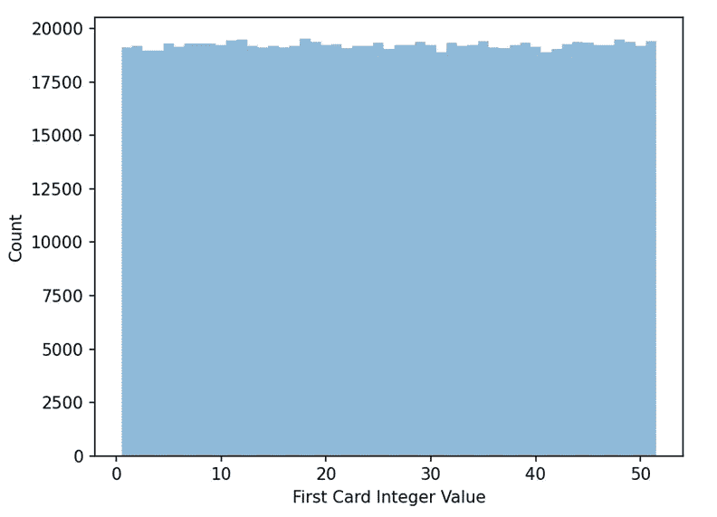

图一。第一张卡整数值的直方图

为了确认卡片分布相同，进行了卡方拟合优度测试。对于这个测试，每张卡片出现的预期次数应该是:

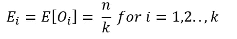

在这个等式中，Ei 是在 1 到 k 的每个区间中值的预期数量，其中 k 是 52。由于 n = 1，000，000 张牌，Ei = 19，230.77。每张牌在每个区间的实际出现次数记录为 Oi，每个区间的差异 Ei-Oi 如附录 a 中的表格所示。然后，该测试的卡方值计算如下:

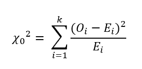

如附录 A 所示，该值为 55.709638。当 n 很大时，我们可以计算卡方检验统计量如下:

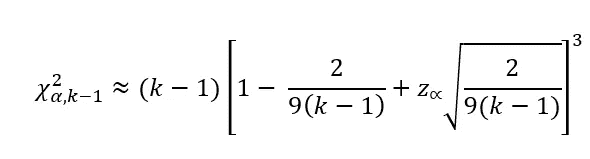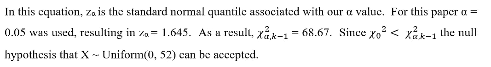

为了测试独立性，进行了高于/低于平均值的测试。在本测试中，B 表示高于或低于第一张卡值平均值的运行次数，其分布如下。假设 n1 = 500064 是我们高于平均值的观察次数，n2 = 499936 是我们低于平均值的观察次数:

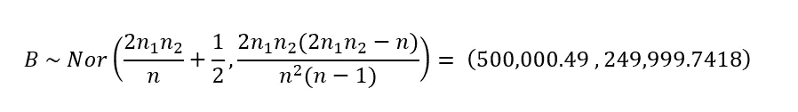

然后，我们的测试统计量计算如下，其中 B = 500258 是平均值上下的整数值运行次数:

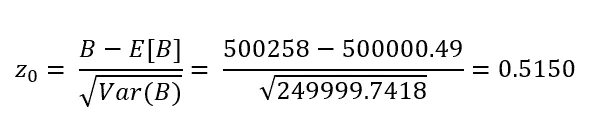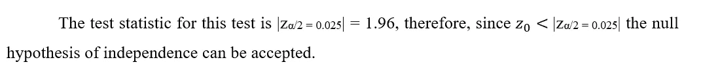

# 产出分析

为了获得一个基线来确认程序是否如预期的那样工作，第一个一百万手牌是在庄家和玩家都不允许击中的地方玩的。因为输入是 i.i.d. normal，所以当收到两张随机牌时，玩家应该有大约 50%的机会获胜。根据中心极限定理，样本均值应分布如下:

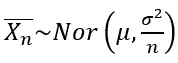

样本平均值的分布显示在下面的直方图中。

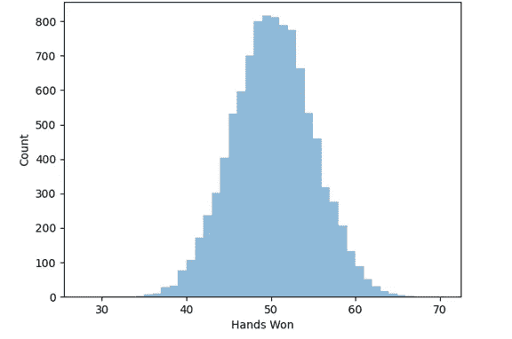

图二。玩家仅在发牌时每 100 手赢的牌数

此外，使用独立重复的方法，可以导出真实均值θ和方差 SZ2/r 的点估计量，并且可以构造均值的置信区间。

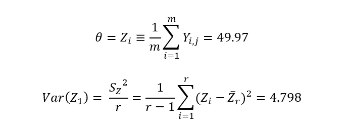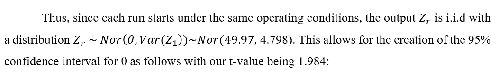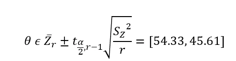

再看图 2，这与 10，000 次重复的样本均值分布一致。

# 使用玩家手牌值进行命中决策

对于第一个简单的策略，玩家是否命中的决定只取决于玩家手中牌的价值。对于[12，21]中的 n，如果该轮中玩家的手牌值小于 n，则玩家选择抽一张牌，如果大于 n，则玩家选择留牌。下面的图表显示了 n 的每个值的结果及其相应的 95%置信区间，完整的数据表可在附录 b 中找到。

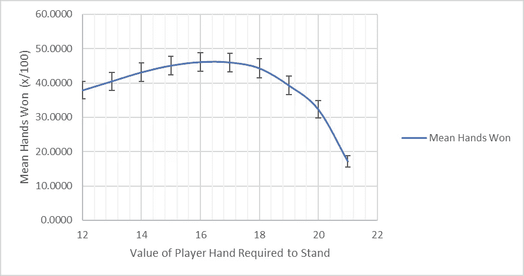

图 3。使用玩家手牌作为命中决定来赢得平均手牌

这表明，如果玩家选择一旦他们的手牌等于 16，他们平均赢 46.1%，95%的置信区间为[43.396，48.861]。值得注意的是，使用 17 作为阈值产生了相似的均值和置信区间，因此在 95%的置信水平下，我们无法判断哪个阈值更好，但这两个值中的一个平均起来会给玩家带来最好的结果。

# 整合经销商的手来提高绩效

在这一部分，庄家的期望值被用来提高玩家的表现。这是通过几种方式完成的，如下表所示。值得注意的是，通过产生一百万个统一的(0，52)prn，将 PRN 转换为卡，并将该卡转换为点值，来获得期望的点值。在这样做时，发现抽取的牌的预期点值是 7.4 点，由于牌只能有整数值，所以向下舍入到 7。在试图预测庄家的手牌时，玩家只能看到面朝上的牌，因此期望值 7 用于预测场景 I-VI 中的总手牌分数。在场景 VII 到 XII 中，玩家在通过生成随机制服(0，52)来计算庄家的预期手牌值时，选择一张随机牌添加到庄家的手牌中。出于篇幅的考虑，每个场景的描述都列在附录 c 中。值得注意的是，有些场景依赖于基于玩家手牌值的命中阈值，而有些则不依赖。对于没有这样做的人来说，这条线相对平坦，因为 100 手牌的每次迭代的样本均值是在相同的条件下获得的，因此，由于每次迭代中 n = 10，000 次观察结果很大，所以从上面看，正态分布与均值的差异很小。

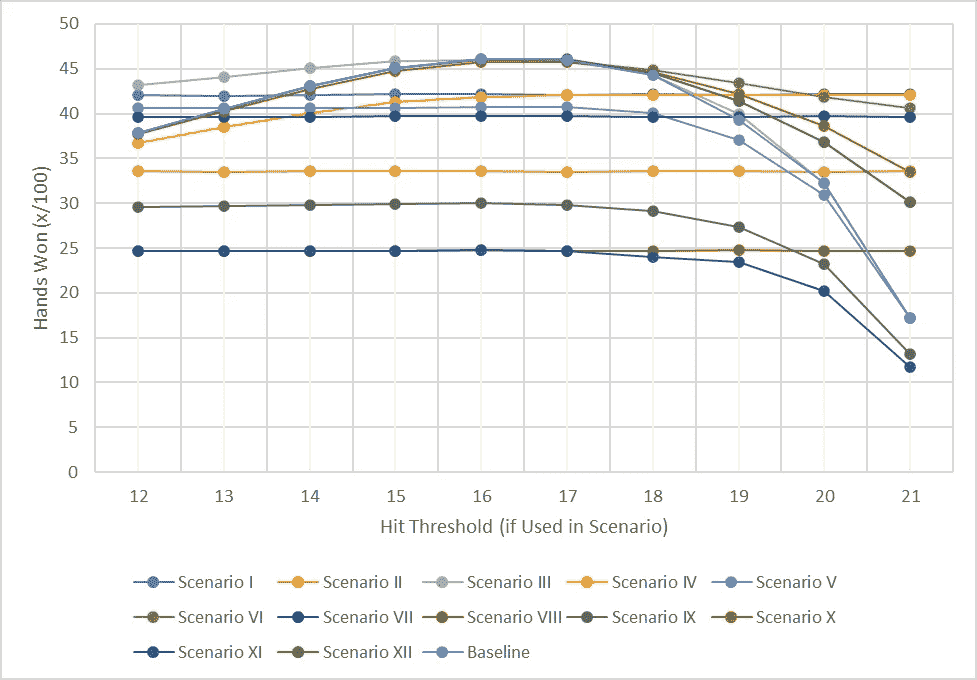

图 4。利用基于预测的模型击败庄家

从这张图中得到的关键信息是，没有一个更复杂的基于预测的模型优于基线。虽然一些在仅基于玩家的手牌的基线模型的置信区间内，但是增加的复杂性似乎不能提供足够的好处来保证利用该策略。此外，玩家抽牌直到超过基于其手牌**或**的命中阈值时，庄家的预期手牌值(DEV)总是优于玩家抽牌直到超过基于其手牌**和**DEV 的命中阈值时的情况，这表明使用玩家的手牌作为命中决策的下注优于使用 DEV。完整的数值表可在附录 c 中找到。

# 高级策略

最后采用的策略来自《21 点学徒》的科林·琼斯(Jones，2021)。这种策略被描述为不涉及算牌的最复杂的策略，是通过允许计算机模拟运行数十亿手 21 点并通过机器学习确定最佳策略而得到的。下表显示了命中决策矩阵。值得注意的是，为了本文的目的，矩阵已经简化。原来的允许手分裂，这个模拟没有。此外，由于该模拟不使用下注，琼斯矩阵被简化，并且列出双倍下注的情况被简单地视为击中。

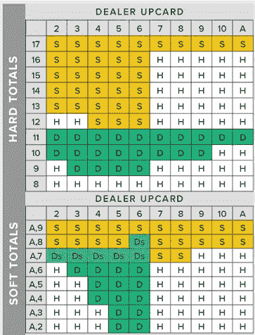

图 5。琼斯击中矩阵，其中 S 和 Ds 是 Stand，H 和 D 被视为击中

在这种情况下，每次运行的成功率显示在下面的直方图中。该方法的平均值为独立重复平均值的 42.05 倍，不幸的是，该方法的表现不如我们的简单方法。其原因可能是不允许分割和下注改变了最优策略，因此琼斯模拟开发的模型在本文的假设下不会产生相同的结果。

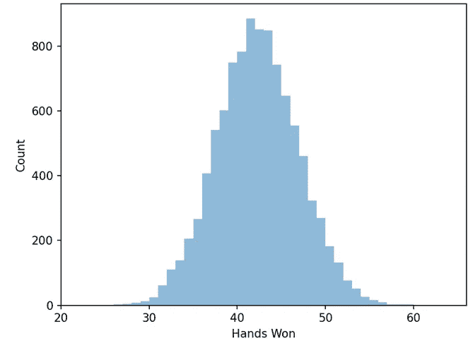

图 6。使用琼斯模型计算每 100 手赢的牌数

# 结论

总之，使用简单的 21 点策略不可能在 50%以上的牌中以 95%的信心击败庄家。更糟糕的是，使用任何测试策略，置信区间的上限都不能超过 50 手。也就是说，最简单的策略(几乎不需要数学或记忆来计算玩家的牌值，一直打到牌值大于 16)确实能让玩家赢下平均 46%的牌。这个策略是本报告中测试过的最佳策略，对于那些希望提高 21 点技巧的人来说是一个可行的起点。

对于一个纸牌经常对玩家不利的赌场游戏，这些赔率是合理的。因此，这种模式的未来建议将纳入投注策略，手分裂和卡计数。这些更复杂的策略中的任何一个都可以将置信区间推向 50%，这平均可以在玩 21 点时产生(轻微的)预期利润。也许模拟和在维加斯的周末真的能让你变得富有。

# 引用的作品

琼斯科林。(2021).*二十一点基本策略图*。21 点学徒。检索自:[https://www . blackjack 学徒制. com/black jack-strategy-charts/](https://www.blackjackapprenticeship.com/blackjack-strategy-charts/)

琼斯科林。(2021).*如何玩 21 点。*二十一点学徒制。检索自:[https://www . blackjack 学徒制. com/how-to-play-blackjack/](https://www.blackjackapprenticeship.com/how-to-play-blackjack/)

# 附录 A:均匀分布的卡方拟合优度

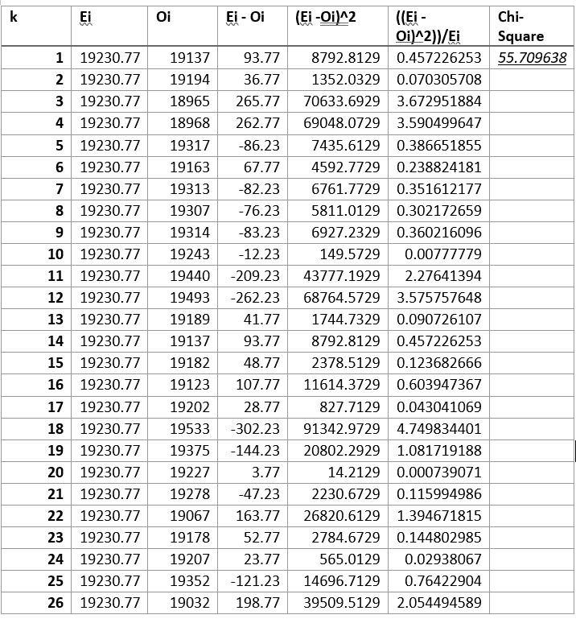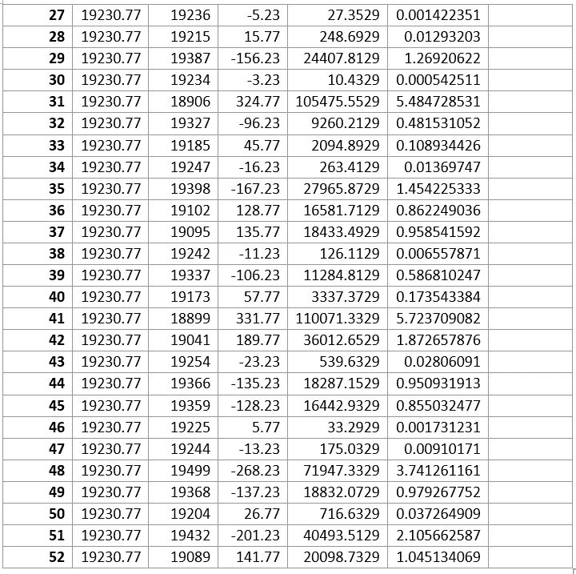

# 附录 B:仅玩家命中阈值结果

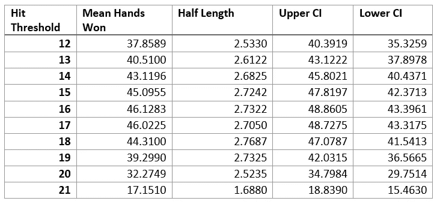

# 附录 C:经销商预期价值场景描述和价值

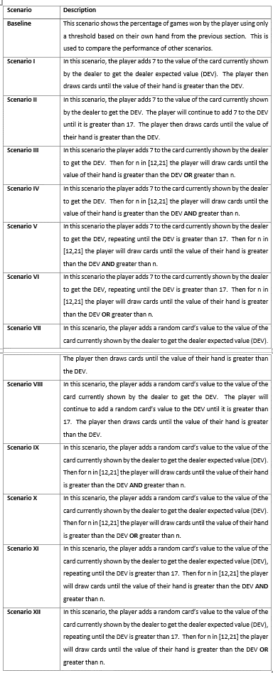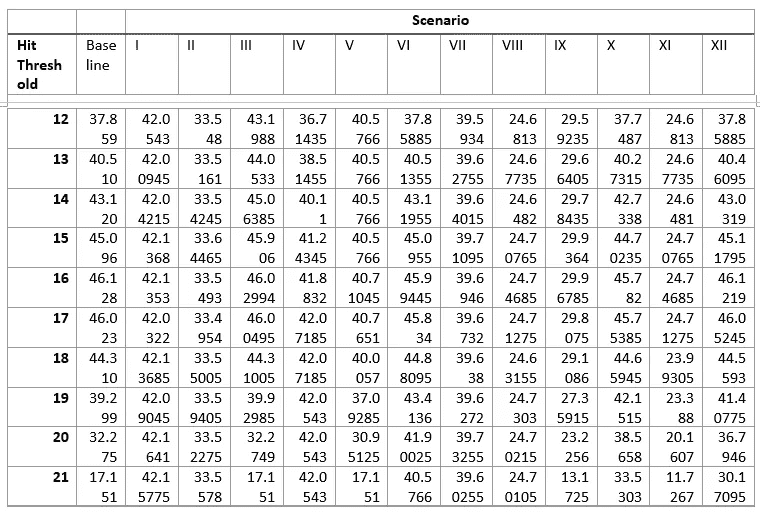

# 附录 D: Python 函数

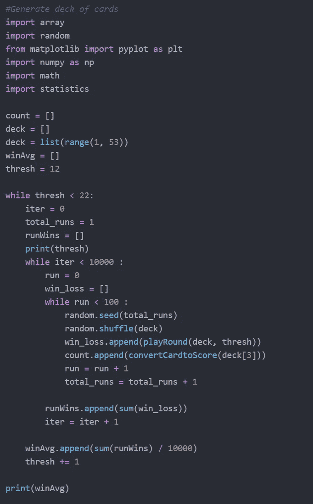

模拟体

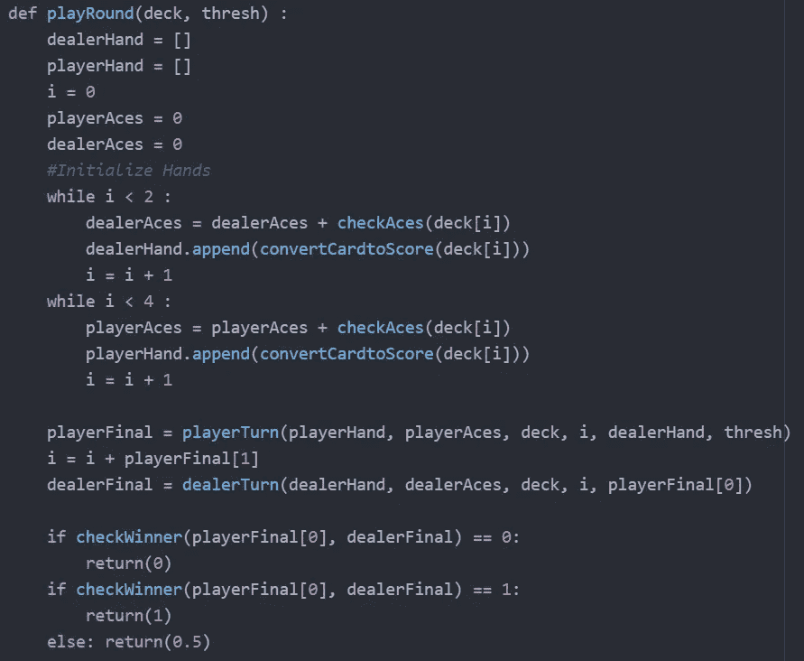

单次模拟运行

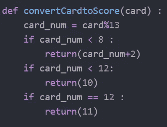

将伪随机数转换为卡片并获得分数

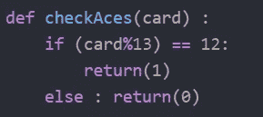

追踪手中 a 的数量

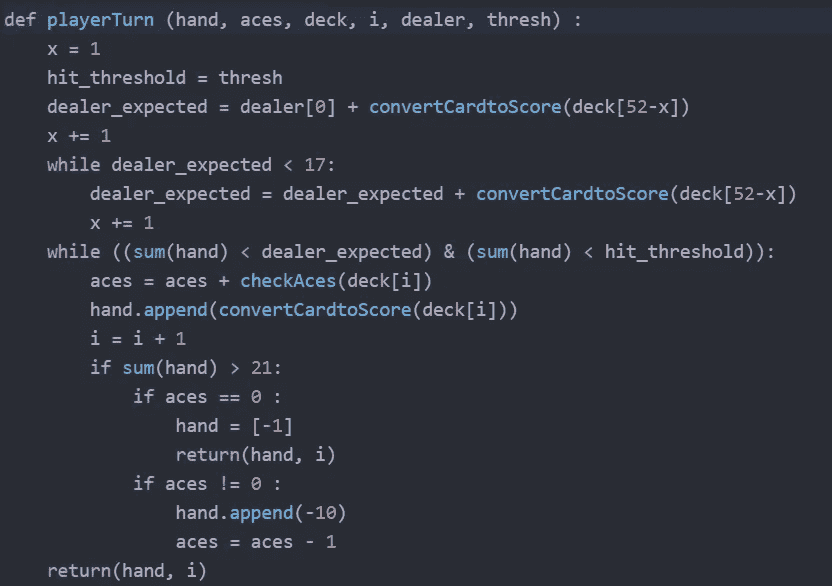

玩家回合的代码，特别是在这种情况下为场景 XII 设置的

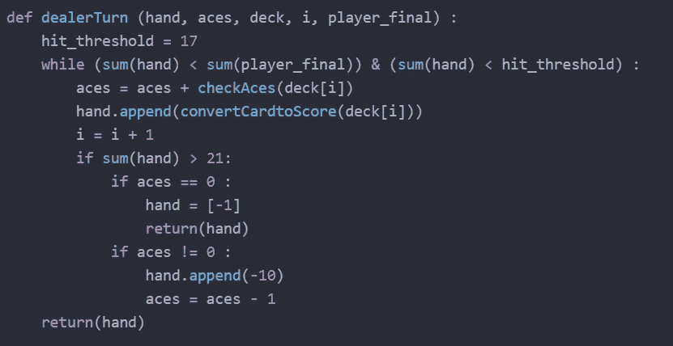

庄家轮次代码

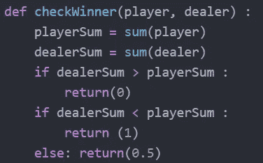

检查手牌赢家

# 附录 E:统计检查

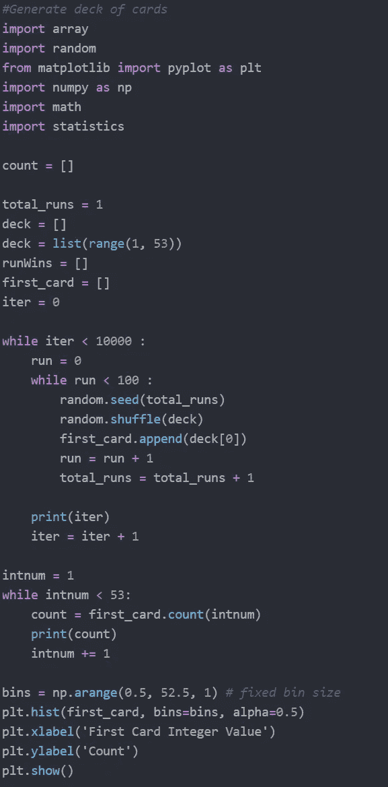

检查相同分布的均匀 prn

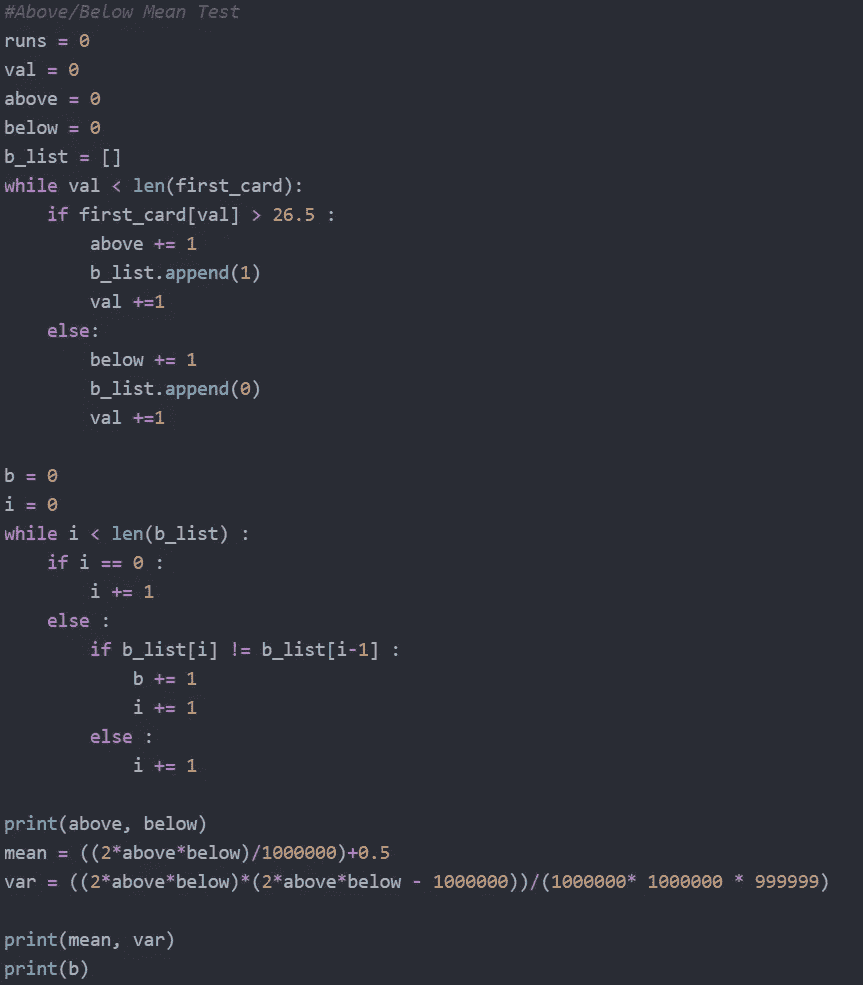

输入独立性测试