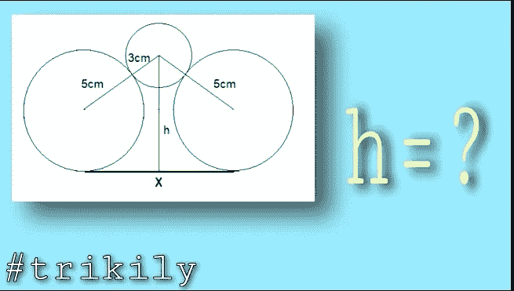
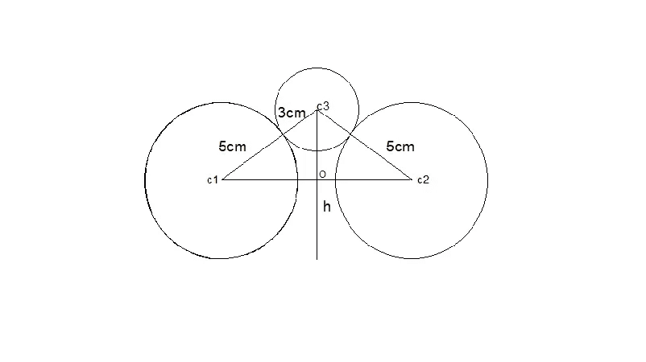
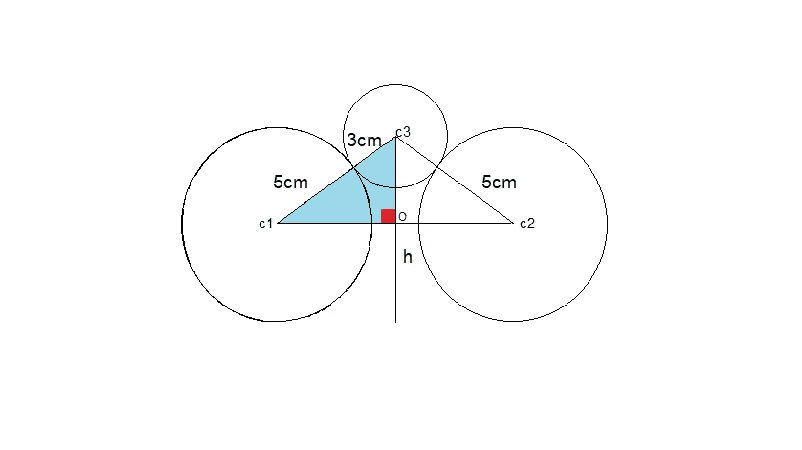

# 你能找到 H 的值吗

> 原文：<https://blog.devgenius.io/can-you-find-the-value-of-h-f432d7901d27?source=collection_archive---------11----------------------->

嗨，朋友们，我是普里塔姆。

这里还有一个有趣的问题。

求 h 的值

这里有 3 个圆，较大的圆的半径是 5 厘米。而小圆的半径是 3 厘米。这两个大圆的圆心之间的距离是 X 厘米。现在我们要用 X 来计算 h 线的长度。

解决方案

让圆圈的中心是 C1、C2 和 C3。线 H 和 X 的交点是 o。

所以，你可以看到这是一个直角三角形，其中角 C3OC1 为 90 度。

因此由毕达哥拉斯定理，我们可以写出(C3O) + (C1O) =(C1C3)。

而 C1C3 等于这两个圆的半径之和。

所以，c1c2 = 5+3=8。

c1o 等于 x/2。

因此，(C3O) + (x/2) = 8。

这意味着(C30)=(8—(x/2)

现在看，h =大圆的半径意味着 5 +C3o

所以在这个方程中，我们把 C3o 的值。

所以 h 会是 5+(8—(x/2))。

这意味着 h = 5+(64-(x/2))。

如果你想把这个问题一般化

h 将是大圆的半径+(64)表示(5+3)表示大圆的半径，R+小三角形的半径，R-(x/2))。

今天就到这里，如果你喜欢这个视频，那么就喜欢它，如果你想在未来看到这样的内容，那么你可以订阅这个频道，然后按下铃铛图标。如果你想给我发送一些问题，那么你是最受欢迎的。你也可以在社交媒体上关注以下描述中的所有链接。

领英:[https://www.linkedin.com/in/pritam-chakraborty-a5a345153](https://www.linkedin.com/in/pritam-chakraborty-a5a345153)

你也可以订阅我的 YouTube 频道 [TRIKILY](https://www.youtube.com/channel/UC2R3T6o0GpfIN2f74X6I6pg?view_as=subscriber) 来看看这个问题的解决方案。

下一个故事再见。