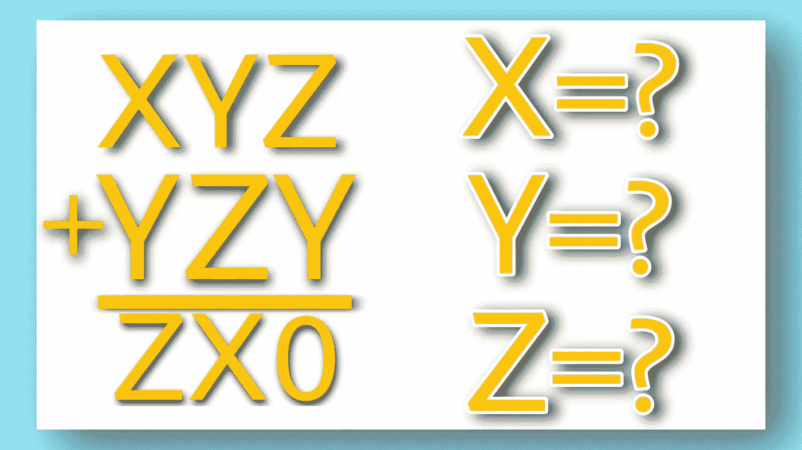

# 你能找到 X，Y 和 Z 的值吗？

> 原文：<https://blog.devgenius.io/can-you-find-the-values-of-x-y-and-z-9e5b24034591?source=collection_archive---------14----------------------->

朋友们，我是普里塔姆。

这里有个好玩的问题。我们有两个号码，一个是 XYZ，另一个是 ZYX。我们把这两个数相加得到 ZX0。

那么问题来了，X，Y，Z 的值是多少，比如 X，Y，Z>0？

**…………..解决方案……..**

首先我们来看这一部分。我们可以看到，Z 和 Y 的和是 0，这意味着它应该是 10，不应该是 20，30 或任何以 0 结尾的数字，因为 Z 和 Y 的最大值应该是 9，因此，Z+Y 将是 18
，Z 和 Y 的最小值应该是 1，因此和将是 2，所以这里只有一个可能的数字 10，它的最后一位数字是 0。

因此 Z+Y=10。
我们在这里筛选进位。

所以，1+Y+Z=X，但是由于我们知道 Z+Y 的值，所以我们只是把值放在这里。
我们得到 X=11，所以我们取最右边的数字作为 X 的值
所以 X=1。

我们再次筛选这里的进位，因此 1+X+Y= Z，因为我们已经知道 X 的值，所以我们把 X 的值放在这里。所以我们得到 Z-Y=2。

到目前为止，我们已经得到了 3 个方程，所以通过求解第一个和第三个方程，我们可以很容易地找到 Z 和 Y 的值，所以我们得到 Z=6 和 Y=4。

因此我们得到，X=1，Y=4，Z=6。

所以这两个数字是 146 和 464，它们的和是 610。

今天就到这里吧，伙计们，如果你们喜欢这个故事，那么就喜欢这个故事，如果你们想给我一些问题，那么欢迎你们。你也可以在社交媒体上关注我

[https://www.linkedin.com/in/pritam-chakraborty-a5a345153](https://www.linkedin.com/in/pritam-chakraborty-a5a345153)

你也可以巧妙地订阅我的 YouTube 频道

[https://www.youtube.com/channel/UCU5Yut-RmqhUTpuFM3by3_w/](https://www.youtube.com/channel/UCU5Yut-RmqhUTpuFM3by3_w/)

下一个故事再见。