# 赌博真的能赢吗？一个真实的赌场对电脑模拟

> 原文：<https://blog.devgenius.io/can-you-really-win-at-gambling-a-real-casino-vs-my-computer-simulation-14db4e241eba?source=collection_archive---------5----------------------->

当我再次打开 Spotify，看到一个广告“玩我们的花式大乐透，赢一百万”，真的变得很烦。赌博真的能赚到钱吗？幸运的是，你不必花真金白银就能知道答案。我将展示如何在不安装任何软件工具的情况下进行简单的计算机模拟。我还将我的模拟与赌场中的真实游戏进行了比较——你不必花钱去看结果，为了科学起见，我已经这样做了。

下面的代码非常简单，是为初学者准备的，那些对编程不感兴趣的人可以跳过前两章。

# JupyterLab

为了模拟赌博过程，我将创建一个“虚拟”玩家，给“他”(或者“她”，如果你喜欢的话)一个虚拟的 100 美元，然后看看这个玩家能赢多少。我将使用 Python JupyterLab 进行模拟，这是一个很好的免费工具，可以编写代码并立即看到结果。JupyterLab 可以在本地运行，速度更快更稳定，但是如果不想安装任何工具，也可以使用在线 IDE。我没有把链接放在这里，只是因为它们经常变化，很快就会过时。只需搜索“jupyterlab online”并选择您想要的任何链接。您将看到类似这样的内容:


选择“Python 3 笔记本”，IDE 将打开。将此代码复制到第一个单元格:

```
import random
import numpy as np%matplotlib inline
import matplotlib.pyplot as pltplt.rcParams['figure.figsize'] = [14, 5]def running_mean(x, N):
    cumsum = np.cumsum(np.insert(x, 0, 0)) 
    return (cumsum[N:] - cumsum[:-N]) / float(N)
```

代码导入了一个随机库，我们将使用它来模拟不同的赌注和 Matplotlib 库，我们将使用它来绘制图形。我还导入了一个科学级的库，它将帮助我们得出平均值。现在，如果您按下“播放”按钮，光标应该会转到下一个单元格:

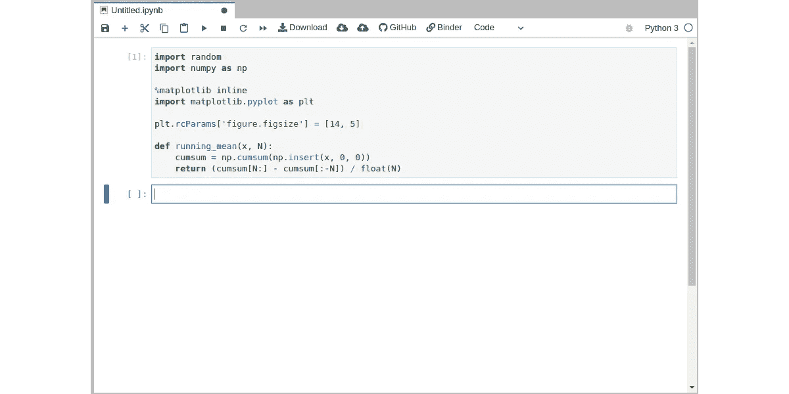

如果您没有看到错误，那么它的工作，我们准备编码。如果你想在你的电脑上使用代码，你可以在你的电脑上安装 Python 3 和 JupyterLab，这两个工具都是免费的。

游戏种类繁多，本文不会像一本书那么长，所以我将集中讨论其中的两种——轮盘赌和彩票。两者都是众所周知的，很容易模拟，在我看来，结果很有趣。

让我们开始吧。

# 轮盘赌

让我们先看看轮盘赌:

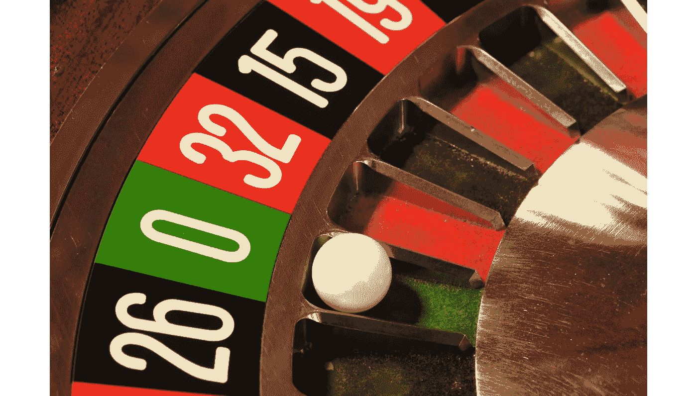

轮盘赌来源维基百科

美国轮盘有 38 段，包括从 1 到 36，0 和 00 的数字。从 1 到 36 的数字用红色和黑色表示，而“单零”和“双零”用绿色表示。欧洲轮盘有 37 个部分和一个“零”部分。这是唯一的区别，可能看起来无关紧要，但正如我们稍后将看到的，这对您的获胜概率有着至关重要的影响。

在轮盘游戏中，有许多不同类型的赌注。你可以在一个特定的数字上下注，在一组 3 或 6 个数字上下注，在一个“红”或“黑”的数字上下注，等等。显然，每一个赌注都有不同的概率和不同的支付比率，如果赌注赢了。让我们模拟一些赌注，给我们的“玩家”一些虚拟货币，然后看看会怎么样。

## **红/黑(或奇/偶)赌注**

这个赌是最简单的。你在赌一个红色或黑色的号码会赢。这个赌注的支付是 1:1，有红色或黑色的机会看起来是 50%——但实际上，它是*小一点*，因为轮盘上有一个“零”数字。

让我们来模拟一下有人下注黑棋的情况。我们将“给”我们的虚拟玩家 100 美元的初始余额，让他*玩很多次*，在我们的例子中是 1000 次。

```
def bet_to_black():
    val = random.randint(1, 38)
    if val == 37 or val == 38: 
        return False
    return val % 2 != 0steps_total = 1000
money_balance = 100wins, losses, history = 0, 0, []
for p in range(steps_total):
    bet = 1
    if bet_to_black():
        money_balance += bet
        wins += 1
        history.append(money_balance)
    else:
        money_balance -= bet
        losses += 1
        history.append(money_balance)

print(f"Bets: {steps_total}, Balance end: {money_balance}")
print(f"Wins: {wins}, Losses: {losses}")plt.plot(history, label="Money Balance")
plt.plot(running_mean(history, 50), linestyle='--', label="Average")
plt.legend(loc="upper right")
```

运行代码后，我们将看到图形形式的结果:

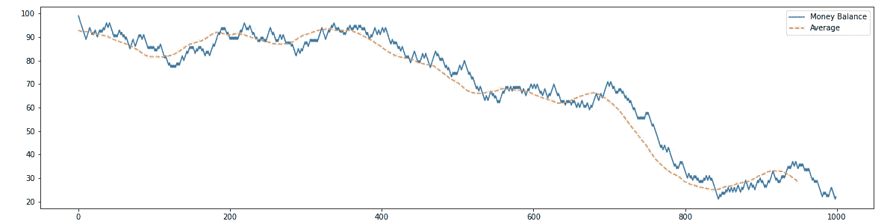

看到结果很有趣。正如我们所看到的，我们的模拟用户赢了很多，从 1000 场游戏中他赢了 452 次。但他输得更多——548 次，平均资金余额在慢慢减少。结果是显而易见的— **赢的机会小于输的机会**，你的资金余额将会减少。知道所有这些差异只“隐藏”在一个“零”扇区中，其实很有趣。知道了这些，我们就很容易理解欧美轮盘赌的区别了。轮盘上有 38 或 37 个扇区看起来是一个微小的变化，但第二个“双零”扇区实际上定义了所有的差异:

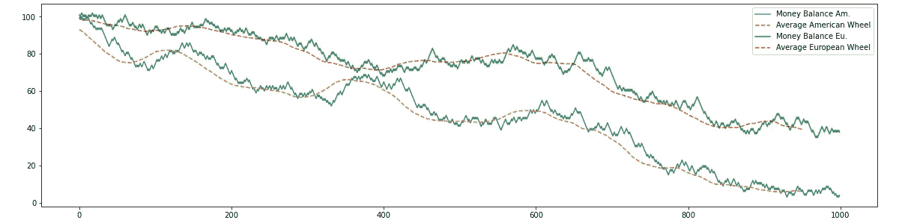

## 单号**投注**

获得红色或黑色部分的机会显然是最高的，但支付也很少，一直这样下注可能会很无聊。让我们试试更刺激的东西。“单一号码”赌注的获胜概率最低，但支付比例最高，为 35:1。让我们看看进展如何:

```
def bet_to_number(num):
    val = random.randint(1, 38)
    return val == numsteps_total = 1000
money_balance = 100wins, losses, history = 0, 0, []
for p in range(steps_total):
    bet = 1
    if bet_number(num=7):
        money_balance += 35*bet
        wins += 1
        history.append(money_balance)
    else:
        money_balance -= bet
        losses += 1
        history.append(money_balance)print(f"Bets: {steps_total}, Balance end: {money_balance}")
print(f"Wins: {wins}, Losses: {losses}")plt.plot(history, label="Money Balance")
plt.plot(running_mean(history, 50), linestyle='--', label="Average")
plt.legend(loc="upper right")
```

很明显，如果轮盘有 38 个部分，那么赢得单个数字赌注的概率是 1/38。但是回报只有 1:35——你不需要有数学博士学位也能计算出你的资金余额减少的几率比增加的几率高。在模拟中也很容易看到:

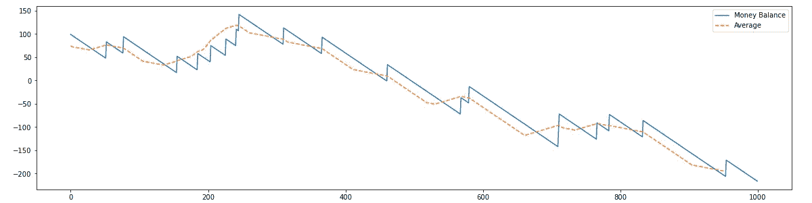

玩家下了 1000 次注，他输了 981 次，赢了 19 次，在游戏过程中，最终的资金余额从+100 美元减少到-216 美元(实际上，您不能用负余额下注)。当然，游戏过程是随机的，在这个序列中有一些“幸运日”，但一般规则保持不变——玩得越多，输得越多。如果愿意，可以将游戏数量增加到 10000 个，然后看看结果:

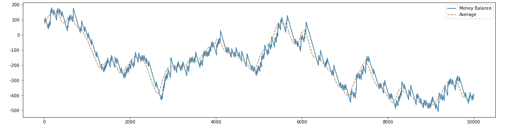

在这个模拟中，玩家周期性地有一个相当长的“幸运系列”的胜利，但是他的平均资金余额总是在减少。重要的是要记住**轮盘没有记忆**——它“不知道”你之前玩了多久。从心理学上讲，如果你输了 5 次，你可能会认为下一次你将*肯定*会赢，但是轮盘不会“记住”你以前的游戏。每一场比赛都是“从零开始”。

我不会对所有其他下注类型进行模拟，那会太长太无聊，但我希望主要思想是清楚的— **对于所有类型的轮盘赌下注来说，输的机会比你可以从赌场得到的支出多**。

## 马颔缰

好了，我们已经知道赢的几率比输的几率低。但是如果我们每次输了都增加两倍的赌注，来“补偿”损失呢？听起来像个计划吗？这个想法并不新鲜——它是在 18 世纪发明的，被命名为[鞅](https://en.wikipedia.org/wiki/Martingale_(betting_system))策略。

如果我们稍微想一想，就很容易理解为什么它不起作用。原因很简单——玩家的预算不是无限的。每次我们输了，我们可以增加赌注，但这个过程是随机的，迟早我们会有一系列的损失，这将超出我们的预算来补偿它。实际上，玩家每次都必须加倍下注才能获得 1 美元的利润，否则就会输掉所有的钱。

让我们做一个模拟，看看它是如何工作的:

```
def bet_to_black():
    val = random.randint(1, 38)
    if val == 37 or val == 38: 
        return False
    return val % 2 != 0steps_total = 100
money_balance = 100
wins, losses, history, bets = 0, 0, [], []
bet = 1
for p in range(steps_total):
    if money_balance > 0: 
        if bet_to_black():
            money_balance += bet
            wins += 1
            bet = 1
        else:
            money_balance -= bet
            if money_balance < 0:
                # Game over
                print("Game over", p)
                bet = 0  
                money_balance = 0
            losses += 1
            bet *= 2

    history.append(money_balance)
    bets.append(bet)

plt.plot(history, label="Money Balance")
plt.plot(bets, label="Bets")
plt.legend(loc="upper right")
```

结果显而易见:

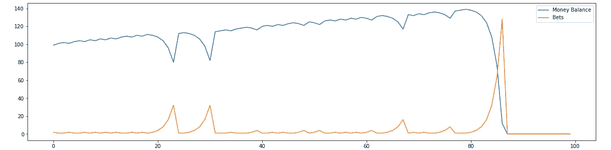

在这里，玩家试图玩 100 场游戏，他在每次失败时增加两次赌注，这使他能够“补偿”高达 64 美元的损失，但最后，他得到了“不幸”的一系列赌注。下注 128 美元超出了玩家弥补损失的预算。为了补偿“仅仅”10 轮，玩家需要有 1024 美元的预算，但是他在 10 轮内最多只能赢 10 美元。连续出现 10 个“黑”的概率是 1 比 784，因此，玩家必须投入比他可能赢得的更多的钱。

鞅的完整数学分析可以在[维基百科](https://en.wikipedia.org/wiki/Martingale_(betting_system))中找到，但是我希望这个想法足够清楚。现在，让我们转到彩票。

# 49 中的六合彩

不同国家有不同类型的彩票游戏，我们来看看“49 选 6”游戏。我会模拟一个“德国”版的游戏，名字叫“6 aus 49”。第一场比赛于 1955 年在德国举行，1965 年它第一次出现在电视上。“6 aus 49”彩票至今仍很流行，是欧洲玩得最久的彩票。

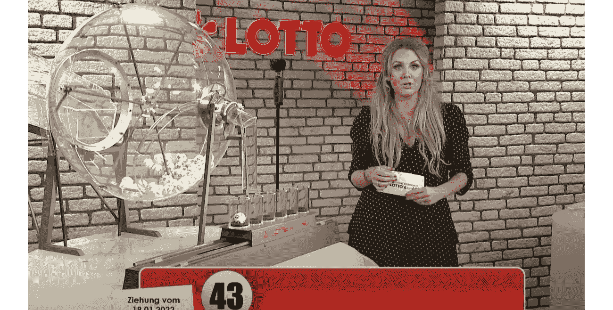

《6 aus 49》视频截图

首先，让我们检查规则。每注的价格是 1.20€，每张纸上有 12 张牌，玩家应该填写，总价格约为 14€:

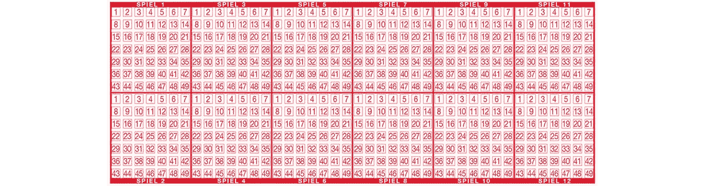

奖金数额根据猜中数字的数量而变化。对于 3 个正确的数字，您可以赢得大约 11€，最后，如果您猜中所有 6 个数字，您可以获得超过 1.100.000€。本次抽奖还有一个从“0”到“9”可选的第 7 个号码，叫做“superzahl”(“超级号码”)，有意愿的人，可以自行添加这个模拟，为了简单起见我就略过了。

让我们编写规则和模拟代码:

```
from collections import Counterdef play_lottery(values):
    balls = list(range(1, 49+1))
    random.shuffle(balls)
    return len(list(set(balls[:6]) & set(values)))def get_win(count):
    if val == 3:
        return 11 
    if val == 4:
        return 48 
    if val == 5:
        return 3839 
    if val == 6:
        return 1131632
    return 0teps_total = 12*365
ticket_price = 1.2money = [] 
money_total = 0
wins = []
for p in range(steps_total):
    money_total -= ticket_price
    val = play_lottery([3,7,12,18,33,28])
    win = get_win(val)
    if win > 0:
        money_total += win
        wins.append(win)
    money.append(money_total)plt.plot(money)
```

正如我们所看到的，我模拟了顾客在 365 天内每天以 1.2€的价格购买 12 张投注卡时的行为。

让我们看看一个人在这一年里会花多少钱。图表上的横线是尝试次数，纵坐标是资金余额:

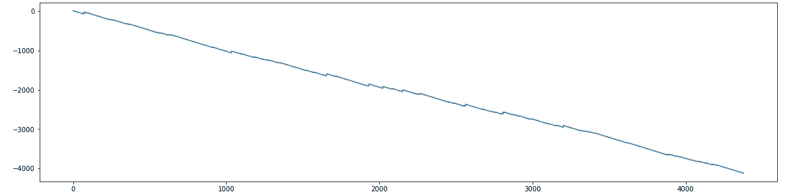

嗯，结果对彩票所有者来说很好，但对玩家来说却令人失望。在这一年中，我们的模拟赌徒 64 次赢得€奖，9 次赢得€奖。他总共花了 5.256€，但只赢得了 1.136€——这一年的最终余额绝对是负数。玩的越多几率越大吗？根据模拟，如果客户在 100 年内每天购买彩票，他将猜中 5 个号码 11 次，总奖金约为 70.000€，但总损失也将更多。根据官方彩票网页，赢得所有 6 个号码的机会是 1 比 15.537.573，因此**如果你在 3547 年**内每天购买一包 12 张彩票，你几乎有 100%的机会猜中所有 6 个号码。我认为，没有必要说购买 1500 万张彩票，玩家将花费比他/她将得到的更多的钱(不要忘记，如果你中了彩票，你必须纳税)。

# 让我们来玩吧！

我觉得有了理论就够了，让我们看看它在现实中是如何运作的。嗯，如果坐在一个真正的赌场里，拿着笔记本电脑或一张纸写下所有的游戏步骤，那就太可疑了，但是现在赌博可以很容易地在网上进行。

在我们开始之前，一个简短的免责声明——这篇文章不是任何在线服务的广告，所有公司的标志都从截图中删除了。

## **报名**

第一步是注册，在我居住的荷兰，规则相当严格。首先，我在流行赌场的网站上注册，我在阿姆斯特丹见过几次。系统要求我输入我的地址和邮政编码，然后我必须用网络摄像头扫描我的身份证并自拍。文件识别过程是自动化的，系统已经自动检测了 ID 类型、我的出生日期、名字和姓氏。但是在最后一步，我得到了一个信息“验证失败”。还有第二个选项是使用手机进行验证，我再次扫描了我的 ID 并用智能手机自拍了一张照片——数据上传成功，但再次验证失败，我收到一条消息“此帐户暂时不可用，请联系支持人员”。也许我的账户被系统检测为可疑(好吧，“Dmitrii”至少不是一个土生土长的荷兰名字)。我可以想象很多人可能试图以某种方式欺骗赌场，但好吧，这只是一个市场——如果一个服务不想为我服务，我可以很容易地选择另一个。

我决定在另一个网站注册，这也是一个在欧洲很受欢迎的赌博提供商。注册过程大体相同，但系统要求我不仅输入我的姓名、电话号码和地址，还要提供我的社会号码和银行账号。我不仅被要求上传我的身份证，还被要求上传我居住的地址证明。他们为什么不信任我的地址——我的身份证、社会号码和银行账户的复印件应该足以核实，甚至在需要时足以缴税。我觉得这太过分了。

不管怎样，我已经试过第三个网站了。在那里，我还必须上传一份我的身份证复印件，并提供我的银行账号，至少不需要自拍。在这个过程的最后，我收到了一条消息，说我的帐户将在 48 小时内得到验证——可能他们是手动验证的。实际上，它在 10-15 分钟内就完成了，之后，我就可以登录了。

## 比赛

作为第一步，我被要求设置每天的游戏限额，例如，100 欧元和每天 4 小时的游戏。我认为这是法律要求的，如果赌徒玩得太多，这可以作为一个很好的提醒。另一方面，这些参数可以很容易地在帐户设置中改变，并不会真正阻止那些真正想在游戏中花更多钱的人。

我还为余额充值了 20 欧元的最低金额——这对于测试来说已经足够了，反正我不会花超过最低金额的钱。有了正平衡后，我就准备好玩游戏了:

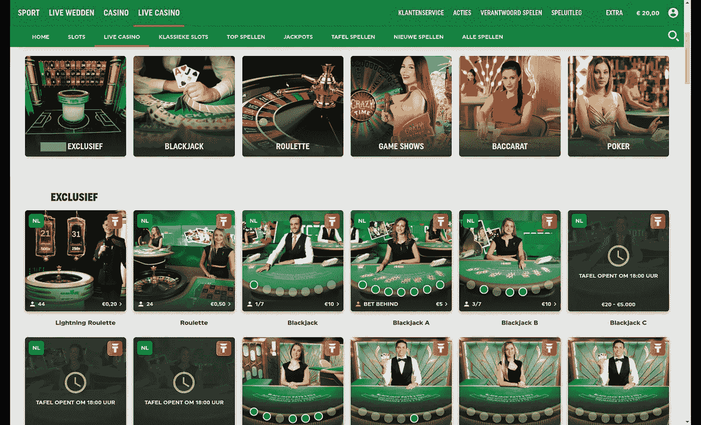

用户界面只有荷兰语，很抱歉，但我认为所有的文字和图片对说英语的读者来说已经足够清楚了。正如我们所看到的，不同的游戏是可用的，因为本文的重点是轮盘赌，让我们到这一点:

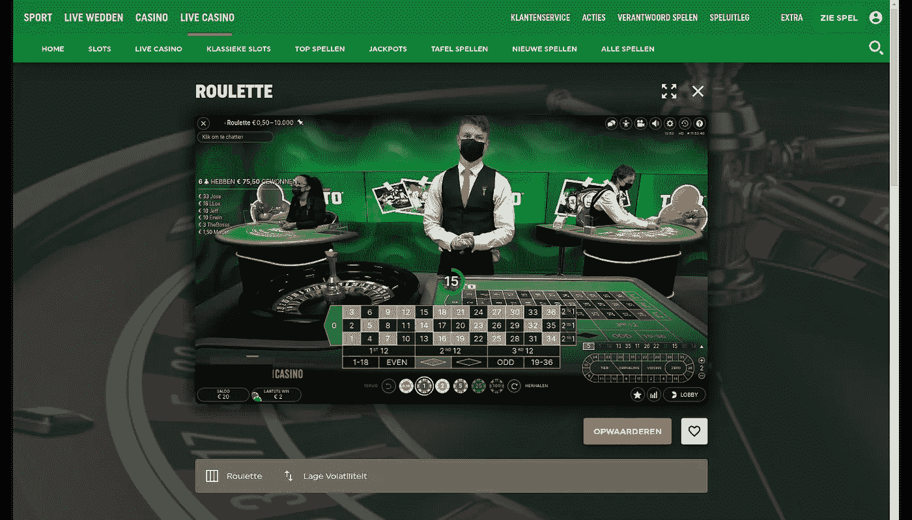

从技术角度来看，这个过程组织得相当好——这是一个视频流，有一个真正的赌台管理员，每个玩家都可以下注，并实时观看结果。一个赌台管理员每分钟都在转动轮盘，玩家有大约 20 英镑来下注。这个过程是完全自动化的，在轮盘停止后，输赢会自动计算(轮盘上方的摄像机可能会检测到球的位置)。

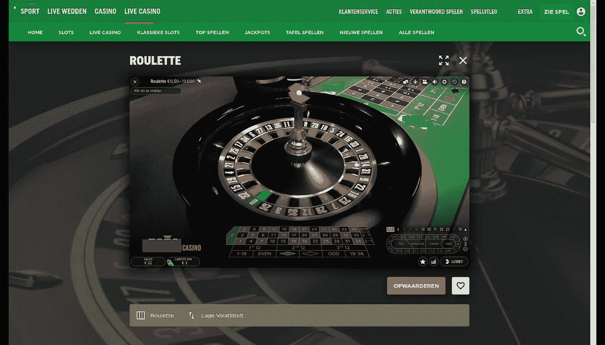

至于结果，我想，是可以预料的。首先，我尝试了不同下注类型的 1 欧元代币(奇数、偶数、第 1 个 12、第 2 个 12 等)。起初，余额甚至增加了一点，但只进行小赌注和小支出会花费太多时间。大约 10 分钟后，我觉得无聊，决定换成 5 欧元的赌注。最终的结果要快得多——我的余额很快就变空了:

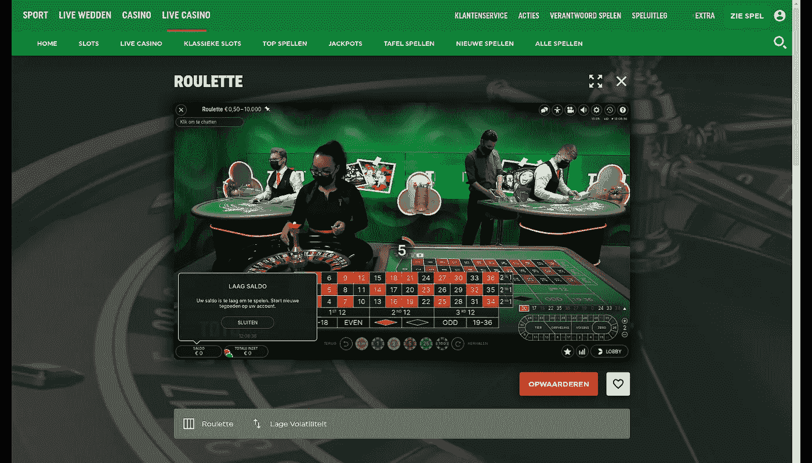

同样，界面是荷兰语，但我认为标签“萨尔多 0 €”不需要翻译。

在图表中也很容易看到结果:

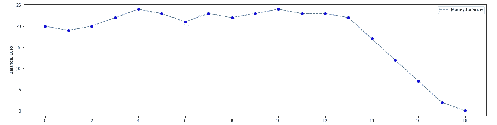

# 结论

赌博是数学和概率论的一个有趣的部分，模拟游戏并测试它是如何工作的很有趣。总的来说，最后的结果是可以预测的，考虑到在每种类型的赌注中，赢的机会都小于输的机会。有趣的是，轮盘赌和彩票的“商业模式”完全不同——在轮盘赌中，玩家会赢很多次，但也会输很多次。大量的赢款有助于赌场保持赌徒的兴趣——输的几率只比赢的几率稍大一点。彩票过程是不同的——潜在的购买者被百万大奖的承诺所吸引，但是获得这个奖项的机会要小得多。我认为大多数人只是没有意识到它有多小——正如文章中提到的，你必须在 3547 年内每天购买 12 张彩票，才有很大的机会从 49 个数字中猜出 6 个数字。

最后，赌博有意义吗？嗯，就努力“挣钱”而言——肯定不是。这是不可能的，赌博过程在数百年内被“微调”，根本没有赢的机会。对于低收入的人来说，记住这一点尤其重要，例如，他们试图购买彩票，希望赢得大奖，使他们的生活变得更好。嗯，这些尝试只能让彩民的生活变得更好。另一方面，就快乐而言——如果它能让人快乐，为什么不呢？我个人在这个测试上花了 20 欧元，我不会花更多的钱——我知道它是如何工作的，当你知道什么是“引擎盖下”时，它就没什么意思了。但是很多人喜欢这样做，美国赌博市场每年超过 2000 亿美元，我不认为这篇文章可以改变它。好吧，如果至少有一些读者决定把他们的钱用于更健康的饮食或暑假，而不是彩票或赌场，我会认为这个故事没有白写。

感谢阅读。