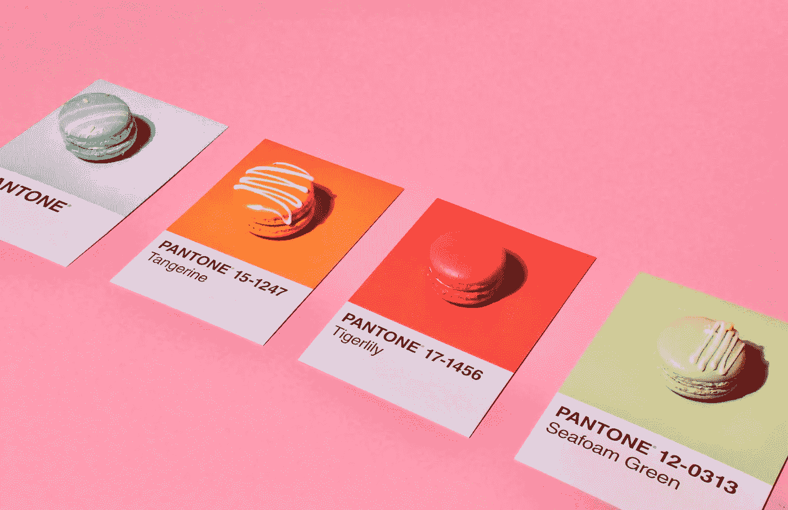

# 画布翻译和状态管理 Android 上的自定义视图——第 2 部分

> 原文：<https://blog.devgenius.io/canvas-translation-and-state-management-custom-views-on-android-part-2-1428171b4eef?source=collection_archive---------6----------------------->

图片来源:[卡莉·赖特](https://www.pexels.com/@thesocialsundae)——佩克斯

*欢迎来到本系列关于 Android 定制视图的第二部分。这是上一篇文章* [*之后的内容，上一篇文章解释了使用定制视图*](https://medium.com/@olaolaore/an-introduction-to-custom-views-on-android-part-1-4972a10fb133) *(及其实现)的基本原理，所以如果您还没有阅读过这篇文章，那么您可能想先浏览一下。*

*在本文中，我们将重点关注画布翻译，并通过使其动态化来为我们的自定义视图添加一些特色。好吧，让我们开始吧！*

## 画布翻译

Android 画布有一个**原点**，所有绘制都从这里调用“开始”/“测量”。通常，这是视图中左上角的点(0，0)。如果我们想在画布上的不同点上绘制多个对象，那么试图在我们想要绘制的每个点上保持标签会变得很忙乱。以这张图表为例。

没有画布平移的绘图元素

有点过了？我也这么认为。但是不需要太多的细节，这就是当我们有大量的元素要画，并且我们最终从原点开始计算坐标值时，模糊的画看起来会是什么样子。正如您在上面看到的，每条线都来自原点，这使得很难记住和维护何时需要进行更改，因为当一个点改变位置时，其他每个点都必须重新计算。

一个解决方法是将 画布进行 ***平移，这有助于我们从本质上“移动”原点，所以我们在绘制时不用太担心周围的坐标，除了我们想要绘制的元素的坐标。下图**试图**提供更多的清晰度。***

通过画布平移改进绘图

在这个“翻译”版本中，我们看到了一些不同的东西。我们只使用实际的原点(左上角)来绘制矩形，而不是每次绘制操作都从原点重新计算点。之后，我们将整个原点平移到三角形的顶部。一旦到了这里，我们需要做的就是用新的原点画出三角形。

最后，我们最后一次平移到画布上的另一个位置，这个位置作为一个圆的中心，然后我们用半径画圆。

这在很大程度上有助于消除绘制大量形状时从画布的实际原点进行不必要的重复计算。当需要时，我们可以通过将画布原点移动到下一个绘制调用的区域来抵制所有这些。

## 现在我们明白了为什么我们想要翻译画布，那么我们该怎么做呢？

> canvas.translate(x，y)

x 和 y 参数表示画布原点应该移动到的点——我们的新原点(我们的绘制调用将从这里开始)。为了更好地理解这个概念，让我们通过移动画布的原点来绘制另一组形状。

## 我们会画什么

我们将绘制与上一篇文章中相同的形状，但是位置不同(样式也不同)。这一次，我们的形状将被勾勒出来，这将使用 Paint 类中的一种样式来完成。让我们从创建画图对象开始。

在上面的代码片段中，我们创建了一个名为 **outlinedRectPaint** 的 paint 对象。在 init 块中，我们像往常一样设置颜色，但是现在我们设置 paint 对象的 style 属性。我们有三个绘画风格的选项，它们是:*填充*、*填充和描边*和*描边*。我们将使用笔画，因为我们希望我们的形状有轮廓/边框样式。最后，我们设置形状笔画的宽度(多大)。

在 onDraw 方法中:

然后我们定义我们的 drawOutlinedRectangle 方法。在这个方法中，我们首先将画布平移到一个新的原点，然后绘制我们的形状。这是在下面的代码中完成的:

现在，translate 方法获取 x 和 y 坐标，并转换到这些线(x，y)相交的点。我们在 x 轴上不做任何移动(因此为 0)，但在 y 轴上向下移动 160px。这可以在下图中看到

一旦完成，我们用画图对象画出我们的矩形。记住，我们已经移动了画布原点，所以我们当前的位置 **(0，160)** 实际上是我们新的 **(0，0)** 。

接下来，我们在画布的另一边画一个圆形。

## 画一个有轮廓的圆。

首先，我们开始创建我们的圆形绘制对象。

我们基本上经历了与第一个绘制对象相同的过程，只是这次有所不同。然后，我们在 onDraw 方法中添加函数调用。

在我们的 drawOutlinedCircle 方法中，我们从再次转换画布原点开始。从视图宽度将 X 设置为 75px(考虑半径)，Y 轴是 75px 加上之前的 Y 位置 160px(再次考虑半径)。

如果你注意到了，X 轴和 Y 轴相交的点是圆心，所以我们保持该点为我们的 X 轴和 Y 轴坐标，因此为(0，0)。然后我们用 75px 作为我们的圆半径。然后我们得出这个结果。

既然我们已经学会了如何画矩形和圆形，让我们试着通过改变形状的状态来使它们变得动态。

# 管理视图状态

大多数时候，我们想要改变我们的自定义视图的状态。我们可能希望它通过改变它的一些属性来做出反应或制作动画，或者根据用户交互(触摸、按住、拖动等)来改变一些细节。当使用自定义视图时，告诉视图其状态需要更改的一种方法是用更改的属性重绘视图。

按照这种思路，当视图发生变化时，我们可能会想到调用 onDraw，但是当视图准备好时，视图本身会调用 onDraw——所以我们不能这样做。另一方面，我们得到了一个叫做`invalidate()`的便利实用程序。当这个方法被调用时，我们告诉视图一些视图属性已经改变，当前的渲染是无效的，需要被改变。`invalidate`指示视图重绘其状态。

## 那么我们会做什么呢？

我们将在自定义视图的底部添加一个按钮，点击后，我们可以改变在自定义视图中绘制的形状的颜色。我们首先给视图一个固定的高度(300dp ),并将按钮放在下面的代码中:

在连接切换按钮之前，我们将采用的方法是拥有一个随机颜色列表，当单击按钮时，我们将在列表的边界内获得一个随机索引，并为 paint 对象设置一个新颜色。在下面的代码中，我们添加了颜色列表和获取随机索引的逻辑。

在上面的代码片段中，我们创建了一个颜色列表，`getRandomIndex`方法返回一个介于 0 和颜色列表最后一个索引之间的索引。让我们继续定义切换颜色的逻辑。

在上面的代码中，在我们为所有四个 paint 对象设置了新的颜色之后，我们调用了`invalidate()`，这用新的颜色重绘了我们的视图状态。我们现在可以从视图中链接按钮。

这样，在运行应用程序后，我们得到了下面的结果。单击切换按钮会改变自定义视图中的形状状态。

将动态应用到自定义视图后的输出。

## 咻！，这是一个漫长的。

在这篇文章中，我们学习了如何翻译画布原点，并使绘图调用和计算更简洁、更易读。我们还学习了如何通过利用 invalidate 方法的超级能力来修改视图状态。如果你对本文或[前一篇](https://medium.com/@olaolaore/an-introduction-to-custom-views-on-android-part-1-4972a10fb133)中讨论的任何概念有任何疑问，请在下面留言或在 [Twitter](https://twitter.com/OlaOlaore) 上联系我。我很乐意回答。

干杯！，感谢您的阅读。