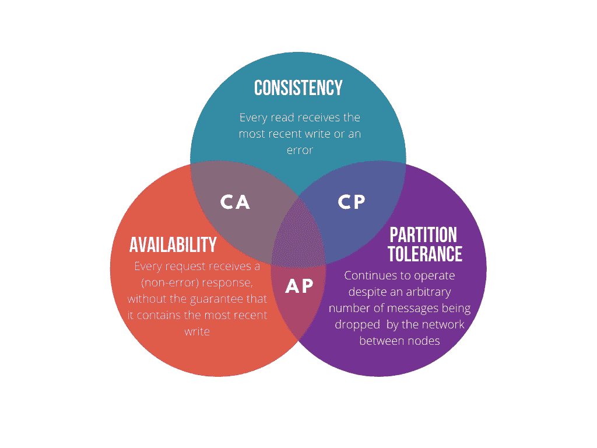

# CAP 定理

> 原文：<https://blog.devgenius.io/cap-theorem-distributed-systems-d3ead9ee6342?source=collection_archive---------7----------------------->

在写关于负载平衡器的文章时，我无意中发现了 CAP 定理，这是一个分布式系统概念，是我下一篇文章的完美继续。

负载平衡器用于在多个服务器之间分配负载，以防止单个服务器过载。换句话说，它增加了应用程序对用户的可用性。从负载平衡器回溯，CAP 定理指出任何系统只能支持三者中的两者: ***、一致性、可用性和分区*** 。分布式系统工程充满了权衡，CAP 定理关注一致性和可用性之间的权衡。

考虑到网络并不完全可靠，没有一个分布式系统可以避免网络故障，也不需要一个自动防故障装置来容忍网络分区。在进行分区的时候，你需要做出一个设计选择:

*   **一致性—** 取消操作，降低可用性，但保证一致性
*   **可用性—** 继续操作，从而提供可用性，但存在不一致的风险

分布式系统中的 CAP 定理

## >>高一致性

所有节点之间的数据是一致的，但是，如果某个节点出现故障，系统可能无法完全可用。系统可以选择返回一个错误或最近的写操作，这取决于您想要的场景。对于多个用户同时访问的应用程序，优先考虑一致性是很常见的。例如，金融信息、个人信息或电子商务网站要求数据库在网络不可靠或可能发生故障的情况下返回一致的最新数据。

## >>高可用性

这些系统是可用的，并允许分区容差，但不能保证一致性。返回的数据可能是陈旧的。为了更好的性能，牺牲了数据一致性。这意味着无论系统中任何单个节点的状态如何，每个客户端都会得到响应。*当系统需要在出现外部错误的情况下继续运行时，可用性也是一个引人注目的选项。* CAP-Available 系统在数据库不需要一直保持一致，而是侧重于从用户那里获取尽可能多的数据的场景中是首选。

**CA** (一致可用)系统不能是分布式系统。MySQL、PostgreSQL 等传统数据库是 CA**CA**因此，可以纵向扩展，而不能横向扩展。 **CP** (一致性和分区容差)不完全可用，但强一致性。分布式系统允许我们获得一定程度的计算能力和可用性，但复杂性是代价。

> 与您的任何系统设计需求一样，您必须考虑不同数据库存储的所有好处以及最适合您的系统的权衡。

***TL；DR —*** 这归结为一个软件权衡——一致性与可用性

*   *可用性高于一致性—* 当业务需求允许一定的灵活性时，以可接受的延迟同步数据
*   *一致性高于可用性—* 当业务需求要求原子读写时

—

为了扩展你在这个话题上的知识，可以考虑阅读这些文章:[https://www . cockroachlabs . com/blog/limits-of-the-cap-theory/](https://www.cockroachlabs.com/blog/limits-of-the-cap-theorem/)，[https://robertgreiner.com/cap-theorem-revisited/](https://robertgreiner.com/cap-theorem-revisited/)，[https://www.ibm.com/cloud/learn/cap-theorem](https://www.ibm.com/cloud/learn/cap-theorem)