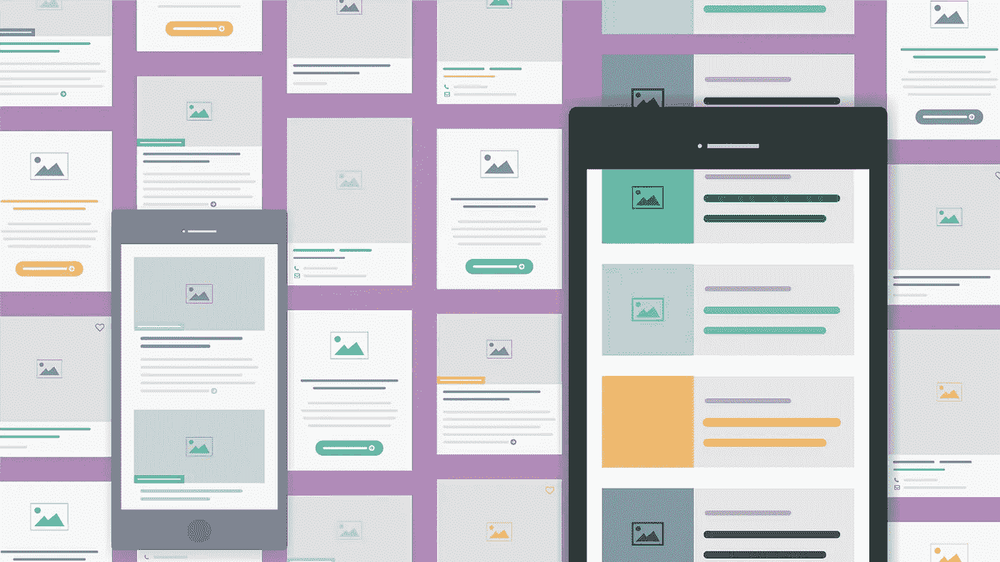
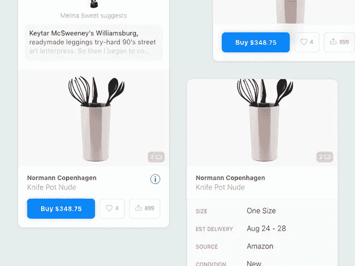
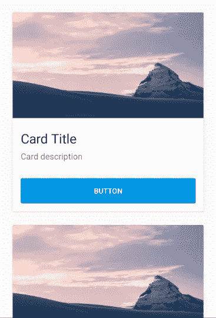
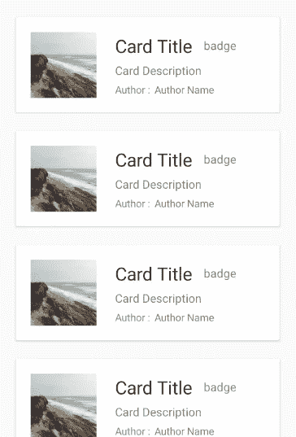

# Xamarin 中的卡组件

> 原文：<https://blog.devgenius.io/card-component-in-xamarin-694db19e7971?source=collection_archive---------6----------------------->

## 如今，我们可以有把握地说，卡片已经成为网站和移动应用用户界面的主要设计元素。这是有充分理由的。

# **定义**

> 该卡是一个用户界面组件，充当更详细信息的入口点。
> 
> 不同来源的信息汇集在一起，并以易于理解的方式呈现。

卡片用户界面设计简单、直观、美观。

它们也是创建响应网站的强大工具。

**卡片有 4 个关键属性:**

## **卡片用于分组信息**

一张卡片将几条不同(但相关)的信息汇集成一个可消化的单元(T9)，可以是新闻网站上的一篇文章，电子商务网站上的一件产品，或者社交应用程序上的一篇帖子。

一张卡**通常会包含一些不同类型的媒体**，比如图像、标题、简介、共享图标或行动号召按钮——所有这些都与同一个概念相关联。

## **卡片展示了一份摘要，并链接到其他详细信息**

> 卡片通常很短，并提供一个**链接** **到进一步细节的入口点**，而不是完整的细节本身

它旨在作为一个[高信息含量的](https://www.nngroup.com/articles/information-scent/)概要，用来吸引用户**点击进入另一页**中包含的更多细节。

## **卡片类似于实体卡片**

卡片在分组内容周围使用边框，并且卡片内的背景颜色不同于底层画布的背景颜色。

这些视觉设计元素营造了一种强烈的感觉，即包含在边框中的不同信息被组合在一起。

通常，**卡片使用轻微的阴影来显示深度**，这是一个可点击的符号。

对于大多数实现来说，点击卡片上的**任何地方都会链接到一个详细信息页面**(尽管有些卡片，比如我们前面例子中的卡片，除了主链接之外，还包括一些次要的行动号召按钮或链接)。

这个更大的触摸区域大大提高了触摸屏设备和基于鼠标的设备的可用性。

## **卡片允许灵活布局**

> 当在一个布局中同时使用多张卡片时，它们通常不具有相同类型的信息

一些卡片可能包括文本摘要、标签或图像，而同一页上的其他卡片可能包括完全不同的细节。

卡片允许不同的高度以容纳不同数量或类型的内容，但是通常一张卡片到下一张卡片的宽度是固定的。

电子商务用户界面卡

# Xamarin 中的卡片视图

> Xamarin 在其 UI 核心库中没有卡组件。

UI 核心库，**。Forms** ，为构建你的移动应用提供了各种基本的 UI 组件，如按钮、标签、输入文本等…

缺少的是高阶组件，如卡片、图表、旋转木马和其他更复杂的元素，如果您正在构建一个企业应用程序，可能需要这些元素。

有不同的第三方 UI 库提供了广泛的组件，但没有免费或廉价的解决方案，我认为这是因为在 Xamarin 中创建复杂且编写良好的 UI 很困难。

卡片视图不是一个复杂的组件，所以在我们的例子中，我们可以考虑通过几个步骤从头开始创建我们自己的组件。

让我们看看如何在 Xamarin 中创建一个带有 UI 核心的卡片，你可以在你的项目中多次学习重用。

# XAML 电码

正如我之前所说的，**创建一个卡片 UI 组件并不困难**，我们只需要在我们想要渲染卡片的视图的 **XAML 代码**中操作。

在下面的代码中，我们将创建一个可滚动的卡片列表，在每张卡片**中，我们将显示一个随机图像、卡片标题、描述和一个动作按钮**。

在上面的代码中，我们使用了一个 **ScollView** 来创建可滚动列表，每个卡片由一个 **Frame** 组件来表示。

在卡片内部，内容是一个随机图像和一个简单的 **StackLayout** 命令文本信息和动作按钮。

这是上面代码的结果

Xamarin 中的卡片视图

这是 Xamarin 中卡片视图的一个简单实现，您可以使用该代码作为基础来创建**更复杂的组合**。

这是另一个布局更复杂的例子

这就是结果

感谢阅读！