# 使用 OpenCV 将图像卡通化

> 原文：<https://blog.devgenius.io/cartoonize-an-image-using-opencv-37c5ca7045ea?source=collection_archive---------1----------------------->

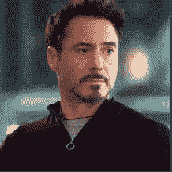

输入图像

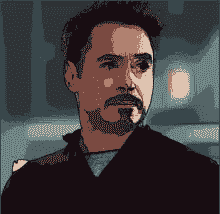

输出图像

现在有很多不同的应用程序可以用来制作卡通形象。本文的主要目的不是简单地为用户构建另一个工具，将他们喜欢的图像转换成卡通图形，而是将他们的注意力吸引到编码方面，以及在学习基础知识后，如何轻松地制作自己的程序。

在这里，我们使用 OpenCV 将图像转换成卡通形式。

## OpenCV -

OpenCV(开源计算机视觉库)是一个开源的计算机视觉和机器学习软件库。OpenCV 旨在为计算机视觉应用提供一个公共基础设施，并加速机器感知在商业产品中的应用。它用于对图像执行不同的操作，这些操作使用不同的技术对图像进行变换。

按照这些步骤来实现预期的结果。

## 步骤 1 —安装 OpenCV

要安装 OpenCV:

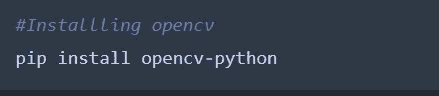

## 步骤 2 —导入必要的库

将以下库导入您的笔记本-

1.  OpenCV
2.  easygui
3.  numpy
4.  matplotlib.pyplot
5.  图像

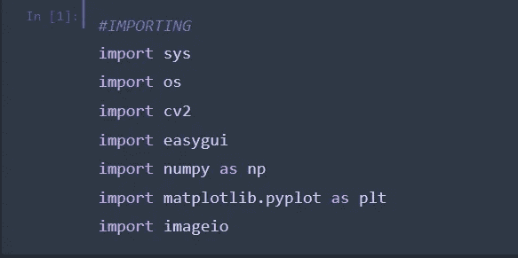

## 步骤 3 —读取图像

现在对于输入，我们需要选择一个图像。图像可以从您的系统中选择，也可以直接从互联网上传。在这里，我已经从我的系统上传了一个。为此，我使用了 easygui 库。

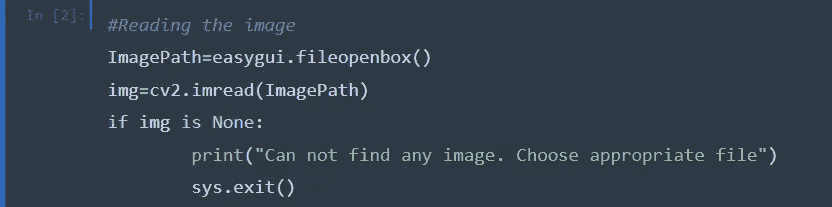

图像存储在 *img 中。*如果未选择文件或未选择上传的文件格式，则显示消息“找不到任何图像”。选择合适的文件”。

默认情况下，图像在 BGR 调色板中读取。我们需要把它转换成 RGB 格式。

更改调色板

接下来，我们必须将图像转换成灰度-

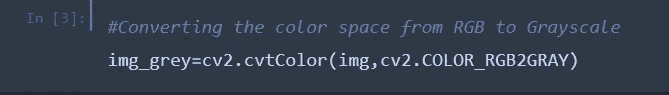

将图像转换为灰度

## 第 4 步——中值模糊

有 3 种类型的模糊可用，

1.  高斯模糊
2.  中值模糊
3.  双边模糊

这里，我们对图像进行中值模糊处理。图像的中心元素由核心区域中所有像素的中值代替。该操作在去除噪声的同时处理边缘。

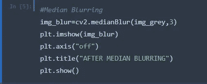

中间模糊

## 步骤 5-边缘遮罩

下一步是创建图像的边缘蒙版。为此，我们利用自适应阈值函数。

**自适应阈值**是为较小的区域计算阈值的方法，因此，不同的区域会有不同的阈值。

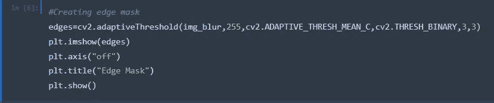

创建边缘遮罩

## 第 6 步—消除噪音

我们需要去掉图像中不想要的细节或“噪音”。在成像中，噪声作为图像中的伪像出现，表现为覆盖图像的粒状结构。

为此，我们执行双边模糊。

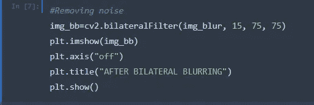

消除噪音

## 第七步——侵蚀和扩张

侵蚀—

*   侵蚀掉前景对象的边界
*   用于缩小图像的特征。

膨胀—

*   增加对象区域
*   用于强调特征

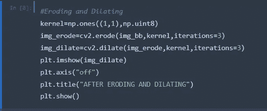

腐蚀和扩张图像

## 步骤 8 —图像的风格化

现在，我们对图像进行风格化处理。

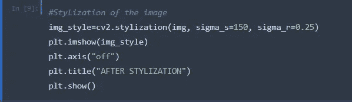

图像的风格化

输出是-

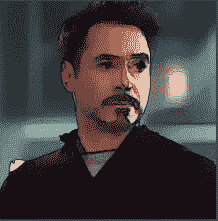

输出

因此，我们看到了如何使用 OpenCV 将图像卡通化。

为了得到更好的效果，我们使用了一种技术——[***颜色量化。***](/color-quantization-using-k-means-clustering-132300ca6864)

完整代码可以在我的 [***GitHub 简介***](https://github.com/AditiRastogi250701/Image-Cartoonifier) ***上找到。***

*感谢阅读！如有任何疑问，请随时联系我的*[***Gmail***](http://aditi2507rastogi@gmail.com)**或我的* [***LinkedIn 简介***](https://www.linkedin.com/in/aditi-rastogi-961789191/) *。**