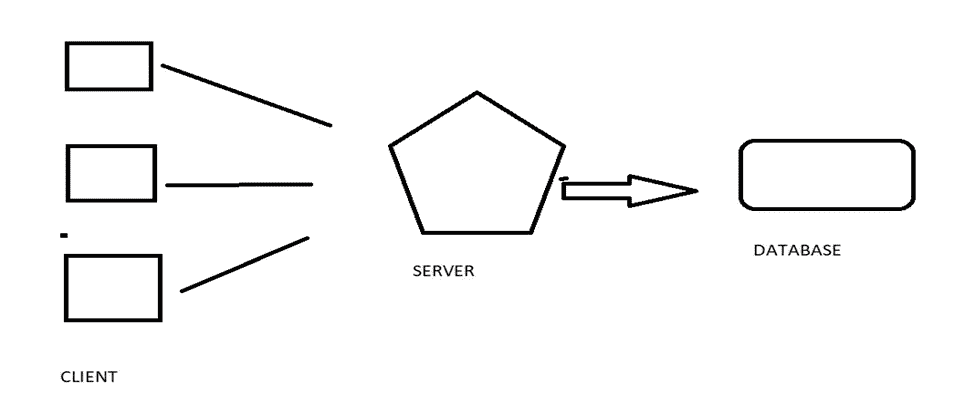

# 案例研究:—远程代码执行引擎系统

> 原文：<https://blog.devgenius.io/case-study-remote-code-execution-engine-system-63aa43344f24?source=collection_archive---------9----------------------->

在我的关于系统设计基础的文章之后，我决定跟进一个关于不同系统的简短案例研究。首先，我们有一个代码执行系统，类似于我们在 leetcode、hackerrank 等中的代码执行系统。跳进它:—

***问题陈述:*** —在一次编码比赛中，或者在一个编码平台上，数百人提交自己的代码等待执行。我们需要设计一个系统，可以接受数百个请求，执行每个提交，并将结果返回给用户。

***约束:*** —我们将更加关注如何设计系统，而不是如何执行提交或如何存储结果或代码文件的实际代码/技术。

***详细问题陈述:*** —假设我们正在进行一场编码比赛。我们需要设计一个系统，它可以同时接收数百个文件，并根据用户提交的代码的实际执行情况，将结果判断为*真*或*假*。为了使事情变得简单，我们假设已经设置了一个服务器和一个数据库。

路易斯·康·恩古吉在 [Unsplash](https://unsplash.com?utm_source=medium&utm_medium=referral) 拍摄的照片

为了进一步简化操作，服务器使用一个脚本来接收客户端提交的文件，执行该文件，并将结果发送到数据库进行存储。反过来，可以单独查询数据库以获得结果。当前系统没有处理受保护恶意代码执行的安全设置，只能支持每秒 50 个请求。现在假设服务器每秒收到 100 个请求。在这种情况下，我们如何处理系统？

接近:-

解决这个问题可以有许多方法，我们不可能一一讨论。但是首先:—

1.我想到的第一种方法是丢弃，也就是说，我们可以丢弃额外的请求，每秒只处理 50 个请求。用户可以再次点击提交或上传按钮，此时他的代码就可以执行了。但是想象一下，对于一个仅仅为了提交代码而不得不点击两三次上传按钮的用户来说，这是多么令人沮丧。因此，这种方法行不通。

2.我想到的第二个方法是缩放。这可能是最基本也是最昂贵的方法，我们可以在现有的服务器上增加更多的服务器，从而增加它的火力。此外，我们可以有一个负载平衡器，它可以根据负载分配请求。但除了成本，这个问题的问题还在于尺寸的缩放。假设不是 100/秒，而是 200 个请求/秒，该怎么办？300，400 等怎么样？我们可以添加一台服务器、两台服务器或三台服务器。但从长远来看，这并不方便。

3.第三个也是最方便的方法是在服务器和客户端之间添加一个消息队列。队列执行以下功能:-

->它接受请求，并向用户发送代码上传/上传完成的确认。文件上传可以上传到文件系统或文件分布式系统。

->队列然后将服务器的请求排队。请求的形式可以是{代码 Id、文件 Id、文件链接、时间失效自上传、详细信息}。

->根据过去的时间，可以安排请求。但是，任何其他算法也可以用于调度。

这里的服务器仍然以相同的容量工作，但是队列的不同之处在于它可以保存请求，这样用户就不需要一次又一次地点击提交。此外，它可以向用户发送一些确认，让他们知道他们的文件是安全的，并且正在执行。

上述方法解决了请求处理/加载问题，但是如果您之前已经注意到，我们没有任何类型的安全性来保护恶意代码的执行。简单地解释一下，用户上传的任何文件都被一个脚本接收，这个脚本就像一个简单的编译器。因此，有很多方法可以让编译器崩溃，比如以某种方式添加“rm -r”或者其他什么，或者在请求中添加一个头等等。为了保护这种问题，我们可以使用**虚拟化环境或容器**。这些容器就像一台计算机一样，用与我们上面的服务器使用的相同的脚本执行上传的代码。现在，如果一个恶意代码进来，它将被执行并且将**只崩溃我们的容器，离开我们的服务器**。这个容器可以一次又一次地组装起来，不会太麻烦。因此，我们可以保护我们的服务器。

有很多方法可以解决上述问题，但这些都是基础，我希望你喜欢。请随意评论您的方法和解决方案。也订阅和跟随我继续阅读这样的文章:)