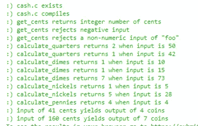

# 现金 CS50

> 原文：<https://blog.devgenius.io/cash-cs50-3c3681ba4b31?source=collection_archive---------3----------------------->

皮沙贝的 IMG。

这个问题中大多数的`main`都是为我们提供的，函数也是如此，我们只需要写出它们里面的内容。让我们浏览一下主要部分，试着理解它。

首先，我们询问用户他们需要返回多少美分，然后我们用`calculate_quarters`函数计算用户需要多少**个 25 美分**，它计算运行该函数后还剩多少美分，这样其他函数就可以做它们的工作，如此类推，直到程序到达`calculate_pennies`函数，之后程序计算总共需要多少硬币，并打印结果。

**功能。**

第一个函数获取我们的收银员/用户需要返还给客户端多少美分，任何小于 0 的数字都必须被我们的程序拒绝，首先，我们初始化一个名为`cents`的变量，然后我决定使用一个`do while`循环来检查该数字是否大于零，如果是，我们将它赋给`cents`，并返回该变量值。这在 main 中调用，返回值存储在另一个名为`cents`的变量中

通过这个函数，`calculate_quarters`我们计算出收银员要给客户多少个 25 美分的硬币。首先，我们声明一个名为`quarter`的变量，其值为 25，这是一个 25 美分硬币的值，请记住，对于像我这样生活在美国以外的人来说。可能是一种奇怪的概念，这就是为什么我要定义它们，在这之后，我们将数量**美分**除以`quarter`并将其存储在变量`r`中，只要它大于 0，就会给出我们需要多少个 25 美分，然后在 **main** 中计算还剩多少美分，对每种硬币都进行这种计算。

现在你可以很容易地找出如何计算其他类型的硬币，基本上与这一个相同，唯一的变化是变量`quarter`的名称和它的值。

每种硬币的价值等于:一角= 10，五分= 5，一分= 1。

现在程序完成了，它可以计算出收银员必须返还给客户多少硬币，我认为打印收银员应该返还什么类型的硬币是很重要的，但这里我们没有被要求这样做，我们的程序只是打印收银员必须返还给客户多少硬币。

感谢阅读，如果有帮助就鼓掌:)。