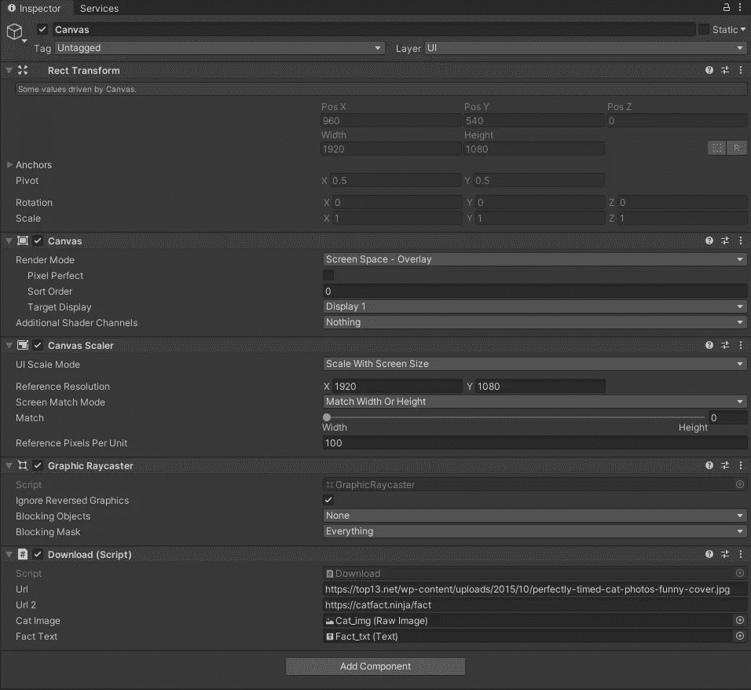

# 卡特彼勒事实:UnityWebRequest

> 原文：<https://blog.devgenius.io/cat-facts-unitywebrequest-f8a5725c15f4?source=collection_archive---------8----------------------->

目标:使用 UnityWebRequest 检索猫的图像和猫的事实。

使用 UnityWebRequest 下载的图像和事实。

创建一个新场景，添加一个 UI > RawImage 和 UI > Text，分别命名为 **Cat_img** 和 **Fact_txt** 。

WebRequest 场景的层次结构。

将 **Cat_img** 锚定器设置为拉伸-拉伸并归零*左侧、右侧、位置 Z、顶部*和*底部*。将颜色设置为浅灰色，以使图像变暗，从而突出文字。

Cat_img 组件设置

**Fact_txt** 尺寸在位置 X，Y，Z 零点为 72，宽度为 1400，高度为 700。将文本居中对齐，水平*换行*和垂直*溢出*。将文本颜色设置为白色，以便从图像中突出出来。

Fact_txt 组件设置。

**画布**设置如下图所示。 *UI 比例模式*设置为*比例，屏幕尺寸*，分辨率为 1920x1080。向**画布**添加一个名为**的新 C#脚本下载**。

画布组件设置，包括下载脚本变量赋值。

下载脚本包含两个类: **CatFact** 和 **Download** 。 **CatFact** 是一个包含 Json 定义的类，由 **fact** *string* 的 *string* **fact** 和 *int* **length** 组成，下载管理 *UnityWebRequests* ，需要图片、 **_url** 和事实、 **_url2 的网站字符串 **UnityWebRequest** 变量使用 *SerializeField* ，因此它们可以在检查器中定义，如上所示。将 **Cat_img** 分配给 **_catImg** ，将 **Fact_txt** 分配给 **_factText** 。**

在 **void Start()** 中，启动 **DownloadImageRoutine** 。*unity brequest***请求**从网站 **_url** 获取纹理。*使用*确保这个**请求**一旦完成就被处理掉。**请求。SendWebRequest** 在这个 IEnumerator 中等待，直到完成。如果**请求.结果**成功，使用*下载处理纹理*分配变量**纹理**，并将**_ 图像**分配给此**纹理**。

用于从网上抓取 jpg 图像的程序。

在 **void Update()** 中，当用户按下空格键时，启动 **CatFactRoutine** 。 *UnityWebRequest* **请求**从网站 **_url2** 获取结果。在**请求之后。SendWebRequest** 成功完成，使用 *DownLoadHandler.text* 设置*字符串* **jsonString** 。事实由前面描述的 **CatFact** 类使用 *JsonUtility 定义。FromJson* 。 **_factText** 被设置为这个 **fact.fact** 。

CatFactRoutine 用于从 web 上获取 cat 事实。

享受悬停猫和事实！