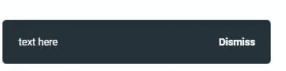
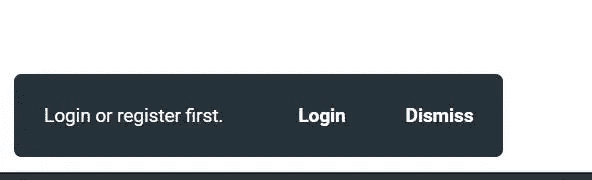

# 用 toast 消息捕获和显示 UI 错误

> 原文：<https://blog.devgenius.io/catching-and-displaying-ui-errors-with-toast-messages-in-angular-db06f2605a6d?source=collection_archive---------3----------------------->

## 错误和干杯


在[的上一篇文章:Angular](https://garage.sekrab.com/posts/catching-and-handling-errors-in-angular) 中的捕获和处理错误中，我们处理了来自 Http 响应和 RxJS 操作符的错误，通过将错误返回给消费者，让每个消费者进行不同的处理。今天，我们将为 Toast 消息创建一个组件，它可能用于错误处理。

最终项目可以在 [StackBlitz](https://stackblitz.com/edit/angular-error-toast?file=src/app/toast/toast.state.ts) 上找到。在[components/list . partial . ts](https://stackblitz.com/edit/angular-error-toast?file=src/app/components/list.partial.ts)中找到`catchError`的使用示例，点击导航中的 **transactions** 查看其工作情况。另一个例子见`components/form.partial.ts`。

# 多好的祝酒辞！

让我们从简单的开始。非常简单:给`app.component root`添加一个组件，并控制它的一些事情。

```
@Component({
    selector: 'gr-toast',
    template: `
      <div class="toast">
        <div class="text">text here</div>
        <button>Dismiss</button>
      </div>
    `,
    changeDetection: ChangeDetectionStrategy.OnPush,
    styleUrls: ['./toast.css'],
})
export class ToastPartialComponent  {
    constructor() { }
}
```

这将手动附加到正文:

```
<!--  in app.component.html -->
<gr-toast></gr-toast><!--  and in app.module, add a declaration, this will end in Angular 14, hopefully -->
```

让我们给它最简单的风格，以便能够使用它:

```
/* basic css for the toast */
.toast {
  border-radius: 5px;
  max-width: 80vw;
  display: flex;
  flex-wrap: nowrap;
  align-items: center;
  justify-content: space-between;
  background-color: #263238;
  color: #fff;
  position: fixed;
  bottom: 10px;
  left: 10px;
  font-size: 90%;
  z-index: 5100;
}
.text {
  padding: 20px;
  flex-basis: 100%;
  margin-right: 10px;
}button {
  padding: 20px;
  cursor: pointer;
  font-weight: bold;
  color: inherit;
}
```

左下角看起来是这样的。



为了在任何地方访问 toast 的可见性，它需要由 root 中提供的服务来处理。**最简单形式的服务有一个内部主题，作为可观察对象公开**，将内容从“null”更改为“something”。

> *我们稍后可以将它变成我们在* [*RxJS 状态管理*](https://garage.sekrab.com/posts/rxjs-based-state-management-in-angular-part-v) *中构建的状态服务。*

服务如下:

```
import { Injectable } from '@angular/core';
import { BehaviorSubject, Observable } from 'rxjs';// the simple model will become bigger as wel move on
export interface IToast {
    text?: string;
}@Injectable({ providedIn: 'root' })
export class Toast {
  // internal subject to control the state
  private toast: BehaviorSubject<IToast | null> = new BehaviorSubject(null);
  toast$: Observable<IToast | null> = this.toast.asObservable(); // show, simply updates the state to something
  Show(text: string) {
    this.toast.next({ text: text });
  }
  // hide, simple updates the state to null
  Hide() {
    this.toast.next(null);
  }
}
```

然后在 toast 模板中，我们观察 toast 状态:

```
@Component({
  selector: 'gr-toast',
  // in template watch the toast observable for null values to hide all
  template: `
    <ng-container *ngIf="toastState.toast$ | async as toast">
      <div class="toast">
        <div class="text">{{ toast.text }} </div>
        <!-- on click, hide the toast -->
        <button (click)="toastState.Hide()">Dismiss</span>
      </div>
    </ng-container>
    `,
  changeDetection: ChangeDetectionStrategy.OnPush,
  styleUrls: ['./toast.css'],
})
export class ToastPartialComponent {
  // inject the state
  constructor(public toastState: Toast) {}
}
```

在任何组件中显示和隐藏非常简单:

`this.toast.Show('hello world');`

> *是不是看起来太简单了？确实是。故意的。*

所以现在，回到我们的 RxJS 捕获和未处理的错误。最终结果看起来是这样的:

```
// in a component that uses the custom operator to unify the error model:
getProjects() {
  this.projects$ = this.projectService.GetProjects().pipe(
    catchError(error => {
      // here we use our toast, we pass the code only
      this.toast.Show(error.code);

      // then continue, nullifying
      return of(null);
    })
  )
}
```

所以我们现在知道第一个参数应该是一个**代码**，它转化为一个消息。

# 文本资源

翻译信息的代码？那看起来像是**资源**。正如我之前在 [SEO 服务](https://garage.sekrab.com/posts/seo-in-angular-with-ssr-part-i)中所说，我避开了 **i18n 包**，创建了自己的[资源文件](https://stackblitz.com/edit/angular-seo-service?file=src/app/resources.ts)。我们将在此基础上进行构建，但稍有改动。由于**代码是从服务器**返回的，我们想要两件东西:

*   找不到的代码的“**未知**”通用文本
*   一条**回退消息**，以防我们希望回退特定于某些情况

```
// under root/locale/resources.ts, lets add a few codes
export const keys = {
  // an unknown key to fall back to
  Unknown:
    'Oops! We could not perform the required action for some reason. We are looking into it right now.',
  // an empty one just in case
  NoRes: '', // if resource is not found
  // some generic keys of our choice
  Required: 'Required',
  Error: 'An error occurred',
  DONE: 'Done',
  // some specific ones
  UNAUTHORIZED: 'Login or register first.',
  INVALID_VALUE: 'Value entered is not within the range allowed', // mapping from server or API
  PROJECT_ADD_FAILED: 'Server did not like this project',
};
```

编写 Show 方法时考虑到了这一点:

```
// Toast show method takes code, and fallback
Show(code: string, fallback?: string) {
  // get message from code, keys is found in locale/resources.ts
  let message = keys[code];
  // if it does not exist, fall back message
  if (!message) {
    // if fallback is not provided, return unknown
    message = fallback || keys.Unknown;
  }
  this.toast.next({ text: message });
}
```

这种先找到一个键然后再返回的模式，在任何使用资源的地方都会用到。它**将代码从资源**中分离出来，使得“未知”更加普遍。但是，因为它解耦了它们，所以在开发期间，当我们真的不知道从服务器期待什么代码时，它更宽容。所以，做以下事情，风险自担(这是我个人的选择):

# 资源类

让我们把这个模式放到它自己的类中:

```
import { keys } from '../../locale/resources';// a simple class that translates resources into actual messages
export class Res {
  public static Get(key: string, fallback?: string): string {
    // get message from key
    if (keys[key]) {
      return keys[key];
    }
    // if not found, fallback, if not provided return NoRes
    return fallback || keys.NoRes;
  }
}
```

现在我们可以在像这样的任何地方使用它

`Res.Get('Invalid_Email');`

或者代码是否更加不可预测

`Res.Get(serverCode, 'Use this message instead');`

由于第二个参数也是文本，我们可以选择一个现有的资源来替换它

`Res.Get(serverCode, keys.Unknown);`

这就是我们将用于祝酒词的内容，此外还公开了回退。回到我们的展示方法，这应该是决定信息的最灵活和全面的方法。

```
Show(code: string, fallback?: string) {
  // use code, then use fallback, then use keys.Unknown
  const message = Res.Get(code, fallback || keys.Unknown);
  this.toast.next({ text: message });
}
```

# 错误处理细节

到目前为止，toast 是一个通用工具，我们可以直接使用它来显示组件中的错误:

```
create(project: Partial<IProject>) {
  // we can catch errors in "error" body or as an operator to RxJS pipe
  this.projectService.CreateProject(project).subscribe({
    next: (data) => {
      console.log(data?.id);
    },
    error: (error: IUiError) => {
      // this needs a bit more information, specifically style
      // also error may not have 'code'
      this.toast.Show(error.code); 
    }
  });
}// in a simpler non-subscribing observable
getProjects() {
  this.projects$ = this.projectService.GetProjects().pipe(
    catchError((error:IUiError) => {
      // same as above
      this.toastShow(error.code);
      // then continue, nullifying, remember here to account for "null" values
      // in the component consuming this observable
      return of(null);
    })
  )
}
```

这将成为一种模式，所以让我们缩小尺寸，把它从组件中去掉:

`catchError(e=>this.toast.HandleUiError(e[, fallBack]))`

此外，我们需要注意错误处理的最后一道关口，**如果错误不是** a `UiError`呢？如果是 JavaScript 错误呢？在 toast state 服务中，我们添加了这个新的`HandleUiError`方法，以及一个最终的重新抛出:

```
export class Toast {
  // ...

  // show code then return null
  HandleUiError(error: IUiError, fallback?: string): Observable<any> {
    // if error.code exists it is our error
    if (error.code) {
      this.Show(error.code, fallback);
      return of(null);
    } else {
      // else, throw it back to Angular Error Service, this is a JS error
      return throwError(() => error);
    }
  }
}
```

# 所有误差都相等吗？

随着我们继续前进并创建样式，我们会认为所有来自`catchError`语句的祝酒词都是红色失败。但是他们都是这样吗？从 UI 角度来看，**肯定不是**。考虑以下使用案例

## 通过电子邮件添加成员

一个允许管理员通过电子邮件添加新用户的特性，一个好的 API 应该(至少)有两点:

*   创建新用户:`POST users/`不仅仅是电子邮件
*   添加会员:`POST members/`用用户 ID，或者邮箱，前面可以加“通过邮箱查找用户”。

作为开发人员，我们将从通过电子邮件添加成员**开始。如果邮件不存在，**将返回错误 404** 。用户界面只需要建立在它的基础上，允许管理员继续填写其他领域。**消息，如果有的话，在这种情况下；不是错误，而是信息**。**消息，如果有的话，在这种情况下；不是错误，而是信息**。**

## 超时的用户

服务器可能会返回**错误 401 或 403，这不是终端**。这种情况下的消息不是错误，而是信息性的，带有“重新登录”按钮，或者在更严重的情况下，是重定向。

先加风格，看看怎么适应。

# 式样

将会有重复的模式来显示红框、黄框、绿框等等。

`this.toast.ShowError`

`this.toast.ShowWarning`

`this.toast.ShowSuccess`

`this.toast.Show (default)`

我们将在州服务中添加那些重复的功能。由于我们有额外的选项，**回退文本将被合并到文本选项**中。

```
// adapt the toast state service to have options as a second argument
// fallback message is now part of options 
  Show(code: string, options?: IToast): void {
    // get message from code
    const message = Res.Get(code, options?.text || keys.Unknown);
    // pass options
    this.toast.next({...options, text: message})
  }// shortcuts for specific styles, replace fallback with options
  ShowError(code: string, options?: IToast) {
    this.Show(code, { extracss: 'error', ...options });
  }
  ShowSuccess(code: string, options?: IToast) {
    this.Show(code, { extracss: 'success', ...options });
  }
  ShowWarning(code: string, options?: IToast) {
    this.Show(code, { extracss: 'warning', ...options });
  }

  // replace fallback here as well
  HandleUiError(error: IUiError, options?: IToast): Observable<any> {
    // if error.code exists it is our error
    if (error.code) {
      this.Show(error.code, options);
      return of(null);
    } else {
      // else, throw it back to Angular Error Service, this is a JS error
      return throwError(() => error);
    }
  }

  // using it is now like this
  // this.toast.Show('SomeCode', {text: 'fallback message'});
```

在我们的 css 文件中

```
/* add to toast.css */
.toast.warning {
  background-color: var(--yellow);
  color: #263238;
}
.toast.error {
  background-color: var(--red);
}
.toast.success {
  background-color: var(--green);
}
```

在我们的 toast 组件模板中

`<div class="toast {{toast.extracss}}">`

但是我们希望“toast”被修改，我们也希望它被默认。为了实现这一点，我们需要状态服务中的一个**默认选项**变量

```
// in toast state service
 private defaultOptions: IToast = {
    css: 'toast',
    extracss: '',
    text: '',
  }; Show(code: string, options?: IToast) {
    // extend default options
    const _options: IToast = { ...this.defaultOptions, ...options }; const message = Res.Get(code, options?.text || keys.Unknown);
    this.toast.next({ ..._options, text: message });
  }
```

在我们的 toast 组件模板中

`<div class="{{ toast.css }} {{toast.extracss}}">`

有了所有这些小工具，创建一个非常具体和动态的警告消息看起来像这样

```
// extreme case of a warning when an upload file is too large
const size = Config.Upload.MaximumSize;
this.toast.ShowWarning(
  // empty code to fallback
  '',
  // fallback to a dynamically created message
  { text: Res.Get('FILE_LARGE').replace('$0', size)}
);

// where FILE_LARGE is:
// FILE_LARGE: 'The size of the file is larger than the specified limit ($0 KB)'
```

# Http 状态错误

回到我们的消费者组件，在那里捕获错误。在示例“获取项目”功能中，我们有以下可能的结果:

```
getProjects() {
  this.projects$ = this.projectService.GetProjects().pipe(
    catchError(error => {
     // what is the error? is it 404? or 401?
     if (error.status === 400){
      this.toast.ShowError(error.code);
     }
     if (error.status === 404) {
       // ignore code from server
       this.toast.ShowWarning('PROJECT_NOT_FOUND');
     }
     if ([401, 403].includes(error.status)){
       // ignore codes and always show unauthorized
       // and in the future also pass a button to login
       this.toast.Show('UNAUTHORIZED', {button: 'TODO'} );
       // or simply log out
       this.authService.logout();
     }
     // and other error statuses...
     // then continue, nullifying
     return of(null);
    })
  )
}
```

> *注意:如果我们把 toast 组件放在 root app 中，重定向到 login 不会让它消失，这正是我们想要的，如果你重定向到一个没有 toast 组件的路由，显示它就没有意义了，因为它会被移除。*

这是解决问题的一种方法。尽管这是一种模式，我们也应该把它移植到我们的国家服务中。同时，我们应该**创建按钮**界面。

```
// rewriting HandleUiError
 HandleUiError(error: IUiError, options?: IToast): Observable<any> {
    if (error.code) {
      // do a switch case for specific errors
      switch (error.status) {
        case 500:
          // terrible error, code always unknown
          this.ShowError('Unknown', options);
          break;
        case 400:
          // server error
          this.ShowError(error.code, options);
          break;
        case 401:
        case 403:
          // auth error, just show a unified message, need to add options for button
          this.Show('UNAUTHORIZED', options);
          break;
        case 404:
          // thing does not exist, better let each component decide
          this.ShowWarning(error.code, options);
          break;
        default:
          // other errors
          this.ShowError(error.code, options);
      }
      return of(null);
    } else {
      return throwError(() => error);
    }
  }
```

使用它是非常灵活的，如果我想具体说明 404 错误，下面是最终结果:

```
getProjects() {
  this.projects$ = this.projectService.GetProjects().pipe(
    catchError((error) => {
      // you could override the extracss, or fallback text
      // this.toast.HandleUiError(error, { extracss: 'warning' })
      // but if 404, i want a different code
      if (error.status === 404) {
        error.code = 'PROJECT_NOT_FOUND';
      }
      return this.toast.HandleUiError(error);
    });
}
```

我们现在可以进行任何类型的特定组合，这是我们之前添加成员的场景，用户 404 不是错误:

```
// example of handling 404 differently
assignMember() {
  this.user$ = this.userService.GetUser('email@something.com').pipe(
    catchError((error) => {
      if (error.status !== 404) {
        return this.toast.HandleUiError(error);
      }
      // a 404 means new user needs to be created
      // may be a toast of that? optional
      this.toast.Show('ADDING_NEW_USER');
      // return new user object and continue
      return of({email: 'email@something.com'});
    });
}
```

您可以更具体地说明您正在进行的项目的需求。因此，请留意重复的模式，并小心处理它们。

# 动作按钮

最后但同样重要的是，我们需要公开按钮，以允许除“解散”之外的按钮。首先，让我们将按钮添加到模板中，并传递 click 事件:

```
<!-- in toast template -->
 <div class="{{toast.css}} {{toast.extracss}}">
  <div class="text">{{ toast.text }} </div>
  <div class="buttons" *ngIf="toast.buttons.length">
    <!-- TODO: add buttons collection to model, and click handler prop -->
      <button *ngFor="let button of toast.buttons"
       [class]="button.css" 
       (click)="button.click($event)"
      >{{button.text}}</button>
  </div>
</div>
```

在 toast 模型中，我们添加了 buttons 集合，每个按钮是一个至少包含文本和 css 的元素，以及一个 click 方法:

```
export interface IToast {
  text?: string;
  css?: string; // basic css, defaults to toast
  extracss?: string; // extra styling
  buttons?: IToastButton[]; // action buttons
}export interface IToastButton {
  text: string;
  css?: string;
  // and a click handler
  click?: (event: MouseEvent) => void;
}
```

例如，在我们的消费者组件中，**登录以继续**场景，让我们在 toast 中添加一个登录按钮。

```
// inside a catchError operator
 return this.toast.HandleUiError(error, {
  buttons: [
    {
      text: 'Login', // better use resources keys
      click: (event) => {
        // route to login then close toast
        this.router.navigateByUrl('/login');
        this.toast.Hide();
      }
    }
  ],
});
```

我们也可以创建默认的解散按钮。可选地添加它的最安全的方法是**暴露解散按钮**，并像对待任何其他按钮一样对待它。在敬酒状态服务中:

```
// public dismiss button
dismissButton = {
  css: 'btn-close',
  text: keys.DISMISS,
  click: (event: MouseEvent) => {
    this.Hide();
  },
};

// added to default options
private defaultOptions: IToast = {
  css: 'toast',
  extracss: '',
  text: '',
  // add dismiss by default
  buttons: [this.dismissButton]
};
```

回到我们要添加两个按钮的消费组件:

```
// inside a catchError operator
return this.toast.HandleUiError(error, {
  buttons: [
    {
      text: 'Login', 
      click: (event) => {
        // route to login then close toast
        this.router.navigateByUrl('/login');
        this.toast.Hide();
      }
    },
    // add dismiss as well
    this.toast.dismissButton
  ]
});
```

为适应新的按钮，对 CSS 做了一些小小的添加:

```
/*allow multiple buttons to appear on one line*/
.buttons {
  display: flex;
}
```



# 自动隐藏

祝酒词应该在一段时间后自动隐藏，但那要等到下周。谢谢你读到这里，如果你发现了角落里的蜘蛛，请告诉我。

最终的项目在[的 StackBlitz](https://stackblitz.com/edit/angular-error-toast?file=src/app/toast/toast.state.ts) 上。

## 控制台系列

*   [为 console.log 编写一个包装器以更好地控制 JavaScript，第一部分](https://medium.com/@aayyash/writing-a-wrapper-for-console-log-for-better-control-in-javascript-part-i-9bbd238fb9ad)
*   [为 console.log 编写一个包装器，以便更好地控制 Angular，第二部分](/writing-a-wrapper-for-console-log-for-better-control-in-angular-part-ii-5b09b65af2c5)
*   [捕捉和处理角度误差](https://medium.com/@aayyash/catching-and-handling-errors-in-angular-3ac6b95853ba)
*   [用 toast 消息捕获并显示 UI 错误](/catching-and-displaying-ui-errors-with-toast-messages-in-angular-db06f2605a6d)
*   [自动隐藏有角度的祝酒辞](https://medium.com/@aayyash/auto-hiding-a-toast-message-in-angular-54f886ad6129)