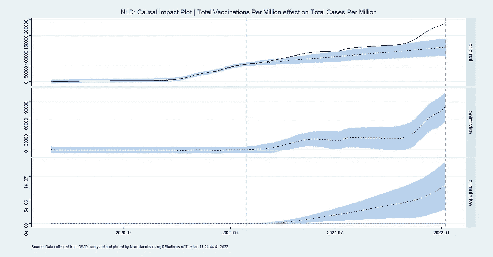

# 时间序列新冠肺炎数据的因果推断

> 原文：<https://blog.devgenius.io/causal-inference-on-time-series-covid-19-data-3cbba9ec35f3?source=collection_archive---------9----------------------->

## *模型无法证明因果关系*

在他的《为什么之书》一书中，朱迪亚·珀尔描述了因果关系的阶梯，它由三个梯级组成:*(看见)*干预*(做)*因果*(想象)。*

*我们大多数人都是通过它的同义词“相关性”来了解关联的，而统计模型是这门手艺的真正大师。这意味着当 A 移动时，B 也必须移动，但是它们不必因为彼此而移动。*

*第二级“干预”更难实现，需要大多数研究人员熟悉的实验设计类型(施加 A，观察 B 是否发生)。在这里，A 的变化必然会导致 B 的变化，而 B 的变化不会导致 A 的变化。事实上，您希望 B 只是因为 A 而变化。要使干预成为干预，其行动必须导致单一结果，并且大多数统计模型都经过训练，以便在发生这种情况时提取推论。然而，他们确实需要一个好的实验设计的帮助，而“统计显著性”领域也不是没有批评，这是理所当然的(参考文献)。*

*最吸引人的是因果关系本身，或者说“想象”。在他的书中，珀尔将想象描述为在你的头脑中召唤出一个平行宇宙并通过虚构的场景进行游戏的能力。尽管干涉比关联更难证明，但不言而喻，平行宇宙永远无法被“证明”。*

*然而，模型经常被滥用于此。例如，想象一个模型预测一批动物的次优生长曲线，导致农民的饮食干预。最终，曲线得到了改善，但从未达到最佳状态。所以，就数据而言，我们现在有了一条观察到的增长曲线，一条预测到的增长曲线，一个干预，以及预测到的和观察到的之间的差异。我们能宣称干预导致了增长的改善吗？我们知道在改善之前进行了干预(梯级 2)，我们有一个由模型提供的平行宇宙，显示了曲线在没有干预的情况下最有可能发生的情况(梯级 3)。然而，在干预发生之前预测会发生的事情从未真正发生，我们所拥有的只是我们捕获的数据。此外，这不是一个所有已知和未知因素都保持不变的实验设置，模型预测本身是不确定的。此外，没有进行复制，而且由于环境不断变化，甚至可能不再进行复制。*

*也许建模者能做的最危险的事情就是宣称一个模型能做的比它能做的更多。模型本身代表了系统如何被调节的假设——如果它被证明是错误的，我们会学到更多。我们都有失败的模型，揭示了我们知识中的漏洞，我们去做实验工作，并重新开发模型的一部分。接受这一点将有助于我们更好地接受模型的本来面目，这是我们当代知识的一面镜子。*

*然而，这并不意味着我们不能看一看，并把我们的数据带到至少因果关系阶梯的第二级。这就是谷歌的[因果影响](https://google.github.io/CausalImpact/CausalImpact.html)算法派上用场的地方。基于[贝叶斯分析](https://medium.com/mlearning-ai/why-science-is-beautifully-human-and-very-frail-4f6225d32bb0)，因果影响使用干预前的时间序列曲线作为先验信息，使用干预后的时间序列作为可能性。然后将两者结合以提供后验可能性。这有点，但不完全像，[非线性模型如何工作。](https://towardsdatascience.com/in-modelling-the-first-steps-are-the-hardest-a4250b80a0f2)*

*这里的关键是定义干预后的观察值与模型预测的偏差。然而，这并不能证明因果关系，因为因果关系需要的不仅仅是干预和时间。*

*这种分析的一个很好的出发点是疫苗接种对新冠肺炎统计数据的影响。凯尔·贝蒂在他的论文中到底做了什么。在这篇文章中，我想强调两者的因果关系，他通过使用他发表的部分代码并将其应用到荷兰场景中所做的事情。*

*开始了。首先是一段代码，然后是结果。*

```
*rm(list = ls()
library(tidyverse)
library(readr)
library(CausalImpact)
library(ggthemes)
getwd()

data_folder <- file.path("")
url <- "https://covid.ourworldindata.org/data/owid-covid-data.csv"
name <- "owid-covid-data.csv"
download.file(url = url, destfile = paste0(data_folder,name))
setwd(data_folder)

# CAUSAL ANALYSIS ---------------------------------------------------------
Covidowid_covid_data <- read_csv(paste0(data_folder,name))
df<-Covidowid_covid_data
countries <- c(unique(df_owid$iso_code))
df <- dplyr::filter(df, iso_code == "NLD") # Use iso_code codes to loop every country
dates <- as.character(df$date) # change to text
df$date = as.Date(dates, format="%Y-%m-%d") # change to date

# Treatment - Independent Variable
vacc <- dplyr::select(df,date,people_fully_vaccinated_per_hundred) # INDEPENDENT VARIABLE
vacc <- unique(vacc) # Make sure there are no duplicate observations
vacc <- na.omit(vacc) # Make sure there are no observations with NA

df <- dplyr::select(df,date,total_cases_per_million)
df <- unique(df) # only choose unique values
df <- na.omit(df) # remove all

dfy <- df$total_cases_per_million
dfyN <- as.numeric(length(dfy))
dfy <- na.omit(dfy)
dfyN2 <- as.numeric(nrow(dfy))
dfx <- df$date # Time Series
df.ts    <- dfx     
df.score <- dfy     
df.time  <- df$date 
days <- as.Date(max(df.ts)) - as.Date(min(df.ts)) # Find length of data frame
days <- as.numeric(days) # Make the string a number
time.points <- try(seq.Date(as.Date(min(df.ts)), by = 1, length.out = days))
SCORE.Y <- ts(df.score) # Dependent Variable
TIME.C <- ts(df.time) # Time Series
test <- try(zoo(cbind(SCORE.Y, TIME.C), time.points))
df <- na.omit(vacc) # Remove any NAs
treatmentS <- (min(df$date)) 
treatmentE <- max(df$date) 
preperS <- min(dfx)
preperE <- treatmentS - 1 
postperS <- (treatmentS) 
postperE <- treatmentE 
pre.period <- c(preperS,preperE) 
post.period <- c(postperS,postperE) 
if ((preperE - preperS) < (postperE - postperS) | anyNA(test) == TRUE) 

impact <- try(CausalImpact(test, pre.period, post.period)) # Calculate Impact

x <- "Total Vaccinations Per Million" # CHANGE ONLY IF YOU CHANGE X VARIABLE
y <- "Total Cases Per Million" # ** CHANGE THIS FOR EACH Y VARIABLE**
plot(impact) + ggplot2::labs(
                    title = paste0("NLD", # Title the plot
                                   ": Causal Impact Plot",
                                   " | ",
                                   x,
                                   " effect on ",
                                   y),
                    caption =
                      paste("Source: Data collected from OWID, analyzed and plotted by Marc Jacobs using RStudio as of",
                            date())) + theme_stata() # Choose a theme
try(summary(impact, "report")) # Produce Summary Report
try(summary(impact)) # Produce Summary Report 2)*
```

*结果出来了。现在，CausalImpact 的结果非常简单，因为它提供了情节和描述性文本。*

**

> *在干预后期间，反应变量的平均值约为。相比之下，在没有干预的情况下，我们预期的平均反应为 83.57K。这种反事实预测的 95%区间为[68.97K，98.34K]。从观察到的反应中减去这一预测，就可以估计出干预对反应变量的因果影响。这个效果是 23.62K，95%区间[8.85K，38.22K]。关于这种效应的意义的讨论，见下文。对干预后期间的各个数据点进行总结(有时只能进行有意义的解释)，响应变量的总体值为 36.87M。相比之下，如果干预没有发生，我们预计的总数为 28.75M。该预测的 95%区间为[23.73M，33.83M]。以上结果是以绝对数给出的。*
> 
> *相对而言，响应变量增加了+28%。这个百分比的 95%区间是[+11%，+46%]。这意味着在干预期间观察到的积极影响在统计上是显著的，不太可能是由于随机波动。然而，应该注意的是，这种增加是否也具有实质性意义的问题只能通过将绝对效果(23.62K)与基本干预的最初目标进行比较来回答。偶然获得这种效果的概率很小(贝叶斯单侧尾区概率 p = 0.001)。这意味着因果关系可以被认为是统计意义上的。*

*现在，这个图和文本强调的是，干预后的观察结果并没有遵循模型预测的模式。然而，这并不意味着接种疫苗会导致增加。要这么说，你必须有一个平行宇宙，在其中你可以看到如果干预没有发生会发生什么。就疫苗而言，我们知道干预不是单一事件，而是一条累积曲线。因此，这种影响也必须是累积的，这也许不是时间序列的先验所能获得的。*

*所附的代码将有助于我所做的模型的许多偏差，具有不同的事件(如度量)和结果。*

*尽情享受吧！*