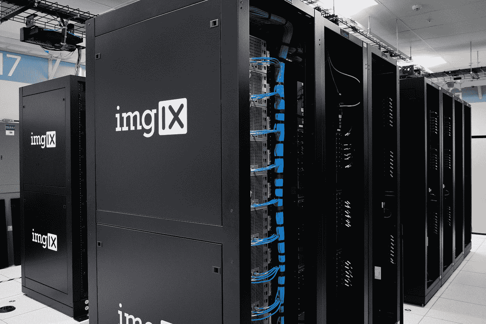

# 给你的数据存储带来混乱

> 原文：<https://blog.devgenius.io/causing-chaos-on-your-data-store-for-profit-7c3a25039761?source=collection_archive---------33----------------------->

*为什么不尝试一下当数据存储崩溃时系统的表现呢？*

每个有趣的应用程序都有某种持久的内存——管理软件和数据存储之间的关系对整个系统的健康至关重要。由于复杂性，您的应用程序可能会以多种方式淹没您的数据存储。例如:错误的查询、丢失或错误的索引、(非常)糟糕的分片、错误的缓存决策……还有很多我们无法计数的。但是它们都会导致数据层没有响应，而且有些破损。这正是我们要测试的！

如果没有我们心爱的数据中心，我们会怎样？好吧，让我们来看看！(图片由 [imgix](https://unsplash.com/@imgix?utm_source=medium&utm_medium=referral) 在 [Unsplash](https://unsplash.com?utm_source=medium&utm_medium=referral) 上拍摄)

## 摧毁什么？

我可以写一整篇文章来说明最终理解数据存储饱和是如何在您的应用程序中体现出来的有多么重要(将来可能会这样)。有几种方法可以用混沌工程实验来模拟。以下是一些可以利用你的系统的方法:

1.  封锁您的数据存储，使其不可用
2.  增加存储延迟，使其看起来很慢
3.  限制 I/O 带宽以模拟过载

我想我们已经忘记了如今拥有一个好的数据存储是多么困难。几乎没有人处理它。您的数据库管理员将为您提供一个方便的数据库，您当然会得到高可用性的持久卷，对吗？不。难怪数据库管理员有时会得到报酬最高的工作。

## 打破它使它变硬

因此，由于数据存储是一个非常、非常、非常重要的依赖项，您应该预料到在数据存储中断期间，您出色的应用程序的一些功能会很慢，甚至不可用。那么，我们最好的情况是什么？
理想情况下，只有外部数据直接支持的功能才会受到影响。如果影响大于此，请查找数据存储上隐藏的依赖关系。你会找到他们的，我敢打赌。这是一个很好的机会来停止数据存储，并测试您陈述的需求是否如预期的那样被截断。

是的，想象一下你的数据中心正在燃烧…(照片由 [Dawn Armfield](https://unsplash.com/@darmfield?utm_source=medium&utm_medium=referral) 在 [Unsplash](https://unsplash.com?utm_source=medium&utm_medium=referral) 上拍摄)

## 快乐新数据商店

是的，我知道，这会感觉很紧张。但是在你烧毁了几次你的数据存储并知道它有什么缺陷之后，你会对每次重启更有信心。你知道为什么！这是一个你在生产中肯定**而不是**必须要做的重启——而且这是一个会让你付出代价而不是客户的重启。
那么我们做了什么？我们减少并减缓了整个数据流量，以确保我们的指标(在应用程序级别)不受影响(这意味着我们的客户保持满意)。我们已经为自己的数据流量建立了一个成功的后备系统，并在必要时显示可爱的小警告和页面。