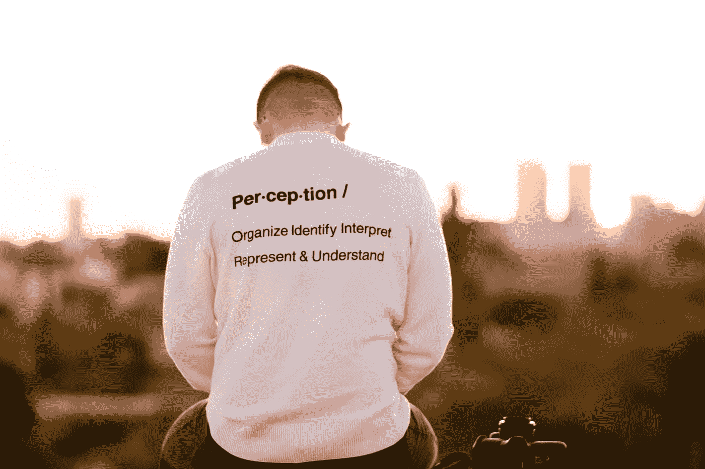

# 小心！接近指标的经理

> 原文：<https://blog.devgenius.io/caution-manager-with-metrics-approaching-212403d85088?source=collection_archive---------2----------------------->

## 度量标准喜欢他们还是讨厌他们？

## 如果你没有意识到其中的微妙之处，衡量敏捷开发可能会有所帮助，也可能会有所阻碍

Arie Wubben 在 [Unsplash](https://unsplash.com?utm_source=medium&utm_medium=referral) 上拍摄的照片

我写这篇文章是为了用一些信息来武装开发人员，以度量的形式来抵御邪恶的灵魂和带有虚假礼物的经理。此外，我的目标是尝试向善意的领导者和管理者传递一些关于如何以及为什么在软件开发的世界中使用度量的建议。

# 为什么要测量？

> “没有数据，你只是另一个有观点的人。”爱德华兹·戴明

软件开发是关于构建东西，为某人解决问题，并为开发它的企业赚钱。这个目标通常以目标的主观形式来表达，“高质量的软件”，“最低成本的软件”，或者“总是交付给我们的承诺”。其中的关键项目通常是:**时间**、**成本**和**质量**，它们通常被设定为目标，并以非常清晰的数字形式进行衡量。

就像坐在你车后座的孩子问“我们快到了吗？”你的经理也想知道同样的事情。他们想知道这些信息有几个原因:

*   他们应该感到恐慌吗？
*   他们需要调整一些东西吗(拉一个杠杆，花更多的钱)
*   管理预期(更新客户，警告他们延迟，协商订单功能的推出)
*   他们是否在预算之内，并因此在工作中获利？
*   实际工作是否与项目开始时的估计足够相似？
*   团队的工作效率如何？

所以回答这个随意的问题“事情进展如何？”需要一个不仅传达数据，而且传达与标准或职权范围的关系的答案，以便听众能够了解进展(或缺乏进展)。

如果你没有数据，那么它就是一种观点，每个人都有不同的观点，并且经常表现为一种更难理解的情绪。

*   “是的，一切都好”
*   “还不错”
*   “可能会更好”
*   “感觉甜蜜”
*   “进展顺利”

# 衡量什么是重要的

如果目标是“按时、按预算交付一个项目，并且只有很少的错误”，那么度量这些项目，并且要有具体的度量单位(UoM)。

*   经过的时间(天数)
*   成本(英镑)
*   吉拉票务系统的漏洞数量

并为项目成功设定目标:

*   经过时间等于或少于 123 天
*   成本不超过 12，345.67 英镑
*   缺陷数量少于 10 个

与这些主要目标和指标相关联的，可能还有可能影响主要度量的其他可度量的事物。

威廉·沃比在 [Unsplash](https://unsplash.com?utm_source=medium&utm_medium=referral) 上的照片

如果这是一条工厂生产线，那么在传送带上的每台机器上，我们可以测量参数，这些参数可以合理地预测成品是否会以所需的速度和质量生产。如果生产线中间的机器以半速运行，这可能会触发警报，表明整个工厂在实现生产目标方面存在重大问题。

因此，为了预测整个项目的成本，可以合理地衡量:

*   每周成本

如果这个数字不容易得到，因为供应商的发票可能是每月一次，那么计算每周雇佣的员工人数可能会给出一个指示。该数据与一周的成本和整个项目的成本有关系。

# 不要衡量无关紧要的东西

T4 霍桑效应通过一系列实验发现，如果人们知道自己被监视，他们会改变自己的行为。

通过测量软件开发过程的各个方面，并使其对人们可见，那么他们将自然地改变他们的行为。如果度量与目标直接相关，这可能会获得积极结果，但是如果度量不是非常重要，可能会导致相反的结果。

# 以正确的分辨率进行测量

如果目标是以特定的成本交付项目，那么尽管可以在项目结束时计算数据以确定成功与否。为了作为任务控制的有效指标，数据需要具有更高的分辨率，例如每周或每天的成本。

迈克尔·朗米尔在 [Unsplash](https://unsplash.com?utm_source=medium&utm_medium=referral) 上的照片

解决方案越精细，就越容易控制，例如，劳动力、工具、托管、域名、差旅的每周成本允许更快地确定哪里的成本失控，哪里需要进行调整。反方观点也是正确的，即在太精细的分辨率水平上测量，增加了不必要的处理和解释负担，并且更难发现趋势。例如跟踪人均成本，并没有增加额外的信息，但是需要更多的数据分析。

# 通过向下钻取隐藏不必要的细节

用于显示进展的详细程度应尽可能高，因为在可接受范围内的无关信息无需进一步解释。如果一个项目或过程在设定的最小和最大范围内执行，那么使用一个简单的红色-琥珀色-绿色(RAG)总结就足够了。琥珀色或红色的任何项目都可以进一步解释，以突出关注的主题。

如果这是一份报告，那么就把它组织起来，把摘要放在开头，然后是细节层次，这样读者就可以在一切正常的情况下停止阅读，或者继续寻找任何问题或顾虑的更多信息。

# 解释指标时要小心

> “在盲人的土地上，独眼龙是国王”

布拉德利·皮斯尼在 [Unsplash](https://unsplash.com?utm_source=medium&utm_medium=referral) 上拍摄的照片

对于刚接触软件开发的人来说，经常有一种诱惑，即抓住错误的度量标准作为成功的指标，或者如果缺少数据，就更加重视他们所拥有的数据。如果只有团队速度的数据，那么它不能解释产品是否正确，团队士气是否愉快，或者解决方案是否会按时交付。

类比:

*   与经理一起驾驶汽车旅行，使用温度传感器确定到达时间。
*   如果温度传感器显示发动机温度过高，可能会出现故障，那么到达时间将会受到影响。
*   一个更好的衡量标准是平均速度和行驶距离。

# 注意你有多少指标

如果一个指标是好的，那么很多必须是辉煌的，对不对？

**错了！**

太多的度量会分散注意力，特别是对于一个新的或者没有经验的团队，或者一个正在经历过程变更的团队。客机飞行员在驾驶飞机和解释来自大量仪器的信息方面训练有素。这些仪表板经过多年的设计，拥有适量的信息，并采用优先考虑关键事实的布局。

当团队面对大量信息时，他们可能不知道如何响应，冒着分散他们在次要项目上的努力的风险，花费时间在测量的任务之间切换上下文，失去对主要目标的跟踪，并变得专注于仪表板和数据。

# 反模式:度量成为目标

> "当一个度量成为目标时，它就不再是一个好的度量了"古德哈特定律

古德哈特定律来自经济和金融领域，但同样适用于软件开发。一旦一个度量成为目标，那么参与者可以玩游戏，实现度量目标而不是目标。

例如，一个团队设定了一个目标，即在每个冲刺阶段，故事点增加 5%,从而提高速度。

*   只需在 sprint 中为每项任务增加 5%的估计值，就能提高 sprint 的速度并达到目标。当他们随后交付这些任务时(因为工作量没有增加)，看起来他们已经成功地增加了产出。实际上，他们仍然生产相同数量的工作。

# 最后的想法

指标表明你正朝着你的目标前进，首先你需要明确最终目标。

然后你需要发现哪些**关键影响因素**会影响你的目标之旅，你能直接或间接地衡量它们吗。

然后用谚语“太多的好东西对你来说是不好的”和“严格适度”，然后**在正确的粒度级别使用足够的度量标准**来帮助你和你的团队。对于一个新团队来说，从很小的规模开始，随着现有团队的改进和团队感受到的好处，逐渐增加度量。

“魔鬼在细节中”，但是如果你有太多的细节，而没有足够的把握来解释它，那么你就有陷入分析的风险——瘫痪和寻找终极指标，并且有迷失方向的风险。

# 其他相关文章

 [## 不要用细节杀死我！！

### 如何发现你的工作关系冲突的原因

blog.devgenius.io](/dont-kill-me-with-detail-54d6e30a4006)  [## 不要先确定流程的开始

### 如何从原始混沌进化成某种过程

blog.devgenius.io](/dont-fix-the-start-of-your-process-first-7d04b4564d14)  [## 由于 VUCA，软件评估失败

### 估计与实际不符，这种差距从何而来？

blog.devgenius.io](/software-estimates-fail-due-to-vuca-2fc4031f1d17) 

# 关于作者的更多信息

Greg 是一名经验丰富的软件专业人士兼首席技术官，曾在多家公司工作过。他现在热衷于帮助他人在软件开发、管理和外包方面取得成功。他刚刚写了一本名为“**”的短篇小说。**

**如果你喜欢这篇文章，请鼓掌👏和**关注**我或者 [**订阅**](https://greg-billington.medium.com/subscribe) 一封邮件✉️。**