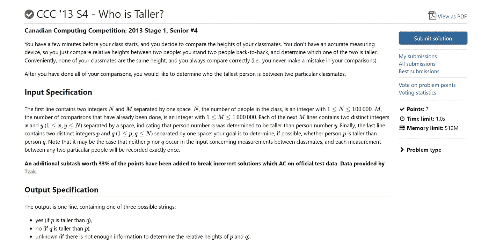
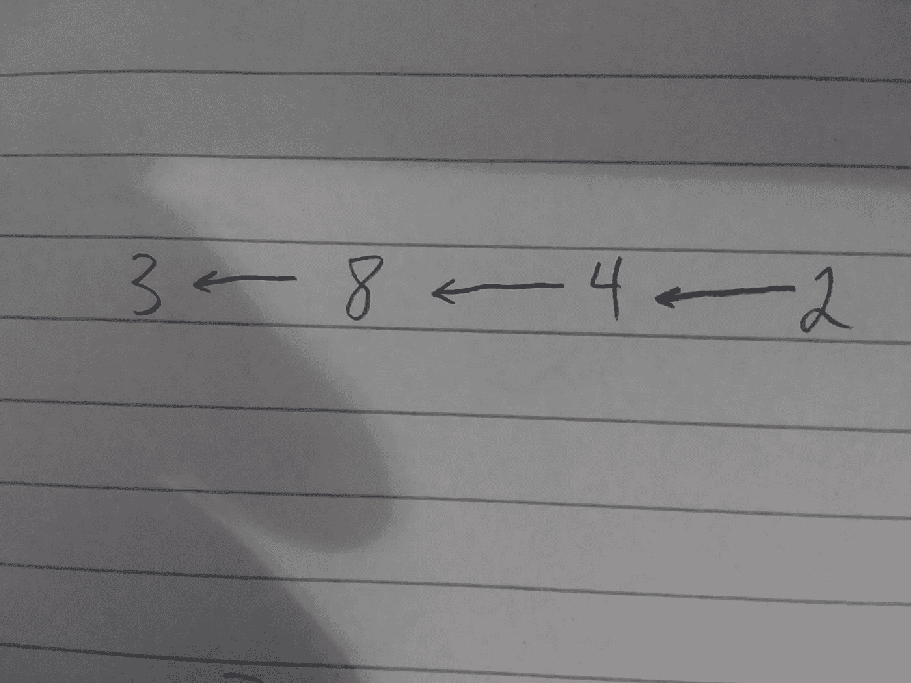
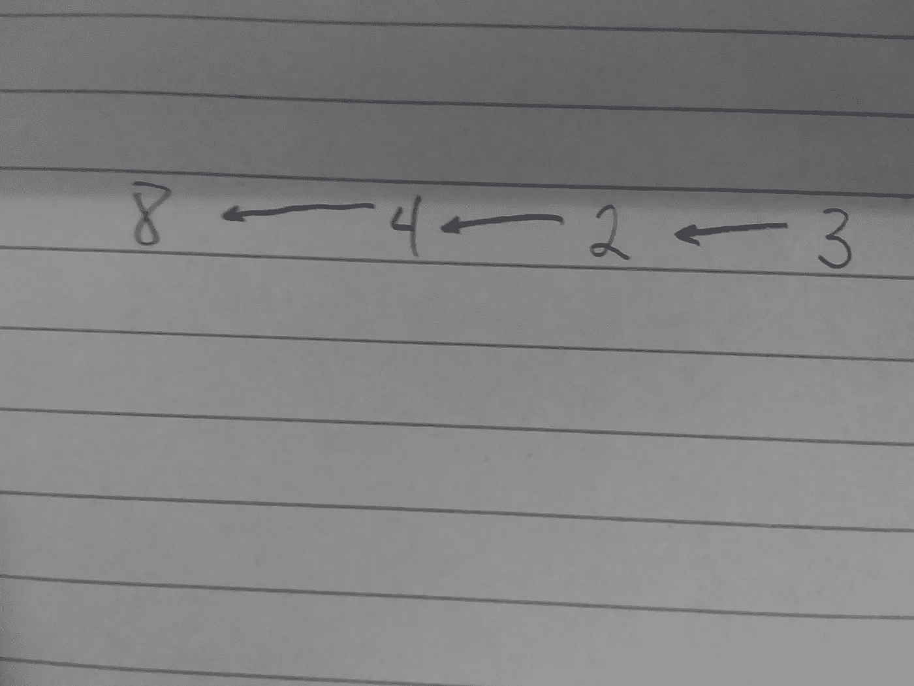

# CCC '13 S4 —谁更高？

> 原文：<https://blog.devgenius.io/ccc-13-s4-who-is-taller-2fadd58fce?source=collection_archive---------12----------------------->



我想分享我解决这个问题的方法。这是我尝试并解决的许多图形问题中的第一个，我想分享一下我是如何解决这个问题的。让我们从分析样本输入开始:

```
10 3
8 4
3 8
4 2
3 2
```

第一个数字(10)是班上的学生人数。第二个数字是进行比较的次数，我们称之为 M。接下来的 M 行由 2 个数字组成，根据比较的结果，高的和矮的人依次排列。这可以用图表来表示。最后两个数字是你要作的比较(用图表来决定哪一个较高)。万一这还不明显，我们正在处理一个有向无环图，简称 DAG。让我们画出这张图表，看看我们在处理什么。这是它看起来的样子:



我们要问的问题是，3 比 2 高吗？从这张图可以看出，答案是肯定的。所以我最初的方法是从个子较小的人开始进行广度优先搜索，如果个子较高的人进行深度优先搜索，那么我们可以输出 yes。然而，如果我们不知道，或者根据图表，假定的高个子并不算高呢？这需要更多的分析。然而，让我们首先快速实现深度优先搜索并处理所有输入。

```
#include <vector>
#include <math.h>
#include <iostream>
#include <bitset>
#include <cstdio>
#include <algorithm>
#include <map>
#include <climits>
#include <unordered_map>
#include <stack>
#include <cmath>

using namespace std;

#define endl "\n"
#define scan(x) do{while((x=getchar())<'0'); for(x-='0'; '0'<=(_=getchar()); x=(x<<3)+(x<<1)+_-'0');}while(0)

bool dfs(int p1, int p2, int N, map<int, vector<int>> graph) {
 stack<int> stack1;
 int current;
 stack1.push(p2);
 vector<bool> visited(N + 1, false);
 while (!stack1.empty()) {
  current = stack1.top();
  visited[current] = true;
  stack1.pop();
  if (current == p1) {
   return true;
  }
  for (int i = 0; i < graph[current].size(); i++) {
   if (!visited[graph[current][i]]) {
    stack1.push(graph[current][i]);
   }
  }
 }
 return false;
}

int main()
{

 int N, M;
 cin >> N >> M;
 map<int, vector<int>> graph;
 vector<int> visited(N + 1, false);
 for (int i = 0; i < M; i++) {
  int t1, t2;
  cin >> t1 >> t2;
  graph[t2].push_back(t1);
 }
 int taller, shorter;
 cin >> taller >> shorter;

 if (bfs(taller, shorter, N, graph)) {
  cout << "yes" << endl;
 }
}
```

正如您在代码中看到的，我们使用 hashmap 结构来存储点，并使用堆栈来遍历图形。我们也将这些点标记为已访问，以防止在错误的情况下循环，这是一个好的做法。请随意分析深度优先搜索，如果您想知道如何实现它，这里有几个链接可以帮助您理解它:

[](https://www.geeksforgeeks.org/depth-first-search-or-dfs-for-a-graph/) [## 深度优先搜索或图的 DFS

### 图的深度优先遍历(或搜索)类似于树的深度优先遍历。这里唯一的问题是…

www.geeksforgeeks.org](https://www.geeksforgeeks.org/depth-first-search-or-dfs-for-a-graph/) [](https://www.programiz.com/dsa/graph-dfs) [## 深度优先搜索

### 深度优先搜索或深度优先遍历是一种递归算法，用于搜索图或树的所有顶点…

www.programiz.com](https://www.programiz.com/dsa/graph-dfs) 

我不会重复如何做这件事。然而，让我们回到我们早先谈论的逻辑。如果你还没有想出来，不要担心，我也花了很多帮助和指导来解决这个问题。基本上，在高个子实际上是矮个子的情况下，我们永远不会在矮个子的图表中找到它。所以，我们可以做的是，我们可以再次调用深度优先搜索功能，不过这次是从高个子的角度，就好像我们在寻找矮个子一样。基本上，在样本输入中，想象一下 3 不是在 8 之后，而是在 2 之前。在第一次深度优先搜索中，我们不会找到它，因为 3 在 2 之前。然而，如果我们从较高的人(3)开始，向前移动，我们找到了 2(较矮的人)，我们可以返回 true 并输出“no ”,这意味着较高的人不比较矮的人高。这看起来会像这样:



然而，如果事实并非如此呢？如果我们找不到这两个问题的答案，并且这两个人在图中没有联系，会怎么样？嗯，这意味着没有足够的信息来解决问题，也就是说我们输出“未知”作为问题状态。

让我们编写第二个深度优先搜索调用并实现逻辑。

```
#include <vector>
#include <math.h>
#include <iostream>
#include <bitset>
#include <cstdio>
#include <algorithm>
#include <map>
#include <climits>
#include <unordered_map>
#include <stack>
#include <cmath>

using namespace std;

#define endl "\n"
#define scan(x) do{while((x=getchar())<'0'); for(x-='0'; '0'<=(_=getchar()); x=(x<<3)+(x<<1)+_-'0');}while(0)

bool dfs(int p1, int p2, int N, map<int, vector<int>> graph) {
 stack<int> stack1;
 int current;
 stack1.push(p2);
 vector<bool> visited(N + 1, false);
 while (!stack1.empty()) {
  current = stack1.top();
  visited[current] = true;
  stack1.pop();
  if (current == p1) {
   return true;
  }
  for (int i = 0; i < graph[current].size(); i++) {
   if (!visited[graph[current][i]]) {
    stack1.push(graph[current][i]);
   }
  }
 }
 return false;
}

int main()
{

 int N, M;
 cin >> N >> M;
 map<int, vector<int>> graph;
 vector<int> visited(N + 1, false);
 for (int i = 0; i < M; i++) {
  int t1, t2;
  cin >> t1 >> t2;
  graph[t2].push_back(t1);
 }
 int taller, shorter;
 cin >> taller >> shorter;

 if (bfs(taller, shorter, N, graph)) {
  cout << "yes" << endl;
 }
else if (bfs(shorter, taller, N, graph)){
  cout << "no" << endl;
}
else {
  cout << "unknown" << endl;
}
```

这会给你一个完整的解决方案。我希望这个逻辑已经帮助你更好地理解了这种类型的图形问题。留下评论让我知道你想让我接下来尝试什么问题。