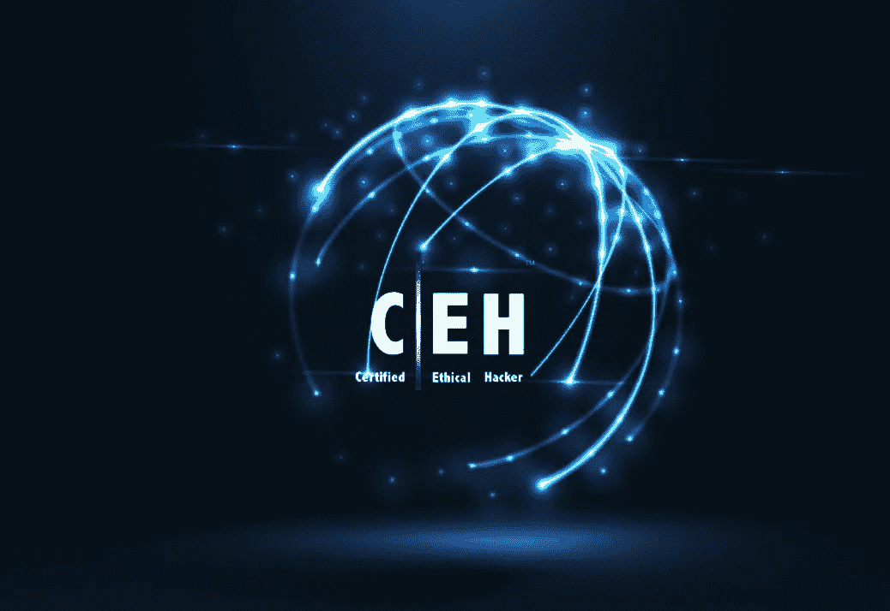

# CEH v11 认证培训课程-“概述”

> 原文：<https://blog.devgenius.io/ceh-v11-certification-training-course-overview-eb88b8a614dd?source=collection_archive---------6----------------------->

认证道德黑客(CEH v11 培训)和认证计划是最值得信赖的认证，更新您的主要安全要素和基础知识。欧盟理事会推出的 CEH V11 认证课程是全球公认的安全培训和认证课程。这一要求最高的安全培训展示了您检测企业网络基础设施中的漏洞和风险的能力，并让您做好充分准备，以提高蓝队的技能并帮助您成功、高效地应对网络攻击。

认证道德黑客(CEH v11 培训)培训是最新 VAPT(漏洞评估和渗透测试)课程中最受欢迎的第二门课程。考虑到当前网络安全领域的改进，最新版本的 EC-Council 增加了深入的概念和主题。该培训课程向您传授最新的商业级攻击或黑客方法、实践和工具，现实生活中的攻击者和信息安全专业人士使用这些方法、实践和工具对任何公司**进行道德黑客攻击。**

甚至自 2003 年推出 CEH 以来，它就被视为业内最大的网络安全专家社区(称为信息安全社区)的基准。CEH v11 继续推出当今信息安全专业人士和恶意黑客使用的最先进的黑客工具和黑客技术。道德黑客的 5 个阶段和 CEH 最初的目标今天仍然是官方的和相关的:“要打败黑客，你需要像黑客一样思考。”

你会仔细检查、测试、攻击和保护你的系统。你将学习道德黑客的 5 个阶段，以及击中目标的方式，并在每次闯入时茁壮成长！5 个关键阶段包括侦察、获取访问权、枚举、管理访问权和掩盖你的踪迹。